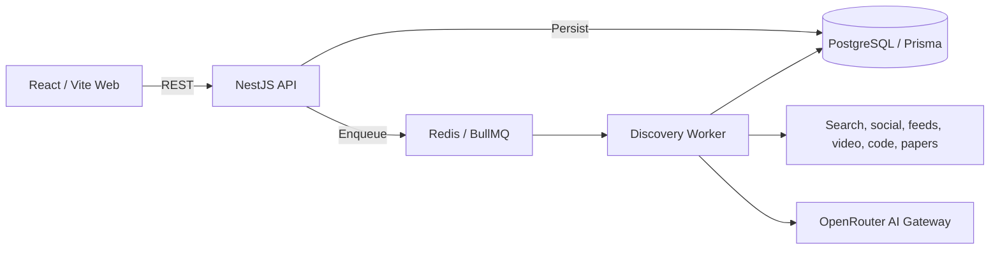

<h1 align="center">LetterMate</h1>

<p align="center">
  面向个人的高精度、多来源信息发现工作台
</p>

<p align="center">
  <a href="./README_EN.md">English</a>
</p>

<p align="center">
  
  
  
  <a href="./LICENSE"></a>
</p>


LetterMate 将完整关键词追踪与自动技术趋势发现合并到一个 Feed。系统通过多个外部来源搜索候选内容，补全正文，验证核心事实支持，执行去重和 AI 评审，最终生成带原始链接的中文摘要与推荐理由。

> [!WARNING]
> LetterMate 当前处于 Alpha 阶段。真实登录、服务端 Session Cookie、CSRF、单实例登录限流和会话撤销已经实现；开发环境仍默认使用 `ALLOW_DEV_IDENTITY=true`。生产部署必须配置强随机 `SESSION_SECRET`、`CSRF_SECRET` 并设置 `ALLOW_DEV_IDENTITY=false`，同时完成目标环境监控、备份和外部连接器验证。

## 目录

- [项目简介](#项目简介)
- [核心能力](#核心能力)
- [工作流程](#工作流程)
- [数据来源](#数据来源)
- [技术架构](#技术架构)
- [快速开始](#快速开始)
- [配置](#配置)
- [API 概览](#api-概览)
- [开发与验证](#开发与验证)
- [项目状态](#项目状态)
- [贡献](#贡献)
- [许可证](#许可证)

## 项目简介

信息发现通常面临两个相反问题：关键词过宽会产生大量噪声，关键词过窄又容易错过真正重要的新内容。LetterMate 使用两条互补管线解决这个问题：

- **精准 Topic 追踪**：保留产品名、项目名、型号和版本边界。`gpt-5.7` 不会被扩展为泛化的 GPT/AI 内容，也不会误匹配 `gpt-5.7.1`。
- **自动趋势发现**：从外部技术榜单收集有限的搜索种子，再通过主发现管线寻找能够支持核心事实的正文、一手记录、代码发布或论文材料。

两条管线共享正文补全、来源证明、事实支持、历史增量、精确与近似去重、来源多样性和中文内容生成逻辑。系统优先保证质量；没有合格结果时，空结果是正常成功状态。

## 核心能力

- 完整关键词与版本标识的高精度追踪。
- Web、社交、Feed、视频、社区、代码和论文等多类来源。
- 趋势榜单只生成搜索种子，不能直接产生 Feed 条目。
- SSRF 安全的正文抓取与重定向检查。
- 核心事实支持门控、历史增量判断和多层去重。
- `hot | quality` 分类、中文摘要、推荐理由和可回溯原始链接。
- Topic 的 6/12/24 小时自适应调度与趋势监控持久化周期。
- Topic 主关键词及扩展词可编辑、删除；AI 只在首次运行生成扩展词，之后完全由用户管理。
- 修改或删除 Topic 不删除历史 Feed；历史卡片保留发现时关键词并显示“关键词已失效”。
- 统一 Feed、已入库文章搜索、来源/分类/时间筛选和自然日期分组。
- 点击刷新与移动端下拉刷新，完成数量来自持久化运行摘要。
- 桌面、平板、手机和 320px 紧凑视口支持。

LetterMate 不向用户展示可信分数、来源排名、证据数量、内部评分或“已核实”标签。`hot` 与 `quality` 是内容推荐分类，不是事实认证状态。

## 工作流程

1. Topic 关键词或趋势榜单条目进入对应入口。
2. 精准关键词策略或技术垂直分类生成有限搜索计划。
3. 启用的连接器并发检索候选内容。
4. 系统验证 URL 和来源证明，并补全网页、线程、README、Release Notes、摘要或视频说明。
5. 事实支持门控、历史增量和去重规则过滤低价值候选。
6. AI 仅从验证后的候选池中选择并生成中文内容。
7. Topic 结果与趋势结果写入 PostgreSQL，并在统一 Feed 中展示。

## 数据来源

| 类别 | 当前接入 | 配置要求 |
| --- | --- | --- |
| AI 与 Web | OpenRouter Web Search | `AI_API_KEY` |
| 社交 | TwitterAPI.io（X）、Bluesky | X 需要 `TWITTERAPI_IO_API_KEY`；Bluesky 无 Key |
| Feed 与社区 | RSS/Atom、Hacker News、Reddit | RSS 需要 URL；Reddit 需要 OAuth 凭据 |
| 研究与代码 | arXiv、GitHub | arXiv 无 Key；GitHub Token 可选 |
| 视频 | YouTube、Bilibili | YouTube 需要 Key；Bilibili 无 Key |
| 社交博主 | X、Bluesky | X 需要 TwitterAPI.io Key；Bluesky 无 Key |
| 通用搜索 | Brave-compatible Search、Tavily、国内 Bing | Brave/Tavily 需要 Key；国内 Bing 无 Key |

趋势输入包括 X Trends、Hacker News Top Stories、YouTube Most Popular、指定 Reddit 社区 Hot、Bilibili 热门和 Google Trends RSS。趋势输入只提供 `TrendSeed`；进入 Feed 前仍必须经过主发现和质量管线。

## 技术架构



| 路径 | 职责 |
| --- | --- |
| `apps/web` | React 工作台、Feed、筛选、主题管理和刷新协调 |
| `apps/api` | 请求身份、用户数据边界、验证、持久化与任务入队 |
| `apps/worker` | 连接器、趋势输入、质量管线、调度器和 BullMQ Worker |
| `packages/contracts` | API、Worker 与 Web 共用的 Zod schema 和 DTO |
| `packages/domain` | 来源证明、URL、质量、去重和多样性规则 |
| `packages/config` | 服务端环境配置解析与默认值 |
| `prisma` | 数据模型与迁移 |
| `tests/e2e` | Playwright 端到端流程 |

## 快速开始

### 环境要求

- Node.js 24+
- npm 11+
- Docker Desktop，或可用的 PostgreSQL 与 Redis
- OpenRouter API Key

### 1. 获取代码

```powershell
git clone https://github.com/sawaki-zexi/LetterMate.git
cd LetterMate
npm install
```

### 2. 配置环境

```powershell
Copy-Item .env.example .env
```

编辑 `.env`，至少设置：

```env
AI_API_KEY=your-openrouter-key
```

默认模型为 `openrouter/auto`。可用 `AI_FAST_MODEL`、`AI_QUALITY_MODEL` 和
`AI_LOCALIZATION_MODEL` 按任务选择模型；未配置时均回退到 `AI_MODEL`。Worker 会在每次
AI 请求前按运行预留调用次数、输入/输出 token 和成本预算，并记录 OpenRouter 返回的实际
模型、provider、token 与成本。真实密钥只能保存在未跟踪的本地 `.env` 中。

可选网页搜索源：

```env
# Tavily 使用官方 JSON API，需要 Tavily Key
TAVILY_API_KEY=tvly-your-key

# 国内 Bing 使用公开的 cn.bing.com 网页搜索，不需要 Key
BING_SEARCH_ENABLED=true
```

Brave 仍通过 `SEARCH_PROVIDER=brave` 和 `SEARCH_API_KEY` 配置。修改 `.env` 后需要重启 Worker。

每日邮件默认未配置。启用生产 SMTP 时至少设置：

```env
SMTP_ENABLED=true
SMTP_HOST=smtp.example.com
SMTP_PORT=587
SMTP_SECURE=false
SMTP_REQUIRE_TLS=true
SMTP_FROM=LetterMate <digest@example.com>
SMTP_USER=
SMTP_PASSWORD=
```

本地无认证 SMTP Relay 可以留空用户名和密码；需要认证时必须同时配置两者。未配置 SMTP 时 Feed 和发现功能正常运行，邮件调度不会启动。

轮换凭据时更新部署环境中的服务端密钥并重启 Worker，确认新的 live smoke 后再撤销旧凭据；停用邮件只需设置 `SMTP_ENABLED=false` 并重启 Worker。

### 3. 启动基础设施并迁移数据库

```powershell
docker compose -f infra/compose.yaml up -d
npm run db:generate
npm run db:deploy
```

### 4. 启动 Web 与 API

```powershell
npm run dev
```

### 5. 启动 Worker

在另一个终端运行：

```powershell
npm run dev -w @lettermate/worker
```

打开 [http://localhost:5173](http://localhost:5173)。API 默认监听 `http://localhost:3000`。如果未启动 Worker，Topic 与趋势任务会保持在队列中。

### 生产容器基线

根目录 `Dockerfile` 提供 `api`、`worker` 和 `web` 三个构建目标；`infra/compose.production.example.yaml` 还包含 PostgreSQL、带密码的 Redis 和一次性 Prisma 迁移任务。使用前必须在 `.env` 中配置强随机 `SESSION_SECRET`、`CSRF_SECRET`、`POSTGRES_PASSWORD`、`REDIS_PASSWORD`，关闭开发身份，并将连接 URL 的主机改为 Compose 服务名：

```env
NODE_ENV=production
ALLOW_DEV_IDENTITY=false
WEB_ORIGIN=https://discovery.example.com
DATABASE_URL=postgresql://lettermate:<url-encoded-password>@postgres:5432/lettermate
REDIS_URL=redis://:<url-encoded-password>@redis:6379
```

先校验配置和镜像，再启动：

```powershell
docker compose -f infra/compose.production.example.yaml config
docker compose -f infra/compose.production.example.yaml build
docker compose -f infra/compose.production.example.yaml up -d
```

示例 Web 容器监听 8080，只负责静态页面和 `/api` 反向代理，不终止 TLS。必须在其前方配置 HTTPS 反向代理，并使 `WEB_ORIGIN` 与浏览器实际 Origin 完全一致；生产 Session Cookie 为 Secure，直接使用 HTTP 无法完成登录。

生产备份和恢复演练使用 `operations` profile，不需要 Docker Socket。备份输出会返回卷内文件路径；将该路径作为 `BACKUP_PATH` 执行隔离恢复：

```powershell
docker compose -f infra/compose.production.example.yaml --profile operations run --rm backup
$env:BACKUP_PATH='/backups/lettermate-YYYYMMDDTHHMMSSZ.dump'
docker compose -f infra/compose.production.example.yaml --profile operations run --rm restore-drill
```

由目标环境的 cron、systemd timer 或 CronJob 每日调用一次 `backup`，成功后将 `.dump` 和 `.manifest.json` 一并复制到加密外部存储。应用仓库不持有外部存储加密密钥。

## 配置

完整定义和非敏感默认值见 [`.env.example`](./.env.example)。

| 分组 | 变量 | 说明 |
| --- | --- | --- |
| 基础设施 | `DATABASE_URL`, `REDIS_URL`, `WEB_ORIGIN` | PostgreSQL、Redis 和 Web Origin |
| 可观测性 | `METRICS_PORT` | Worker 内部健康与 Prometheus 指标端口；默认 9464 |
| 认证与会话 | `SESSION_SECRET`, `CSRF_SECRET`, `ALLOW_DEV_IDENTITY` | Session Cookie、CSRF 和开发身份开关；生产必须关闭开发身份 |
| AI | `AI_API_KEY`, `AI_MODEL`, `AI_*_MODEL`, `AI_FALLBACK_MODELS`, `AI_PROVIDER_*`, `AI_RUN_*`, `AI_WEB_SEARCH`, `AI_TIMEOUT_MS` | OpenRouter 任务路由、运行预算、用量审计与结构化生成 |
| 可选来源 | `TWITTERAPI_IO_API_KEY`, `GITHUB_TOKEN`, `YOUTUBE_API_KEY` | X、GitHub 和 YouTube |
| Reddit | `REDDIT_CLIENT_ID`, `REDDIT_CLIENT_SECRET` | Reddit OAuth |
| 通用搜索 | `SEARCH_PROVIDER`, `SEARCH_API_KEY`, `SEARCH_API_BASE_URL` | Brave-compatible Search |
| Tavily | `TAVILY_API_KEY`, `TAVILY_API_BASE_URL` | Tavily Search API；需要 Key |
| 国内 Bing | `BING_SEARCH_ENABLED`, `BING_SEARCH_BASE_URL` | 公开的 `cn.bing.com` 网页搜索；不需要 Key |
| Feed | `DISCOVERY_RSS_FEED_URLS`, `TREND_GOOGLE_RSS_URLS` | 主发现与趋势 RSS URL |
| 发现调度 | `DISCOVERY_RUN_TIMEOUT_MS`, `DISCOVERY_CONNECTOR_CONCURRENCY`, `DISCOVERY_SCHEDULER_ENABLED` | 超时、并发和 Topic 调度 |
| 趋势调度 | `TREND_MONITOR_ENABLED`, `TREND_INTERVAL_HOURS` | 趋势开关与缺失 Monitor 的初始周期 |
| 趋势范围 | `TREND_X_WOEIDS`, `TREND_YOUTUBE_REGION`, `TREND_REDDIT_COMMUNITIES` | 地区与社区范围 |
| 每日邮件 | `SMTP_ENABLED`, `SMTP_HOST`, `SMTP_PORT`, `SMTP_SECURE`, `SMTP_REQUIRE_TLS`, `SMTP_FROM` | 生产 SMTP 投递与 TLS |
| 邮件认证 | `SMTP_USER`, `SMTP_PASSWORD` | 可选 SMTP 认证；必须同时配置 |
| 邮件超时 | `SMTP_CONNECTION_TIMEOUT_MS`, `SMTP_SOCKET_TIMEOUT_MS` | 连接和 Socket 超时 |

缺少可选凭据时只禁用对应连接器。`TREND_INTERVAL_HOURS` 只用于创建缺失的 TrendMonitor；已有记录始终使用数据库中的 `intervalHours`。

## API 概览

所有业务端点位于 `/api/v1`：

| Method | Path | 用途 |
| --- | --- | --- |
| `POST` | `/auth/register` | 创建账户并签发 Session Cookie |
| `POST` | `/auth/login` | 登录并签发 Session Cookie |
| `POST` | `/auth/logout` | 校验 CSRF、撤销会话并清除 Cookie |
| `GET` | `/auth/session` | 读取当前登录用户和 CSRF Token |
| `GET` | `/health` | 存活探针，不检查外部依赖 |
| `GET` | `/health/ready` | 依赖就绪探针；异常时返回 HTTP 503 |
| `GET` | `/metrics` | 内部 Prometheus API 指标；不属于 `/api/v1`，生产 Web 不代理 |
| `POST` | `/topics` | 创建完整关键词 Topic 并入队首次运行 |
| `GET` | `/topics` | 获取 Topic、调度和最新运行摘要 |
| `PATCH` | `/topics/:id` | 修改主关键词和用户管理的扩展词，并入队新关键词发现 |
| `DELETE` | `/topics/:id` | 从活动列表软删除 Topic，保留历史 Feed |
| `POST` | `/topics/:id/refresh` | 登记 Topic 手动刷新 |
| `GET` | `/trends/status` | 获取趋势 Monitor 和最新运行摘要 |
| `POST` | `/trends/refresh` | 登记趋势手动刷新 |
| `GET` | `/feed` | 查询统一 Feed |
| `GET` | `/items/:id` | 获取 Topic 或趋势条目详情 |
| `GET` | `/discovery-sources` | 获取脱敏后的连接器启用状态 |
| `GET/PUT` | `/digest-preference` | 读取或修改每日邮件设置 |
| `GET` | `/digest-preview` | 预览下一封邮件候选 |
| `GET` | `/digest-status` | 获取邮件能力、下一次本地发送时间和最近运行 |

Feed 支持 `range=1d|3d|7d|30d|90d|all`、`origin=all|topic|trend|creator`、`kind=hot|quality`、可选 `topicId` 和最长 100 字符的 `q`。`q` 只搜索当前用户已入库文章的标题、摘要和推荐理由，不触发外部发现；有关键词时按标题、摘要、推荐理由的加权相关性排序，再按文章时间和 ID 稳定排序。`topicId` 不能与 `origin=trend|creator` 同时使用。

## 开发与验证

| 命令 | 用途 |
| --- | --- |
| `npm run dev` | 并行启动 Web 与 API |
| `npm run dev -w @lettermate/worker` | 启动 Worker 与调度器 |
| `npm run lint` | ESLint，禁止 warning |
| `npm run typecheck` | TypeScript project references 检查 |
| `npm test` | Vitest 单元与集成测试 |
| `npm run evaluate:quality` | 运行离线 Agent golden fixtures 质量门槛 |
| `npm run evaluate:source-quality -- http://127.0.0.1:9090 24` | 从 Prometheus 评估最近 24 小时来源漏斗和窗口完整性 |
| `npm run evaluate:interest-effects -- YYYY-MM-DD` | 汇总指定 UTC 日的曝光、显式反馈与订阅保护效果 |
| `npm run evaluate:semantic-recall -- YYYY-MM-DD 14` | 以指定日期为末日运行 14 天 rolling-split 标签召回准入评估 |
| `npm run ops:doctor` | 脱敏检查配置和可用来源，不访问外部服务 |
| `npm run ops:doctor -- live` | 额外探测 PostgreSQL 与 Redis |
| `npm run build` | 构建 Web、API 与 Worker |
| `npm run test:e2e` | Playwright 桌面、平板和移动端流程 |
| `npm run db:migrate` | 创建本地 Prisma 开发迁移 |
| `npm run db:deploy` | 应用已提交迁移 |
| `npm run db:backup` | 创建 PostgreSQL custom-format 备份、SHA-256 清单并执行保留策略 |
| `npm run db:backup:direct` | 使用本机 PostgreSQL 客户端和 `DATABASE_URL` 创建备份 |
| `npm run db:backup:verify -- <backup-path>` | 校验备份文件大小、SHA-256 和清单 |
| `npm run db:restore:verify -- <backup-path>` | 将备份恢复到临时隔离数据库并验证表与迁移记录 |
| `npm run db:restore:verify:direct -- <backup-path>` | 通过 `DATABASE_URL` 执行隔离恢复验证 |
| `npm run backfill:interest-tags -w @lettermate/worker` | 为近期合格内容回填版本化兴趣标签；需要 `AI_API_KEY` |

离线评估检查预期命中、禁止命中、HTTP(S) 来源覆盖、中文内容覆盖和重复率；任一 case 未达到门槛时返回非零状态。Topic 与 Trend Worker 同时输出脱敏的 `agent.stage.completed` 阶段事件，便于定位规划、检索、质量门控和持久化耗时。详见 [Agent 质量评估](./docs/agent-quality-evaluation.md)。

默认测试不访问外部服务。Live smoke test 需要显式开关和对应 Key：

```powershell
$env:RUN_LIVE_AI_TESTS='1'
npm test -- apps/worker/src/openrouter.live.test.ts

$env:RUN_LIVE_TWITTERAPI_IO_TESTS='1'
npm test -- apps/worker/src/twitterapi-io.live.test.ts

$env:RUN_LIVE_BILIBILI_TESTS='1'
$env:BILIBILI_LIVE_MID='目标 UP 主 mid'
npm test -- apps/worker/src/bilibili-creator.live.test.ts

$env:RUN_LIVE_YOUTUBE_TESTS='1'
$env:YOUTUBE_LIVE_CHANNEL_ID='目标频道 channelId'
npm test -- apps/worker/src/youtube-creator.live.test.ts

$env:RUN_LIVE_BLUESKY_TESTS='1'
$env:BLUESKY_LIVE_DID='目标账号 DID'
npm test -- apps/worker/src/bluesky-creator.live.test.ts

$env:RUN_LIVE_EMAIL_TESTS='1'
npm test -- apps/worker/src/smtp-email.live.test.ts
```

SMTP live smoke 还需要完整 SMTP 配置和 `SMTP_SMOKE_RECIPIENT`。普通 SMTP 通过确定性 `Message-ID` 尽力减少重试重复，但不能严格覆盖“服务器已接受、客户端未收到确认”的情况；严格零重复需要支持幂等键的供应商 API。

数据库备份默认写入 `.backups/postgres`，保留最近 14 天的全部备份、随后 8 周每周最新一份、再保留 12 个月每月最新一份。只有文件与清单均有效的完整备份会参与自动清理；恢复验证始终使用独立数据库，并拒绝 `lettermate`、`postgres`、`template0` 和 `template1`。生产主库恢复不提供自动覆盖命令，必须在停机、外部备份可用和人工审批后按运行手册执行。

生产 Compose 提供可选的本地 Prometheus 基线：

```powershell
docker compose -f infra/compose.production.example.yaml --profile monitoring config --quiet
docker compose -f infra/compose.production.example.yaml --profile monitoring up -d prometheus
```

Prometheus 默认只绑定 `127.0.0.1:9090`。通知渠道和 Alertmanager 由目标环境提供，仓库不保存通知凭据；完整校验和接入步骤见 [运行手册](./docs/operations-runbook.md)。

## 项目状态

已实现：

- Topic 与趋势两条持久化发现管线。
- RSS/Atom、X、Bilibili、YouTube 与 Bluesky 博主关注；YouTube 固定 `channelId` 并同步 uploads playlist，Bilibili 支持公开视频、公开动态、专栏和带原帖上下文的转发动态，Bluesky 固定 DID 并同步原创、引用、转发和带父帖上下文的回复。
- 可审计兴趣事件、版本化内容标签、短期/长期/负向画像和个性化 Feed 排序。
- 对现有候选的相邻兴趣识别、约 10% 探索编排，以及每日邮件预览、调度、重试和可选生产 SMTP 投递。
- 14 个主发现连接器和 6 个趋势输入。
- 调度、租约恢复、幂等刷新和运行摘要。
- API 统一 `x-trace-id`、脱敏结构化请求日志、Worker 队列快照与任务/连接器失败事件。
- API `/metrics` 与 Worker `:9464/metrics` 的低基数 Prometheus 指标，覆盖请求、队列、任务、Agent 阶段，以及按稳定连接器聚合的来源尝试、拒绝原因和最终精选贡献。
- API 存活/就绪检查、依赖异常 503、SIGINT/SIGTERM 优雅退出，以及 API/Worker/Web 容器与一次性迁移 Compose 基线。
- 脱敏 `ops:doctor` 配置/依赖诊断，以及密钥轮换、配额、告警与故障恢复手册。
- PostgreSQL custom-format 备份、SHA-256 清单、14 日/8 周/12 月分层保留和隔离恢复验证。
- 统一 Feed、已入库文章搜索、时间/来源筛选、日期分组和响应式界面。
- 默认离线自动化测试与凭据型 live smoke test 入口。

生产使用前仍需完成：

- 在生产环境配置 `SESSION_SECRET`、`CSRF_SECRET`，并设置 `ALLOW_DEV_IDENTITY=false`。真实登录、服务端会话和 CSRF 已实现；开发环境默认保留 `ALLOW_DEV_IDENTITY=true` 以兼容本地调试。
- 在目标环境逐一验证外部连接器、配额、限流和故障恢复。
- 将仓库内 Prometheus 规则和结构化日志接入目标环境的 Alertmanager、通知渠道与日志聚合。
- 在目标环境完成 TLS 入口、秘密存储、容量基线和部署演练。
- 为数据库备份配置定时任务、加密外部副本和周期恢复演练，并建立部署、主库恢复审批、密钥轮换和安全响应流程。

详细范围与技术决策见 [产品需求](./docs/requirements.md) 和 [技术方案](./docs/design.md)。
生产检查、告警和恢复步骤见 [运行手册](./docs/operations-runbook.md)。

## 贡献

欢迎提交问题和改进：

1. Fork 仓库并从 `main` 创建功能分支。
2. 保持改动聚焦，并为行为变化补充测试。
3. 运行 `npm run lint`、`npm run typecheck`、`npm test` 和适用的构建/E2E 检查。
4. 提交 Pull Request，说明问题、方案、验证结果和未运行的检查。

Bug 和功能建议可通过 [GitHub Issues](https://github.com/sawaki-zexi/LetterMate/issues) 提交。安全问题请不要公开披露敏感凭据或可利用细节。

## 许可证

本项目采用 [GNU General Public License v3.0 or later](./LICENSE) 发布。你可以依据 GPL v3 或任何后续版本分发和修改本项目，但须遵守所选版本的源代码与许可证义务。
