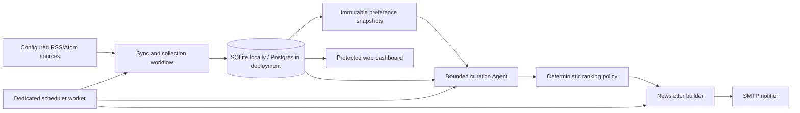

# LetterMate

LetterMate is an early-stage personal intelligence agent for newsletter curation.

## Current status

LetterMate provides source collection, bounded curation with traceable decisions, preference
snapshots, newsletter generation and delivery, protected operational views, and a separate
scheduler worker. The deployed topology uses Postgres shared by the web and worker processes.
Real owner dogfood and an external pilot remain required before the portfolio release can claim
the business metrics in the requirements.

The container topology has been exercised against a fresh Postgres volume; see the
[container deployment verification record](docs/deployment-verification.md) for the exact
scope, evidence, and host-specific limitations.

The repeatable local workflow record is available in the
[offline demo walkthrough](docs/demo-walkthrough.md). It verifies the full daily path with the
deterministic fake provider and dry-run email; it is not a substitute for a real model or SMTP
acceptance run.

The authoritative product requirements are the
[LetterMate Agentic Product Requirements V2](docs/lettermate-agentic-product-requirements-v2.md),
and active implementation work follows the
[LetterMate Agentic MVP V3 implementation plan](docs/superpowers/plans/2026-07-21-lettermate-agentic-mvp-v3-implementation-plan.md).
The earlier V2 vertical-slice plan is retained only as historical planning context.

## Architecture



The workflow owns source synchronization, collection, ranking, newsletter membership, and
delivery state. The optional Agent only produces structured semantic assessment. It cannot send
mail, mutate sources or preferences, execute shell commands, access arbitrary URLs, or choose
final newsletter membership.

Agent tools are limited to full text from the current item/source host, recent-topic lookup, and
preference-evidence lookup. Tool calls have a turn limit, timeout, public-network validation,
bounded response size, and redacted audit traces. Ranking remains deterministic and records its
score components.

## Development setup

LetterMate requires Python 3.12. From PowerShell:

```powershell
py -3.12 -m venv .venv
.\.venv\Scripts\python.exe -m pip install --upgrade pip
.\.venv\Scripts\python.exe -m pip install -e ".[dev]"
.\.venv\Scripts\python.exe -m pytest -q
```

## Local Demo

The committed fixture can run the entire daily workflow without external network, model, or SMTP
traffic. It uses the fake provider and an ignored local SQLite database:

```powershell
$env:DATABASE_URL = "sqlite:///./data/lettermate-demo.db"
$env:APP_ENV = "local"
$env:LLM_PROVIDER = "fake"
$env:EMAIL_DRY_RUN = "true"
.\.venv\Scripts\lettermate.exe run-daily `
  --feed-fixture configs\demo-feed.xml `
  --issue-date 2026-07-23
```

Run it a second time with the same database to demonstrate idempotent content analysis and
newsletter membership. The recorded result is in [the offline walkthrough](docs/demo-walkthrough.md).

For individual stages, use `lettermate sync-sources`, `lettermate collect --feed-fixture ...`,
`lettermate analyze`, `lettermate newsletter`, and `lettermate send --dry-run`. The protected web
application is served by `uvicorn lettermate.api.app:create_app --factory` and requires the owner
token configured in the environment for operational API access.

## Curation provider

`LLM_PROVIDER=fake` is the default and is suitable for local tests and the offline demo. For a
live bounded curation agent, configure the following in the deployment environment:

```text
LLM_PROVIDER=openai
LLM_MODEL=gpt-5-mini
OPENAI_API_KEY=<real-secret>
```

The application rejects unknown provider names and rejects `LLM_PROVIDER=openai` without an API
key. `analyze`, `run-daily`, and the scheduler all construct the same configured provider. The
Agent is still bounded by `CURATION_MAX_TURNS`, `CURATION_TIMEOUT_SECONDS`, and
`CURATION_MINIMUM_CONFIDENCE` (each has a safe default in application settings).

## Evaluation

The repository includes versioned Eval schemas, deterministic ranking metrics, a sanitized sample
dataset, label rubric, and four comparison interfaces: latest-first, static one-shot, fixed
workflow, and bounded Agent. Run the committed sample evaluation with:

```powershell
.\.venv\Scripts\lettermate.exe eval
npm run security-eval
```

The sample data and prompt-injection evaluation only establish regression coverage. The required
final report needs 100 real items, 30 labels, a holdout set, all four baselines, failure slices,
and trajectory/cost/latency metrics. Its current evidence state is recorded in
[portfolio-final.md](docs/evals/reports/portfolio-final.md).

## Security And Failure Semantics

- Secrets are environment-provided; production rejects default/short signing and owner tokens.
- Dashboard and owner APIs require the owner token; scheduler claims use a distinct scheduler token.
- Feed content is sanitized. Full-text retrieval permits only public HTTP(S) endpoints related to
  the current item/source and rejects local/private network addresses.
- Feedback links are signed and expire. Feedback creates immutable preference snapshots rather
  than altering prior ranking context.
- Each stage persists a JobRun and structured failure events. A failed source is isolated so
  healthy sources continue.
- SMTP delivery is at-least-once at the provider boundary. The application prevents automatic
  resend after a confirmed send; an ambiguous provider acknowledgement is recorded for explicit
  reconciliation rather than reported as exactly-once delivery.

## Scope And Evidence Boundaries

This is a single-owner newsletter MVP, not a general feed-reader SaaS, collaborative workspace,
or autonomous email system. Vector memory, arbitrary browsing, write-capable Agent tools, and
multi-Agent orchestration are intentionally excluded.

The public demo uses committed public sources and a synthetic feed fixture. It does not expose
owner content. Container acceptance and local workflow evidence are linked above; there is no
live reviewer URL because a production instance with real secrets has not been provisioned.

The following release evidence remains pending and must be collected without backfilling or
fabrication: a seven-day pre-product baseline, fourteen consecutive owner-dogfood days, a
seven-day isolated external-user pilot with feedback and an interview, and a real holdout Eval.
Templates for the first three are [owner dogfood](docs/pilot/owner-dogfood-log.md),
[external pilot](docs/pilot/external-user-feedback.md), and
[final evaluation](docs/evals/reports/portfolio-final.md).

## Docker deployment

Create `.env` from `.env.example` and replace every placeholder with a distinct secret of at
least 32 characters. `APP_ENV=production` is intentional: the application rejects development
defaults in this mode.

```powershell
Copy-Item .env.example .env
docker compose config
docker compose up --build -d
docker compose ps
curl.exe --fail http://127.0.0.1:8000/health
```

The `migrate` service runs `alembic upgrade head` before the web and worker start. `web` serves
the protected dashboard at port 8000; `worker` runs `lettermate scheduler`; Postgres data is kept
in the `postgres_data` volume. To apply a later migration explicitly, run:

```powershell
docker compose run --rm migrate alembic upgrade head
```

Before calling a deployment production-ready, repeat the container check with a real OpenAI API
key and SMTP configuration, then collect the real-use evidence listed in the current-status
section.
