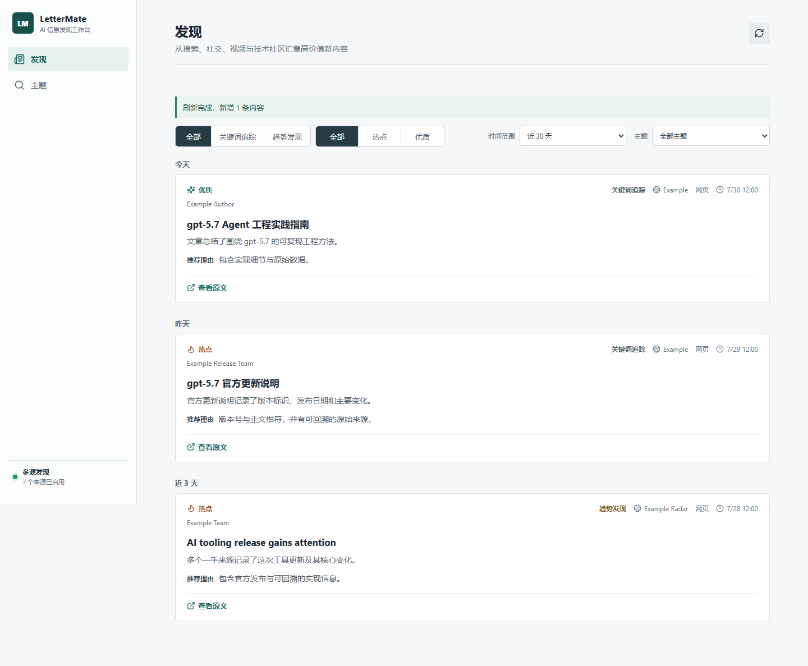
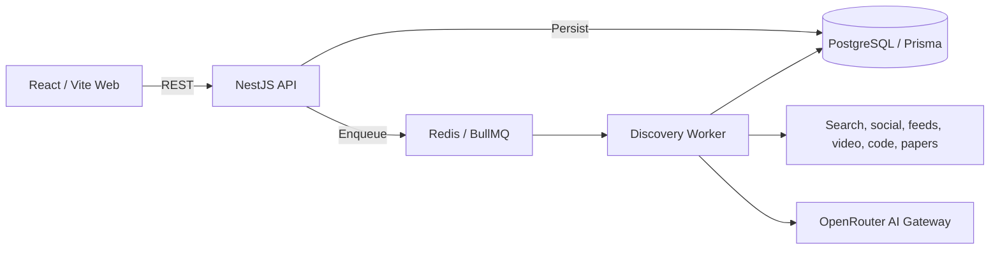

<h1 align="center">LetterMate</h1>

<p align="center">
  A high-precision, multi-source personal discovery workspace
</p>

<p align="center">
  <a href="./README.md">简体中文</a>
</p>

<p align="center">
  
  
  
  <a href="./LICENSE"></a>
</p>



LetterMate combines exact-keyword tracking and automatic technology-trend discovery in one Feed. It searches multiple external sources, enriches candidate content, checks support for core claims, deduplicates results, and uses AI review to produce Chinese summaries and recommendation reasons with original links.

> [!WARNING]
> LetterMate is currently alpha software. Real login, server-side Session Cookies, CSRF protection, single-instance login throttling, and session revocation are implemented. Development still defaults to `ALLOW_DEV_IDENTITY=true`; production must configure strong random `SESSION_SECRET` and `CSRF_SECRET` values and set `ALLOW_DEV_IDENTITY=false`.

## Table of Contents

- [About](#about)
- [Highlights](#highlights)
- [How It Works](#how-it-works)
- [Sources](#sources)
- [Architecture](#architecture)
- [Quick Start](#quick-start)
- [Configuration](#configuration)
- [API Overview](#api-overview)
- [Development and Verification](#development-and-verification)
- [Project Status](#project-status)
- [Contributing](#contributing)
- [License](#license)

## About

Information discovery has two opposing failure modes: broad keywords produce noise, while overly narrow monitoring can miss important developments. LetterMate addresses this with two complementary pipelines:

- **Precise Topic tracking** preserves product, project, model, and version boundaries. `gpt-5.7` is not broadened into generic GPT/AI material and does not match `gpt-5.7.1`.
- **Automatic trend discovery** collects a limited set of seeds from external technology lists, then searches for substantive pages, first-party records, code releases, or papers that support their core claims.

Both pipelines share content enrichment, source proof, claim-support gating, historical novelty checks, exact and near deduplication, source diversity, and Chinese content generation. Quality takes priority over volume; an empty result is a valid successful outcome.

## Highlights

- High-precision tracking for complete keywords and version identifiers.
- Multi-source discovery across web, social, feeds, video, communities, code, and papers.
- Trend lists create search seeds only and never create Feed items directly.
- SSRF-safe content fetching with redirect validation.
- Core claim-support gating, historical novelty checks, and layered deduplication.
- `hot | quality` classification, Chinese summaries, recommendation reasons, and traceable original links.
- Adaptive 6/12/24-hour Topic scheduling and persisted trend intervals.
- Unified Feed with origin, category, time-range, and calendar grouping controls.
- Click and mobile pull-to-refresh with counts from persisted run summaries.
- Responsive layouts for desktop, tablet, mobile, and 320px compact viewports.

LetterMate does not expose trust scores, source rankings, evidence counts, internal scores, or verified labels. `hot` and `quality` are recommendation categories, not fact-verification states.

## How It Works

1. An exact Topic keyword or an external trend entry enters its respective pipeline.
2. Exact-keyword policy or technology-vertical classification creates a bounded query plan.
3. Enabled connectors search for candidates concurrently.
4. The system validates URLs and source proof, then enriches pages, threads, README files, release notes, abstracts, or video descriptions.
5. Claim-support, historical novelty, and deduplication rules reject low-value candidates.
6. AI can select only from the validated candidate pool and compose Chinese content.
7. Topic and trend results are persisted in PostgreSQL and shown in the unified Feed.

## Sources

| Category | Current integrations | Configuration |
| --- | --- | --- |
| AI and Web | OpenRouter Web Search | `AI_API_KEY` |
| Social | TwitterAPI.io (X), Bluesky | X requires `TWITTERAPI_IO_API_KEY`; Bluesky is keyless |
| Feeds and communities | RSS/Atom, Hacker News, Reddit | RSS requires URLs; Reddit requires OAuth credentials |
| Research and code | arXiv, GitHub | arXiv is keyless; a GitHub token is optional |
| Video | YouTube, Bilibili | YouTube requires a key; Bilibili is keyless |
| General search | Brave-compatible Search, Tavily, China Bing | Brave/Tavily require keys; China Bing is keyless |

Trend inputs include X Trends, Hacker News Top Stories, YouTube Most Popular, Hot posts from configured Reddit communities, Bilibili popular content, and Google Trends RSS. A trend input produces only a `TrendSeed`; it must still pass the main discovery and quality pipeline before reaching the Feed.

## Architecture



| Path | Responsibility |
| --- | --- |
| `apps/web` | React workspace, Feed, filters, Topic management, and refresh coordination |
| `apps/api` | Request identity, user ownership boundaries, validation, persistence, and enqueueing |
| `apps/worker` | Connectors, trend inputs, quality pipelines, schedulers, and BullMQ workers |
| `packages/contracts` | Shared Zod schemas and DTOs for API, Worker, and Web |
| `packages/domain` | Source proof, URL, quality, deduplication, and diversity rules |
| `packages/config` | Server-side environment parsing and defaults |
| `prisma` | Data model and migrations |
| `tests/e2e` | Playwright end-to-end flows |

## Quick Start

### Prerequisites

- Node.js 24+
- npm 11+
- Docker Desktop, or available PostgreSQL and Redis instances
- An OpenRouter API key

### 1. Get the source

```powershell
git clone https://github.com/sawaki-zexi/LetterMate.git
cd LetterMate
npm install
```

### 2. Configure the environment

```powershell
Copy-Item .env.example .env
```

Set at least the following value in `.env`:

```env
AI_API_KEY=your-openrouter-key
```

The default model is `openrouter/auto`. Keep real secrets only in the untracked local `.env` file.

Optional web sources can be enabled with:

```env
# Tavily uses the official JSON API and requires a Tavily key.
TAVILY_API_KEY=tvly-your-key

# China Bing uses the public cn.bing.com HTML search page and does not require a key.
BING_SEARCH_ENABLED=true
```

Brave remains available through `SEARCH_PROVIDER=brave` and `SEARCH_API_KEY`. Restart the Worker after changing `.env`.

Daily email is disabled until SMTP is configured. A minimal production configuration is:

```env
SMTP_ENABLED=true
SMTP_HOST=smtp.example.com
SMTP_PORT=587
SMTP_SECURE=false
SMTP_REQUIRE_TLS=true
SMTP_FROM=LetterMate <digest@example.com>
SMTP_USER=
SMTP_PASSWORD=
```

Leave both authentication values empty for an unauthenticated local relay. If SMTP is not configured, discovery and Feed remain available and digest scheduling is not started.

To rotate credentials, update the server-side secret and restart the Worker, verify the new live smoke, then revoke the old credential. Set `SMTP_ENABLED=false` and restart the Worker to disable delivery.

### 3. Start infrastructure and apply migrations

```powershell
docker compose -f infra/compose.yaml up -d
npm run db:generate
npm run db:deploy
```

### 4. Start Web and API

```powershell
npm run dev
```

### 5. Start the Worker

Run in a second terminal:

```powershell
npm run dev -w @lettermate/worker
```

Open [http://localhost:5173](http://localhost:5173). The API listens on `http://localhost:3000` by default. Topic and trend jobs remain queued if the Worker is not running.

### Production container baseline

The root `Dockerfile` provides `api`, `worker`, and `web` build targets. `infra/compose.production.example.yaml` also includes PostgreSQL, password-protected Redis, and a one-shot Prisma migration service. Before using it, configure strong random `SESSION_SECRET`, `CSRF_SECRET`, `POSTGRES_PASSWORD`, and `REDIS_PASSWORD` values in `.env`, disable the development identity, and use Compose service names in the connection URLs:

```env
NODE_ENV=production
ALLOW_DEV_IDENTITY=false
WEB_ORIGIN=https://discovery.example.com
DATABASE_URL=postgresql://lettermate:<url-encoded-password>@postgres:5432/lettermate
REDIS_URL=redis://:<url-encoded-password>@redis:6379
```

Validate the configuration and images before starting the stack:

```powershell
docker compose -f infra/compose.production.example.yaml config
docker compose -f infra/compose.production.example.yaml build
docker compose -f infra/compose.production.example.yaml up -d
```

The example Web container listens on port 8080 and only serves static files and proxies `/api`; it does not terminate TLS. Put an HTTPS reverse proxy in front of it and make `WEB_ORIGIN` exactly match the browser origin. Production session cookies are Secure and therefore do not work over direct HTTP.

Production backups and restore drills use the `operations` profile and do not require a Docker socket. The backup output reports the path inside the backup volume; pass that path as `BACKUP_PATH` for an isolated restore:

```powershell
docker compose -f infra/compose.production.example.yaml --profile operations run --rm backup
$env:BACKUP_PATH='/backups/lettermate-YYYYMMDDTHHMMSSZ.dump'
docker compose -f infra/compose.production.example.yaml --profile operations run --rm restore-drill
```

Schedule the one-shot `backup` service daily with the target environment's cron, systemd timer, or CronJob. After success, copy both the `.dump` and `.manifest.json` files to encrypted off-site storage. The application repository does not hold that storage encryption key.

## Configuration

See [`.env.example`](./.env.example) for the complete definition and non-sensitive defaults.

| Group | Variables | Purpose |
| --- | --- | --- |
| Infrastructure | `DATABASE_URL`, `REDIS_URL`, `WEB_ORIGIN` | PostgreSQL, Redis, and Web origin |
| Observability | `METRICS_PORT` | Internal Worker health and Prometheus metrics port; defaults to 9464 |
| Authentication | `SESSION_SECRET`, `CSRF_SECRET`, `ALLOW_DEV_IDENTITY` | Session HMAC, CSRF, and the development identity switch; production must disable it |
| AI | `AI_API_KEY`, `AI_MODEL`, `AI_WEB_SEARCH`, `AI_TIMEOUT_MS` | OpenRouter search, assessment, and composition |
| Optional sources | `TWITTERAPI_IO_API_KEY`, `GITHUB_TOKEN`, `YOUTUBE_API_KEY` | X, GitHub, and YouTube |
| Reddit | `REDDIT_CLIENT_ID`, `REDDIT_CLIENT_SECRET` | Reddit OAuth |
| General search | `SEARCH_PROVIDER`, `SEARCH_API_KEY`, `SEARCH_API_BASE_URL` | Brave-compatible Search |
| Tavily | `TAVILY_API_KEY`, `TAVILY_API_BASE_URL` | Tavily Search API; key required |
| China Bing | `BING_SEARCH_ENABLED`, `BING_SEARCH_BASE_URL` | Public `cn.bing.com` HTML search; no key required |
| Feeds | `DISCOVERY_RSS_FEED_URLS`, `TREND_GOOGLE_RSS_URLS` | Main discovery and trend RSS URLs |
| Discovery scheduling | `DISCOVERY_RUN_TIMEOUT_MS`, `DISCOVERY_CONNECTOR_CONCURRENCY`, `DISCOVERY_SCHEDULER_ENABLED` | Timeout, concurrency, and Topic scheduling |
| Trend scheduling | `TREND_MONITOR_ENABLED`, `TREND_INTERVAL_HOURS` | Trend switch and initial interval for a missing monitor |
| Trend scope | `TREND_X_WOEIDS`, `TREND_YOUTUBE_REGION`, `TREND_REDDIT_COMMUNITIES` | Regions and communities |
| Daily email | `SMTP_ENABLED`, `SMTP_HOST`, `SMTP_PORT`, `SMTP_SECURE`, `SMTP_REQUIRE_TLS`, `SMTP_FROM` | Production SMTP delivery and TLS |
| Email authentication | `SMTP_USER`, `SMTP_PASSWORD` | Optional SMTP authentication; configure both together |

Missing optional credentials disable only the corresponding connectors. `TREND_INTERVAL_HOURS` is used only when provisioning a missing TrendMonitor; existing records always use their persisted `intervalHours`.

## API Overview

All business endpoints are under `/api/v1`:

| Method | Path | Purpose |
| --- | --- | --- |
| `POST` | `/auth/register` | Create an account and issue Session Cookies |
| `POST` | `/auth/login` | Throttled login and Session Cookie issuance |
| `POST` | `/auth/logout` | Validate CSRF, revoke the session, and clear cookies |
| `GET` | `/auth/session` | Read the current user and CSRF token |
| `GET` | `/health` | Liveness probe without dependency checks |
| `GET` | `/health/ready` | Dependency readiness probe; returns HTTP 503 when degraded |
| `GET` | `/metrics` | Internal Prometheus API metrics outside `/api/v1`; not proxied by production Web |
| `POST` | `/topics` | Create an exact-keyword Topic and enqueue its initial run |
| `GET` | `/topics` | Read Topics, schedules, and latest run summaries |
| `POST` | `/topics/:id/refresh` | Register a manual Topic refresh |
| `GET` | `/trends/status` | Read the trend monitor and latest run summary |
| `POST` | `/trends/refresh` | Register a manual trend refresh |
| `GET` | `/feed` | Query the unified Feed |
| `GET` | `/items/:id` | Read Topic or trend item details |
| `GET` | `/discovery-sources` | Read redacted connector availability |

The Feed supports `range=1d|3d|7d|30d|90d|all`, `origin=all|topic|trend|creator`, `kind=hot|quality`, and optional `topicId`. `topicId` cannot be combined with `origin=trend|creator`.

## Development and Verification

| Command | Purpose |
| --- | --- |
| `npm run dev` | Start Web and API in parallel |
| `npm run dev -w @lettermate/worker` | Start workers and schedulers |
| `npm run lint` | Run ESLint with zero warnings |
| `npm run typecheck` | Check TypeScript project references |
| `npm test` | Run Vitest unit and integration tests |
| `npm run evaluate:quality` | Run the offline Agent golden-fixture quality gate |
| `npm run ops:doctor` | Run redacted configuration and source checks without external access |
| `npm run ops:doctor -- live` | Also probe PostgreSQL and Redis |
| `npm run build` | Build Web, API, and Worker |
| `npm run test:e2e` | Run Playwright desktop, tablet, and mobile flows |
| `npm run db:migrate` | Create a local Prisma development migration |
| `npm run db:deploy` | Apply committed migrations |
| `npm run db:backup` | Create a PostgreSQL custom-format backup and SHA-256 manifest, then apply retention |
| `npm run db:backup:direct` | Create a backup with local PostgreSQL tools and `DATABASE_URL` |
| `npm run db:backup:verify -- <backup-path>` | Verify the backup size, SHA-256 digest, and manifest |
| `npm run db:restore:verify -- <backup-path>` | Restore into a temporary isolated database and verify tables and migrations |
| `npm run db:restore:verify:direct -- <backup-path>` | Run isolated restore verification through `DATABASE_URL` |

The offline evaluation checks expected hits, forbidden hits, HTTP(S) source coverage, Chinese content coverage, and duplicate rate. A failed case exits with a non-zero status. Topic and Trend workers also emit redacted `agent.stage.completed` events for planning, retrieval, quality-gate, and persistence latency. See [Agent quality evaluation](./docs/agent-quality-evaluation.md).

Default tests do not access external services. Live smoke tests require an explicit flag and matching key:

```powershell
$env:RUN_LIVE_AI_TESTS='1'
npm test -- apps/worker/src/openrouter.live.test.ts

$env:RUN_LIVE_TWITTERAPI_IO_TESTS='1'
npm test -- apps/worker/src/twitterapi-io.live.test.ts

$env:RUN_LIVE_BILIBILI_TESTS='1'
$env:BILIBILI_LIVE_MID='target creator mid'
npm test -- apps/worker/src/bilibili-creator.live.test.ts

$env:RUN_LIVE_EMAIL_TESTS='1'
npm test -- apps/worker/src/smtp-email.live.test.ts
```

The SMTP smoke test also requires complete SMTP configuration and `SMTP_SMOKE_RECIPIENT`. A deterministic `Message-ID` provides best-effort retry deduplication, but standard SMTP cannot guarantee strict idempotency after an ambiguous accepted delivery.

Database backups default to `.backups/postgres`. Retention keeps every backup for the latest 14 days, the newest backup from each of the following 8 weeks, and the newest backup from each of the following 12 months. Invalid or incomplete backups are never deleted automatically. Restore verification always uses an isolated database and rejects `lettermate`, `postgres`, `template0`, and `template1`. There is intentionally no command that overwrites the production database; a production restore requires downtime, a verified external copy, and manual approval.

## Project Status

Implemented:

- Persisted Topic and trend discovery pipelines.
- RSS/Atom, X, and Bilibili creator subscriptions; Bilibili includes public videos, dynamics, articles, and reposts with original-post context.
- Interest memory, personalized ranking, adjacent-interest exploration, and explicit feedback.
- Daily digest preview, scheduling, retry recovery, and optional production SMTP delivery.
- 14 main discovery connectors and 6 trend inputs.
- Scheduling, lease recovery, idempotent refresh, and run summaries.
- Unified API `x-trace-id`, redacted structured request logs, Worker queue snapshots, and safe job/connector failure events.
- Low-cardinality Prometheus metrics at API `/metrics` and Worker `:9464/metrics` for requests, queues, jobs, and Agent stages.
- API liveness/readiness checks, dependency-failure 503 responses, graceful SIGINT/SIGTERM shutdown, and API/Worker/Web container targets with one-shot migrations.
- Redacted `ops:doctor` configuration/dependency diagnostics and a key-rotation, quota, alerting, and recovery runbook.
- PostgreSQL custom-format backups, SHA-256 manifests, 14-day/8-week/12-month retention, and isolated restore verification.
- Unified Feed, time/origin filters, calendar grouping, and responsive UI.
- Offline default automation and credential-gated live smoke-test entry points.

Required before production use:

- Configure `SESSION_SECRET`, `CSRF_SECRET`, and `ALLOW_DEV_IDENTITY=false`; real login, server-side sessions, and CSRF protection are implemented.
- Validate external connectors, quotas, rate limits, and failure recovery in the target environment.
- Connect structured logs and queue snapshots to target-environment aggregation and alerts.
- Complete the TLS ingress, secret store, capacity baseline, and deployment drill in the target environment.
- Schedule database backups, maintain encrypted off-site copies, run periodic restore drills, and establish deployment, production-restore approval, key rotation, and security response procedures.

See [Product Requirements](./docs/requirements.md) and [Technical Design](./docs/design.md) for detailed scope and decisions.
See the [Operations Runbook](./docs/operations-runbook.md) for production checks, alerts, and recovery procedures.

## Contributing

Issues and focused improvements are welcome:

1. Fork the repository and create a feature branch from `main`.
2. Keep changes focused and add tests for behavioral changes.
3. Run `npm run lint`, `npm run typecheck`, `npm test`, and the applicable build/E2E checks.
4. Open a pull request that explains the problem, approach, verification results, and any checks not run.

Report bugs and feature ideas through [GitHub Issues](https://github.com/sawaki-zexi/LetterMate/issues). Do not publicly disclose credentials or exploitable security details.

## License

LetterMate is released under the [GNU General Public License v3.0 or later](./LICENSE). You may redistribute and modify it under GPL v3 or any later version, subject to the source-code and license obligations of the selected version.
