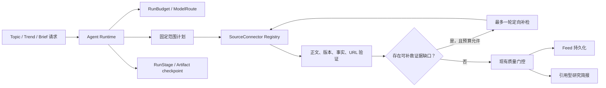

# LetterMate Agent 能力建设方案

**状态：** 待评审
**日期：** 2026-08-08
**依据：** [Agent 能力与企业方案对比研究](./research/agent-capability-benchmark-2026.md)
**范围：** 不包含离线评估建设；聚焦 Agent 产品能力、运行可靠性、成本治理和人机协作。

## 1. 决策摘要

LetterMate 已经具备受约束的信息发现 Agent 基线，包括多源检索、正文补全、来源证明、精确关键词和版本边界、结构化 AI 输出、URL allowlist、运行租约、幂等任务、兴趣记忆和脱敏日志。

下一阶段不迁移到通用 Agent 框架，也不增加没有业务目标的多 Agent 对话。推荐围绕一条完整的受控研究链路建设：

```text
RunBudget + ModelRoute
        +
RunStage checkpoint/resume
        +
bounded evidence-gap retrieval
        ->
cited research brief
```

这条路线同时具备：

- 用户价值：把持续发现的链接转化为有原文引用的中文研究简报；
- Agent 特征：观察证据缺口、制定受限补检计划、调用工具并重新验证；
- 企业工程能力：预算、模型路由、checkpoint、取消、恢复、版本和成本治理；
- 业务一致性：不扩大 Topic、不降低质量门槛、不允许模型生成来源 URL。

## 2. 方案对比

| 方案 | 用户价值 | 工程价值 | 主要问题 | 决策 |
| --- | --- | --- | --- | --- |
| 只强化 Agent Runtime | 中 | 很高 | 用户难以直接感知 | 作为 P0 基础 |
| Runtime + 受限补检 + 引用简报 | 很高 | 很高 | 需要分阶段建设 | **推荐主线** |
| 通用 Feed/RAG 聊天 | 中低 | 一般 | 同质化，范围容易失控 | 暂缓 |
| 自由协作式多 Agent | 低 | 表面较高 | 随机性、成本和调试复杂度高 | 不采用 |
| 全面 MCP 化 Connector | 当前低 | 中 | 扩大认证和工具信任边界 | 满足触发条件后再做 |
| 迁移 LangGraph、Temporal 或云 Agent Runtime | 当前低 | 高 | 与 BullMQ、Prisma 状态重叠 | 参考模式，不迁移 |

## 3. 目标架构



`Agent Runtime` 是编排模块，不替代现有业务模块。关键词规则、来源验证、去重和质量判断继续由现有 Domain 与 Worker 模块负责。

## 4. P0：运行预算与模型路由

### 4.1 目标

让每类 AI 任务使用明确、可版本化的模型策略，并让每次运行受到可执行的成本与资源上限约束。

### 4.2 建议能力

`ModelRoute` 按任务定义：

- 主模型和允许的 fallback；
- 所需结构化输出、上下文和数据策略能力；
- 输入、输出 Token 与超时上限；
- provider allowlist 和 route version。

首批任务类型：

- `topic_expansion`；
- `trend_classification`；
- `candidate_assessment`；
- `evidence_gap_detection`；
- `brief_synthesis`；
- `feed_localization`；
- `creator_localization`；
- `interest_tagging`。

`RunBudget` 至少限制：

- connector 请求数和每 connector 请求数；
- 抓取总字节、候选总数；
- AI input/output/reasoning Token；
- AI 实际成本；
- follow-up round 和 tool call 数；
- wall-clock deadline；
- 用户日预算和并发配额。

### 4.3 失败语义

- 预算耗尽时停止可选步骤，不降低来源、中文或事实门槛；
- 已完成质量门控的少量结果可以保留；
- 没有合格内容时允许返回零结果；
- 只有 retryable provider/model 错误可以触发受控 fallback；
- 记录 requested model、actual model、route version、Token、cost 和安全错误码。

### 4.4 完成标准

- 不同 AI 任务不再隐式共享单一模型策略；
- 每个运行能说明资源消耗和停止原因；
- fallback 不改变输出契约和业务门槛；
- 日志不包含 prompt、正文、关键词、URL 或模型原始响应。

## 5. P0：阶段 Checkpoint 与恢复

### 5.1 目标

租约继续负责运行所有权；checkpoint 负责避免重试时重复已经完成的外部调用。

### 5.2 建议阶段

```text
plan -> retrieve -> enrich -> assess -> followup -> compose -> persist
```

每个 `RunStage` 保存：

- `runId`、stage、status 和 attempt；
- 输入摘要与工件引用；
- code、policy、prompt 和 model-route version；
- 开始、完成时间和安全错误码。

大正文不放入 BullMQ job data。Redis 只保存运行游标和小型引用，阶段工件由 PostgreSQL 或受控对象存储保存并设置保留期。

### 5.3 恢复规则

只有当输入摘要和全部关键版本一致时，才能复用已完成工件。持久化仍使用事务、租约和幂等键，避免旧 Worker 或旧工件覆盖新运行。

### 5.4 技术决策

首版采用 BullMQ Process Step Jobs + PostgreSQL 工件，不增加 LangGraph、Temporal 或第二套工作流基础设施。

### 5.5 完成标准

- Worker 在 retrieve 或 AI 阶段后退出，重试可以从最近安全阶段继续；
- 不重复抓取、评估或持久化相同工件；
- 旧策略或旧 prompt 产生的工件不会被错误复用；
- 支持运行取消和超时收敛。

## 6. P1：受限证据缺口补检

实现状态：已完成。Topic 和 Trend 已接入单轮补检，使用原计划关键词策略与连接器 allowlist 做
确定性校验；补检阶段可恢复，失败时保留首轮结果，所有新增候选继续经过既有质量管线。

### 6.1 目标

把当前一次性发现管线升级为真正但可控的 Agent 闭环：观察缺口、制定补检动作、再次调用工具、重新验证。

### 6.2 内部缺口类型

- `missing_body`：正文不足；
- `missing_primary_record`：重大声明缺少官方或一手记录；
- `version_ambiguous`：型号或版本不能确定；
- `date_ambiguous`：发布时间或事件时间不足；
- `source_conflict`：标题、正文或来源之间存在冲突。

这些是内部运行工件，不能成为用户可见 trust state、证据数量或来源排名。

### 6.3 执行规则

1. 首轮检索和正文补全完成后生成 `EvidenceGap[]`。
2. 确定性控制器检查 Topic 边界和剩余预算。
3. 模型最多生成一轮精确 query 和 connector capability。
4. 模型不能生成 URL，也不能任意启用远程工具。
5. 补检候选重新经过现有正文、来源、事实、去重和中文门控。
6. 补检失败不影响首轮已经合格的内容。

### 6.4 硬约束

- 默认 `maxFollowupRounds = 1`；
- query 必须包含完整 Topic；
- 具体产品和版本必须保留 required terms；
- 趋势榜单仍只能提供种子；
- 达到请求、Token、成本或 deadline 上限立即停止；
- 无法取得充分证据时允许不生成结果。

### 6.5 完成标准

- 能对可补救缺口执行一次定向补检；
- 不能通过补检扩大精确关键词边界；
- 同一 source 或 candidate fingerprint 不重复调用；
- 所有补检结果仍由现有质量管线决定是否入库。

## 7. P2：有引用的中文研究简报

### 7.1 产品入口

首版只允许从以下上下文主动发起：

- 一个已有 Topic；
- 一个 Feed 条目；
- 用户明确选择的一组 Feed 条目。

不提供无边界的“研究任何内容”聊天入口。

### 7.2 输出结构

- 发生了什么；
- 按原始发布时间组织的时间线；
- 与精确 Topic 或版本的关系；
- 来源之间的一致与冲突；
- 尚无充分证据的未决事项；
- 逐段或逐事实的原文引用。

### 7.3 引用约束

- 简报只读取 LetterMate 已验证来源；
- 模型输出稳定 `sourceId`，服务端负责映射 URL；
- 引用必须属于当前简报来源快照；
- 模型不能新增、改写或猜测 URL；
- 冲突内容并列展示，不由模型制造确定结论；
- 没有充分材料时允许短报告或零结果。

### 7.4 快照与控制

简报保存：

- `asOf`；
- Topic 或 Feed 输入快照；
- 来源集合；
- policy、prompt 和 model-route version；
- 最终中文内容与引用关系。

用户可以查看进度、取消、重试和导出 Markdown。简报不能自动修改 Topic、兴趣记忆、Feed 或外部平台。

### 7.5 完成标准

- 每个关键事实都有有效来源引用；
- 简报完全基于已验证来源池；
- 同一输入和版本可以解释或重放生成依据；
- 冲突、未知和零结果具有明确界面状态；
- 320px、移动端、平板和桌面流程可用。

## 8. P3：定点人机协作

当前不建设通用 HITL 审批引擎，只在真正需要用户授权的位置使用：

- 保留 Creator 身份候选确认；
- Agent 可以提出后续精确 Topic 建议，用户确认后才能创建；
- 未来外部写操作必须展示工具和参数并要求确认；
- 超预算重跑、改变数据策略等操作可以要求管理员审批。

来源冲突不能通过人工点击“批准”为事实，只能作为未决信息保存。

## 9. 保持不变的业务边界

- Web 只调用 LetterMate API，凭据和授权头保留在服务端；
- 完整关键词、型号和版本边界不可扩大；
- 趋势列表只产生搜索种子；
- 最终 Feed、邮件和简报引用必须来自验证过的 HTTP(S) 来源；
- 个性化不能降低内容质量门槛；
- 用户所有权检查覆盖运行、工件、简报和引用；
- 外部内容始终是不可信数据，不能改变工具、预算和停止条件；
- 不展示可信分、证据数量、来源排名或内部 AI 判断；
- 没有合格内容是正常结果。

## 10. 明确不做

- 不引入自由文本 Agent memory；
- 不把用户兴趣压缩成单一平均向量；
- 不增加 Planner、Researcher、Critic、Writer 之间的自由对话；
- 不迁移 AutoGen、CrewAI、Semantic Kernel 或云厂商 Agent Runtime；
- 不让模型动态发现任意 MCP Tool；
- 不增加自动发帖、点赞、外部关注或第三方资源修改；
- 不用通用聊天框替代明确的 Topic、Feed 和简报工作流；
- 不在当前规模引入 Temporal 或独立向量数据库。

## 11. 风险与控制

| 风险 | 控制方式 |
| --- | --- |
| 补检扩大 Topic | required terms、query validator、最多一轮 |
| 模型发明来源 | 只输出 source/candidate ID，服务端映射 URL |
| 长任务重复付费 | stage checkpoint、input digest、幂等工件 |
| fallback 改变质量 | 固定 route version、能力约束、输出 schema |
| 成本失控 | run/user 日预算、Token/cost/tool/wall-clock 上限 |
| Prompt injection | 来源字段视为不可信数据，工具和停止条件由代码控制 |
| 引用与事实不匹配 | claim-source validator、引用必须属于来源快照 |
| 数据泄露 | 所有权检查、脱敏日志、默认不记录 prompt 和正文 |
| 架构过重 | 复用 BullMQ、Prisma、AiGateway 和 Connector Registry |

## 12. 推荐开发顺序

1. `ModelRoute + RunBudget + AiUsage`；
2. `RunStage + Artifact + checkpoint/resume`；
3. `EvidenceGap + bounded follow-up retrieval`；
4. `ResearchBrief + Claim + Citation`；
5. 研究简报 Web 流程、取消、重试和 Markdown 导出；
6. 有真实业务需求后再评估后续 Topic 建议、MCP 或 Temporal。

每一阶段必须独立可交付，不能以“未来简报会使用”为理由提前建设通用框架。

## 13. 项目表达

完成本路线后，LetterMate 可以准确描述为：

> 一个面向技术信息发现的长期运行 Agent。系统使用类型化多源工具、精确关键词约束和来源证明进行持续检索，通过有预算的证据缺口闭环补检提高有效发现，并以可恢复的阶段状态、任务级模型路由和成本治理生成带原文引用的中文研究简报。

这个表述强调真实业务和工程约束，不依赖“多 Agent 数量”或特定框架名称制造亮点。
