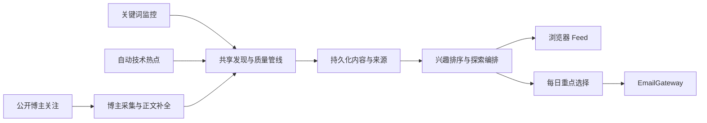

# LetterMate 个性化发现技术方案

**状态：** 当前架构上的下一阶段设计
**更新日期：** 2026-08-08

## 1. 当前状态

当前代码已经形成两条可运行的发现管线：

```text
Topic keyword -> connectors -> enrichment -> quality gates -> DiscoveryItem
Trend sources -> TrendSeed -> connectors -> enrichment -> quality gates -> RadarItem
DiscoveryItem + RadarItem -> unified Feed API -> React Web
```

已实现 Topic 管理与调度、14 个主发现连接器、6 个趋势输入、正文和事实支持门控、去重、中文内容生成、统一 Feed、已入库搜索、手动刷新、运行租约和离线测试。博主关注已完成 RSS/Atom、X 与 Bilibili 三个切片，包括统一身份确认、订阅生命周期、独立队列、每日调度、完整有效内容档案、质量门控和 Creator Feed 来源。

RSS/Atom、X 与 Bilibili 已接入统一身份基础：支持名字、Handle、平台主页、Feed URL、RSS/Atom 自动发现、身份预览、短期确认令牌、批量原子创建契约和平台能力展示。X 订阅固定 provider 稳定用户 ID，按账号时间线同步原创、引用、纯转发、连续帖和带父帖上下文的高价值回复。Bilibili 订阅固定 `mid`，通过公开卡片接口刷新身份，并以 WBI 搜索分页和稳定 `mid` 过滤同步公开视频。未通过精选的结构有效内容仍保留在 Creator 档案中，并可在 Web 博主内容页查看；转发与回复会保留原帖入口和上下文。统一 Feed 已按规范化 URL、稳定内容 ID 和内容指纹合并 Topic、Trend 与 Creator，并返回全部 `origins[]`。Feed 显式反馈已实现持久化、幂等切换、取消、合并内容共享状态和用户所有权保护。Bluesky、YouTube 的博主适配器、兴趣排序、探索推荐和邮件发送尚未实现。身份层仍信任开发用 `x-user-id`，不能直接用于不可信网络。

## 2. 目标架构

下一阶段不替换现有发现管线，而是增加一个博主入口、一个个性化选择层和一个邮件出口：



核心约束：

- 质量门控先于个性化；偏好不能使不合格内容入库。
- 发现、排序和交付分离；邮件失败不影响 Feed 和发现调度。
- 所有跨应用结构进入共享 contracts，业务规则进入 domain，提供商代码留在适配层。
- 当前表和 API 以增量方式扩展，避免为了个性化重写已稳定的 Topic/Trend 管线。

## 3. 模块边界

| 模块 | 当前职责 | 下一阶段增量 |
| --- | --- | --- |
| React Web | Topic、Feed、筛选、刷新和详情 | 博主、反馈、探索标记和邮件设置 |
| NestJS API | 用户边界、验证、Feed 合并和任务入队 | 博主/反馈/邮件端点与个性化 Feed |
| Worker connectors | 多来源候选标准化 | 可按稳定账号身份拉取内容的博主适配器 |
| Worker discovery | Topic/Trend 编排与质量管线 | 关键词意图、博主内容评审和兴趣标签 |
| Schedulers/BullMQ | Topic/Trend 定时运行 | 博主采集和每日邮件任务 |
| PostgreSQL/Prisma | Topic、Trend、运行和发现结果 | 博主、反馈、兴趣权重和邮件记录 |
| packages/contracts | API 与任务 DTO | Creator、Feedback、Digest 和扩展 Feed 契约 |
| packages/domain | 关键词、来源、质量和去重规则 | 兴趣权重、探索配额和邮件选择规则 |

## 4. 关键词监控

### 4.1 用户模型

Web 将“主题”统一改称“关键词监控”。用户只编辑一个主关键词；查询变体是内部检索数据，不再作为必填配置或主要交互暴露。

### 4.2 内部意图

Worker 为关键词建立提供商无关的内部 `KeywordProfile`：

- `entity`：具体产品、项目、型号或版本，查询优先覆盖发布、可用性、价格、能力变化和重大问题；
- `domain`：领域或主题，查询优先覆盖重要发布、研究、工具和行业变化；
- `unknown`：分类失败时沿用当前完整关键词检索，不扩大语义范围。

该分类不由用户选择。主关键词变更后 profile 失效并在下一次运行重建。无论 profile 为何，候选都必须通过现有完整关键词与必要标识符门控。

查询变体可以改变大小写、空格和标点，或增加 release、update 等有限意图词；不得删除版本段、替换实体或创建宽泛近义词。

### 4.3 兼容策略

数据库继续保留 `Topic` 作为内部模型，避免无价值的全仓库重命名。API 可以继续使用 `/topics`，但 Web 文案和产品文档统一使用“关键词监控”。现有历史关键词快照、软删除和运行记录保持不变。

## 5. 博主关注

### 5.1 来源契约

博主创建分为身份解析和持续同步两步。新增 `CreatorIdentityResolver`，接收名字、Handle、公开主页 URL 或 RSS/Atom URL，返回零到多个 `CreatorIdentityCandidate`：

- 平台、稳定账号 ID 和规范化主页 URL；
- 展示名、Handle、头像、简介和平台认证状态；
- `enabled | not_configured` 能力状态；
- 短期、服务端可验证的 `resolutionToken`，供确认创建使用。

名字和 Handle 默认在所有已启用 Creator 平台中并发解析；URL 先路由到对应平台或 Feed 解析器。只有带 `@` 的 Handle 和平台主页 URL 走精确账号查询；其他裸文本（包括单个不完整词）交给平台原生搜索并按平台相关度返回，不在本地猜测子串关系。客户端不能提交自造的稳定账号 ID。`POST /creators` 只接受一个或多个未过期 `resolutionToken`，服务端重新校验平台身份后创建独立订阅。未配置平台可以显示在能力列表中，但不返回可创建的候选。

`CreatorConnector` 输入已确认且规范化的公开账号引用，输出：

- 平台和稳定账号 ID；
- 账号主页 HTTP(S) URL；
- 内容外部 ID、发布时间和原始 URL；
- `original | repost | reply` 类型及可获取正文；
- 转发的原作者和原内容引用；
- 回复的父帖上下文及连续帖归并信息。

连接器必须固定平台账号 ID，后续运行不得仅依赖可变展示名或 Handle。改名更新展示信息但不创建新订阅；账号不存在、封禁或转私密时进入 `unavailable`，保留历史并按退避策略重试。单个平台失败与现有连接器一样隔离，不阻塞其他博主。

RSS/Atom、X 与 Bilibili 已实现身份和采集链路。Bluesky 和 YouTube Creator 暂未实现。只使用官方 API、公开端点、已配置的合规中转服务或公开 Feed。

### 5.2 数据模型

- `CreatorSubscription`：用户、平台、稳定账号 ID、主页 URL、展示信息、启用状态、可用状态、下次运行时间和租约。同一用户不能重复关注同一平台账号；同一个人在不同平台的账号分别订阅。
- `CreatorRun`：触发方式、状态、时间、候选数、新增数和安全错误。
- `CreatorItem`：某个订阅账号发布、转发或回复公开内容的记录，包含平台内容 ID、类型、原始 URL、作者、原作者、父帖上下文、发布时间、内容指纹、质量结果和 `feedEligible`。

博主页面读取全部成功解析且通过结构、安全和来源校验的 `CreatorItem`，包括低优先级内容。内容质量只决定 `feedEligible`；只有 `feedEligible=true` 的条目进入统一 Feed、生成中文内容并成为每日邮件候选。无效、来源不可验证或重复条目不持久化为可浏览内容。

### 5.3 调度与去重

博主使用独立队列和持久化 `nextRunAt`，沿用现有租约、幂等任务 ID、失败隔离和手动刷新模式。平台内容 ID、规范化 URL 和指纹用于精确及近似去重。

CreatorItem 保留每个博主的发布或转发行为。统一 Feed 在读取时按平台原内容 ID、规范化主 URL 和内容指纹合并 Topic、Trend 和多个 Creator 条目，并返回 `origins[]`、原作者及推荐/转发账号；跨入口命中的同一内容只渲染一次，每日邮件也只选择一次。多个已关注博主转发可增加排序信号，但不能改变 `feedEligible`。

### 5.4 平台切片

**X Creator 切片（已实现）：** 复用 TwitterAPI.io 的鉴权与安全错误语义，通过用户资料/搜索接口解析账号并固定稳定用户 ID；按账号时间线增量同步原创、引用、纯转发、连续帖和高价值回复。纯转发保留原作者与原帖，回复缺少父帖时通过批量帖子接口补取，连续帖通过线程上下文归并，简短社交回复在质量判断前过滤。

**Bilibili Creator 切片（已实现）：** UP 主名称通过 WBI 用户搜索解析，空间主页通过公开卡片接口校验，订阅固定稳定 `mid`。同步先按 `mid` 刷新当前名称，再分页搜索公开视频并严格过滤 `mid`；这避免依赖可变名称，同时不使用 Cookie、登录态或验证码绕过。空间稿件接口在当前环境返回 `-352`，因此不作为运行前提。`412`、`-352`、限流或接口不可用只使该账号运行失败。第一版不包含动态和专栏。

## 6. 兴趣与探索

完整的兴趣记忆、模块界面、数据模型、排序与分期方案见 [LetterMate 兴趣记忆与个性化发现设计](./personalization-memory-design.md)；开源与企业一手资料见 [兴趣记忆与个性化发现研究](./research/personalization-memory-systems.md)。

### 6.1 信号

已实现两种显式反馈：`interested | less`。`ContentFeedback` 以 `(userId, contentKey)` 唯一，Feed DTO 返回 `feedback: interested | less | null`，使跨来源合并后的同一内容共享反馈。`PUT /feedback/:contentKey` 重复写入幂等，切换时覆盖，`null` 清除；写入前必须证明该内容属于当前用户可见的 Topic、Trend 或有效 Creator Feed，未知和跨用户目标统一返回 `404`。

内容生成阶段为最终合格条目产生有限、规范化的 `interestTags`。标签只用于排序，不参与事实判断，也不向用户表示可信度。

用户的兴趣权重来自：

- 活动关键词监控；
- 活动博主关注；
- 对内容的 `interested | less` 反馈。

活动博主只从其 `feedEligible=true` 内容中贡献有限兴趣标签，不能把该博主涉及的所有主题都视为强兴趣。显式反馈权重高于博主推断；取消关注后停止新增该信号，但保留历史反馈。点击和未反馈不改变权重。重复提交同一反馈必须幂等，切换反馈时撤销旧权重后应用新权重。

### 6.2 排序

Feed 先取得通过当前筛选的合格内容，再计算稳定排序：

1. 用户明确订阅的直接命中；
2. 兴趣标签得分；
3. `hot | quality` 与信息增量；
4. `publishedAt ?? discoveredAt`；
5. ID。

搜索结果仍以文本相关性为主，兴趣得分只作为相同相关度下的次级排序，避免个性化破坏明确搜索意图。

### 6.3 探索

探索候选必须满足质量门槛、未被用户明确排斥，且来自已有正向兴趣的相邻技术标签。服务端在普通排序之后按稳定规则插入，最多每 10 条出现 1 条；不足 10 条时允许没有探索内容。

Feed DTO 返回 `isExploration`。邮件选择器始终排除该字段为真的条目。

## 7. 每日邮件

### 7.1 数据与窗口

- `DigestPreference`：用户、启用状态和本地发送时间；时区使用 User 的 IANA timezone。
- `DigestRun`：用户、候选窗口、状态、计划日期、发送时间、提供商消息 ID 和安全错误。
- `DigestItem`：某次邮件包含的规范化内容键、顺序和内容快照。

每次运行的窗口从该用户最近一次成功发送的窗口终点开始，到本次任务创建时间结束。没有合格内容时记录 `skipped` 终态但不调用邮件服务，使下一天不会反复扫描同一批不合格候选。

### 7.2 选择与投递

邮件选择器复用个性化得分，从关键词、自动热点和博主高价值内容中选择最多 10 条，并排除探索内容和已经成功投递的规范化内容键。

新增服务端 `EmailGateway`，生产适配器负责发送，Fake 适配器用于默认测试。模板只接收已持久化的中文标题、摘要、推荐理由和原始链接，不访问外部正文，也不再次调用 AI。

同一用户和计划日期只能有一个有效 `DigestRun`。任务重试复用同一运行与内容快照；只有提供商确认成功后才提交成功终态。失败不会推进成功投递边界。

### 7.3 调度

邮件调度器按短周期扫描在其本地时间已经到期且当天尚无终态运行的用户，创建持久化运行后再入队。夏令时和服务中断恢复以用户时区的计划日期判定，每个本地日期最多发送一次。

## 8. API 与契约

现有端点保持兼容，新增：

| Method | Path | 行为 |
| --- | --- | --- |
| `POST` | `/topics/:id/pause` | 暂停关键词监控，保留历史内容并停止后续调度 |
| `POST` | `/topics/:id/resume` | 恢复关键词监控并安全排队一次刷新 |
| `POST` | `/creators/resolve` | 用名字、Handle、主页 URL 或 RSS/Atom URL 返回可核验身份候选和创建令牌 |
| `POST` | `/creators` | 用一个或多个身份解析令牌创建独立关注 |
| `GET` | `/creators` | 返回当前用户的关注与安全运行状态 |
| `PATCH` | `/creators/:id` | 暂停或恢复关注 |
| `DELETE` | `/creators/:id` | 取消关注并保留历史内容 |
| `POST` | `/creators/:id/refresh` | 手动刷新单个博主 |
| `GET` | `/creators/:id/items` | 分页读取该账号的全部有效公开内容 |
| `PUT` | `/feedback/:contentKey` | 幂等设置或清除内容反馈 |
| `GET` | `/digest-preference` | 读取每日邮件设置和最近运行摘要 |
| `PUT` | `/digest-preference` | 启用、停用或修改本地发送时间 |

`GET /feed` 的 `origin` 扩展为 `all | topic | trend | creator`，条目增加 `origins[]`、反馈状态和 `isExploration`。所有输入由共享 schema 验证，跨用户资源继续返回 `404`。

## 9. 质量、安全与隐私

- Creator 内容进入 Feed 前复用正文补全、事实支持、历史增量、去重和 AI 评审。
- 博主身份候选必须来自平台或 Feed 的结构化响应，并验证平台响应与主页 URL；AI 只能提示疑似冒充风险，不能生成候选、猜测账号或链接。
- 转发必须保留原作者和原内容引用，回复必须保留父帖上下文；缺失必要上下文时不能成为 `feedEligible` 内容。
- 邮件地址、平台凭据和邮件服务凭据不得进入客户端、日志、错误响应或测试快照。
- 退订每日邮件只停用交付，不删除 Feed、监控、博主或历史邮件记录。
- 用户数据和运行记录继续执行现有所有权边界；生产交付前替换固定 `x-user-id`。
- 外部正文和博主页面抓取继续执行 SSRF、MIME、大小、重定向和超时限制。

## 10. 测试策略

最高层验证边界是：用户配置关键词或博主后，固定来源产生候选，质量管线筛选，结果进入个性化 Feed，并在适用时进入下一封每日邮件。

- 单元测试：关键词 profile、兴趣权重、稳定排序、探索配额、邮件窗口和幂等选择。
- API/数据库集成测试：名字/Handle/URL 解析、令牌篡改与过期、多选创建、重复账号、所有权、Creator 生命周期、跨来源合并、反馈切换、邮件运行状态和失败恢复。
- Worker 集成测试：CreatorConnector Fake、稳定账号 ID、改名与不可用恢复、X 转发/回复上下文、Bilibili 视频分页、博主调度、质量管线复用和邮件 Fake。
- Playwright：跨平台候选确认、未配置平台状态、多选关注、关注/暂停博主、全部内容与重点内容分层、Feed 合并、反馈、探索标记、邮件设置和响应式布局。
- 默认测试不联网；live smoke test 使用显式开关和对应凭据。

涉及 Prisma schema 的每个切片都必须生成 Prisma Client 并提交迁移。最终依次运行：

```powershell
npm run db:generate
npm run db:deploy
npm run lint
npm run typecheck
npm test
npm run build
npm run test:e2e
```

## 11. 交付顺序

1. RSS/Atom 关注补身份解析与确认，替换“URL 直接创建”的临时交互。
2. X Creator 切片：账号候选、身份确认、时间线增量、转发和带原帖的高价值回复，可独立上线。
3. Bilibili Creator 切片（已完成）：UP 主候选、身份确认和公开视频增量；公开动态与专栏后续单独交付。
4. Creator 全部有效内容档案、跨来源合并和 Feed 去重（已完成）。
5. 兴趣反馈（已完成）、个性化筛选与探索推荐。
6. 每日重点邮件。

### 11.1 共享身份基础（已完成）

1. 在 contracts 中增加解析输入、候选、平台能力和批量创建 schema；候选只暴露短期 `resolutionToken`，不把客户端字段作为账号事实。
2. 在 API 增加 Resolver registry、令牌签发/校验、`POST /creators/resolve` 和令牌式 `POST /creators`；保留现有 URL 创建路径一个迁移周期，仅供旧客户端兼容。
3. 为 RSS/Atom 增加 Feed 标题、作者和站点主页解析，返回单一候选预览。
4. Web 将 URL 表单替换为统一搜索框、平台状态、候选列表和多选确认；未配置平台可见但不可选。
5. 完成离线 resolver fixtures、令牌篡改/过期、重复账号、多选原子性和所有权测试。

完成条件：名字、Handle 或普通主页即使暂时没有匹配，也会得到明确结果；RSS URL 不再未经预览直接创建；旧 RSS 关注继续运行。

### 11.2 X Creator 切片

1. 基于 TwitterAPI.io 实现用户搜索、主页/Handle 精确解析和稳定用户 ID 固定。
2. 实现按账号时间线和游标增量同步，规范化原创、连续帖、引用、纯转发及回复。
3. 转发保存原作者和原内容，回复补父帖并合并连续上下文；缺少父帖的回复不进入 Feed。
4. 扩展 CreatorItem 和 Feed 合并所需字段，保留全部有效账号内容，只让 `feedEligible` 内容进入 Feed 和邮件候选。
5. 增加改名、账号不可用、限流、重试、幂等游标、跨博主转发去重和 Web 用户闭环测试。
6. 使用显式 live smoke 开关验证一个账号搜索和一次时间线读取；测试及日志不得输出 Key。

完成条件：用户输入 X 名字、Handle 或主页，确认候选后可独立完成首次同步、每日增量、手动刷新、暂停/恢复和取消；高质量转发及带原帖回复正确展示；X 完成即可上线。

### 11.3 Bilibili Creator 切片（已完成）

1. 实现 UP 主名字搜索、空间主页解析和稳定 `mid` 固定。
2. 实现公开视频列表分页和发布时间游标增量，复用现有 Bilibili 请求限制与安全错误映射。
3. 将视频标题、简介、封面元数据和原始链接规范化为 CreatorItem；正文不足的视频可留在博主详情页，但不能进入 Feed。
4. 增加改名、空账号、分页幂等、`412`、限流、暂不可用恢复和 X/RSS 故障隔离测试。
5. 完成候选确认、视频列表和状态展示的 Web/E2E 验收；真实接口只通过显式 live smoke 开关运行。

完成条件：用户输入 UP 主名字或空间主页，确认候选后可完成公开视频首次同步和每日增量；Bilibili 故障不影响 X、RSS、Topic 或 Trend。动态和专栏不阻塞本切片验收。

真实认证、生产邮件供应商配置和外部连接器目标环境验收是正式部署的共同前置条件。
