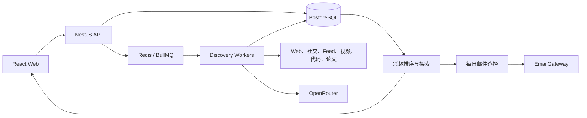

# LetterMate 技术方案

**状态：** 当前实现基线

**更新日期：** 2026-08-10

## 1. 架构

LetterMate 是 npm workspaces 单仓库：React/Vite Web、NestJS API、BullMQ Worker、PostgreSQL/Prisma 和 Redis。



### AI Runtime

Worker 通过统一 AI Runtime 隐藏模型供应商、任务路由、预算和用量持久化。Topic、Trend、
Creator 在取得运行租约后创建 `{ runKind, runId, userId }` 执行上下文，并将它传给该运行内
的扩展、分类、质量判断、中文编排、本地化和兴趣标签任务。

- `ModelRoute` 将快速分类、质量生成和中文本地化映射到独立模型，支持有序模型与 provider fallback。
- `RunBudget` 在网络请求前用可串行化事务原子预留调用、输入、最大输出和成本额度；超限时不调用上游。
- `AiUsage` 记录请求/实际模型、provider、token、缓存/推理 token、成本、状态和安全错误码。
- 预算采用保守预留且不因失败或较低实际用量返还，防止重试循环突破运行成本上限。
- 同一运行固定 AI policy 版本，运行中修改路由或预算不会产生混合策略结果。

兴趣标签回填没有运行上下文，因此不会写入某个在线发现运行的预算账本。

### RunStage Checkpoint

阶段恢复通过 `RunStageManager.run` 提供单一 seam。调用方只需提供运行上下文、阶段名、输入值和
执行函数；Manager 对输入做稳定 JSON 摘要，并把 `policyVersion`、`routeVersion` 一并纳入复用键。
成功结果写入 `RunArtifact`，失败只保留安全错误码；工件超过大小上限时返回当前结果但不持久化。

Topic、Trend、Creator 已在检索、评估、质量门控、编排等外部调用前接入该 seam。可重试失败保持原
`runId` 为 queued，下一次 BullMQ claim 恢复同一运行；最终失败清除租约。旧输入、旧策略或旧
route version 不会复用工件，完整正文也不会进入 BullMQ job data。

### Evidence-gap Follow-up

Topic 和每个已接受的 Trend 种子在首轮连接器检索后，可以通过 `EvidenceGapRetriever.retrieve`
执行至多一轮证据补检索。该模块隐藏缺口判断、策略校验、查询收敛、连接器调用、结果合并和
checkpoint；调用方只提供原始 `SourceQueryPlan`、首轮 `ConnectorSearchSummary` 与运行上下文。

- 仅允许 `missing_body | missing_primary_record | version_ambiguous | date_ambiguous | source_conflict` 五类内部缺口；证据充分时返回空决策。
- 补检索查询必须同时满足原计划的完整 `KeywordPolicy` 和决策中的全部 `requiredTerms`，因此 Topic、产品名和版本边界不能被放宽。
- 连接器只能从原计划 `connectorIds` 中选择，最多 4 个；补检索最多返回 12 个候选，且只执行一轮。
- AI 输出不得包含 URL；最终 URL 仍只能来自连接器，并继续经过 HTTP(S) 来源证明校验和既有质量管线。
- 首轮与补检索结果按规范化 URL 合并。AI 或连接器补检索失败时保留首轮结果，不把可选增强升级为整次运行失败。
- `followup` 阶段由 `RunStageManager` 持久化；同一输入恢复时不会重复消耗 AI 和连接器请求。

Creator 归档不接入该能力，因为它按已固定的作者来源抓取，不存在跨连接器证据补检索的业务需求。

核心约束：

- Web 只调用 LetterMate API，不持有 AI、平台或邮件凭据。
- 趋势榜单只产生搜索种子，不能直接产生 Feed 或邮件内容。
- 质量门控先于个性化，兴趣不能让不合格内容进入 Feed。
- 精确关键词和版本边界不可被查询扩展破坏。
- 最终内容必须有经过验证的 HTTP(S) 原始来源，并执行用户所有权检查。

## 2. 模块边界

| 模块 | 职责 |
| --- | --- |
| `apps/web` | Feed、关键词、博主、兴趣记忆和每日邮件界面 |
| `apps/api` | 输入验证、用户边界、Feed 合并、状态查询和任务入队 |
| `apps/worker` | 来源连接器、质量管线、AI 网关、调度器和队列消费者 |
| `packages/contracts` | API、Web 与 Worker 共享的 Zod 契约 |
| `packages/domain` | 关键词、质量、去重、兴趣排序和探索规则 |
| `packages/config` | 服务端环境配置和安全默认值 |
| `prisma` | 数据模型和迁移 |

提供商实现必须留在适配层。公共数据结构进入 `packages/contracts`，跨入口业务规则进入 `packages/domain`。

## 3. 发现管线

Topic 和 Trend 共用主发现流程：

1. 精确关键词或趋势种子生成有限查询计划。
2. 已启用连接器并发检索候选。
3. 在严格保留原查询边界的前提下，按需执行至多一轮证据缺口补检索。
4. 验证 URL、来源证明和正文可用性。
5. 执行事实支持、历史增量和精确/近似去重。
6. AI 只从验证后的候选中选择并生成中文标题、摘要和推荐理由。
7. 结果持久化后进入统一 Feed。

Topic 使用 6/12/24 小时自适应周期。TrendMonitor 使用持久化周期。调度、手动刷新和故障恢复都复用运行租约和幂等任务边界。

Topic 与 Trend 编排通过可选遥测接口输出 `plan | collect | classify | retrieve | quality_gate | persist` 阶段事件。事件只包含运行 ID、耗时和聚合输入/输出/失败数量；不包含用户、关键词、URL、正文或供应商响应。遥测 Adapter 的失败不会改变发现运行结果。

离线 Agent 评估使用版本化的 expected/forbidden URL golden fixtures，对最终结果计算预期召回、禁止命中率、HTTP(S) 来源覆盖、中文内容覆盖和重复率。评估接口位于 Domain，CLI 是独立 Adapter；默认不联网，未达到门槛时返回非零状态，可直接接入 CI。仓库内 fixtures 用于验证质量边界和评估机制，不代表真实线上效果基准。

## 4. 博主关注

博主创建分为身份解析和确认创建：

- 用户输入名字、Handle、主页 URL 或 RSS/Atom URL。
- Resolver 只从平台或 Feed 的结构化响应产生候选。
- 客户端只能提交短期 `resolutionToken`，不能自造账号 ID。
- 订阅固定平台稳定账号 ID，改名不会创建新关注。

当前实现 RSS/Atom、X、Bilibili、YouTube 和 Bluesky 博主内容。X 支持原创、连续帖、引用、转发和带父帖上下文的高价值回复；转发保留原作者，回复缺少父帖时不能进入 Feed。YouTube Resolver 将频道名、Handle 或频道主页解析为稳定 `channelId`，Connector 读取频道 uploads playlist 并用视频详情接口补充描述、发布时间和公开互动数据。Bilibili 订阅固定 `mid`，并行读取公开 WBI 视频搜索与公开动态流；动态流覆盖纯动态、专栏、Opus、视频卡片和转发动态。视频卡片按 `bvid` 与公开视频去重；转发使用发布者动态作为主链接，并保存原作者、原动态 ID、原帖链接和原文上下文。无法解析原帖的转发不会进入候选池。Bilibili 对视频和动态接口独立风控；动态流受限、限流或暂时异常时降级为公开视频同步，不把整个博主标记为不可用，父级任务取消仍会立即终止同步。Bluesky Resolver 通过公开 Actor 搜索、Handle 解析和 Profile 接口得到稳定 DID；Connector 使用 `app.bsky.feed.getAuthorFeed`，按 DID 校验作者，保留原创、引用、转发和带父帖上下文的回复，缺失父帖的回复不进入候选池。

Creator 同步状态使用 `queued | running | succeeded | degraded | failed`。当连接器返回有效候选且同时报告安全的来源降级信息时，运行保存为 `degraded`，并仅记录来源标识、受控错误码和是否可重试；不保存 provider 原始响应、URL 或账号数据。降级状态仍是终态，允许下一次自动或手动同步。

`CreatorItem` 保存全部结构有效且已中文化的公开内容；只有 `feedEligible=true` 的内容进入 Feed 和邮件候选。单个平台失败不阻塞其他博主、Topic 或 Trend。

## 5. Feed、兴趣与探索

兴趣投影只把活动 Topic、显式反馈和满足重复证据门槛的 Creator 标签作为画像信号。Creator 自动信号要求同一高置信 `topic | entity` 标签至少出现在两篇不同内容、两个不同自然日中；`content_type` 和单篇标签仅保留为内容元数据，不进入用户画像。该门槛在投影时计算，因此旧画像会在下一次选择或兴趣查看时自动重建，无需数据迁移。

`less` 同时包含内容级和主题级作用：评分器始终对当前 `contentKey` 应用直接惩罚，不依赖标签提取是否成功；存在高置信标签时再通过负向画像降低相似内容。Topic 与 Creator 内容仍属于保护集合，不被删除，但可以降序。客户端保存反馈后使 Feed 和兴趣记忆查询失效，立即获取新的排序与画像。

统一 Feed 按平台内容 ID、规范化 URL 和内容指纹合并 Topic、Trend 与 Creator，并返回全部 `origins[]`。

兴趣信号来自：

- 活动关键词；
- 活动博主的合格内容；
- `interested | less` 显式反馈。

Feed 先完成质量和筛选，再应用稳定兴趣排序。明确订阅不会因负向偏好消失。探索内容来自正向兴趣的相邻技术标签，最多约 10%，候选不足时为零，并永久排除在每日邮件之外。

## 6. 每日研究简报

数据模型：

- `DigestPreference`：启用状态、本地发送时间、规范化收件地址及其 `unverified | pending | verified | suppressed` 状态，以及当前唯一 `unsubscribeTokenId`；时区来自 User。
- `DigestEmailVerification`：绑定用户和收件地址的一次性验证记录。原始 Token 只进入验证邮件，数据库仅保存 SHA-256 哈希、失效时间和使用时间。
- `EmailDeliveryEvent`：只保存供应商、Svix 事件 ID、允许列表内的规范化事件类型、结果、供应商消息 ID 和发生时间；唯一约束保证长期幂等，不保存原始 payload、邮件正文或收件地址。
- `DigestTestEmail`：独立测试投递记录，冻结当前已验证地址、幂等桶、状态、租约和安全错误码；不属于日报运行历史。
- `DigestRun`：计划日期、选择窗口、冻结的已验证收件地址与退订令牌 ID、状态、租约、安全错误和提供商消息 ID。
- `DigestItem`：冻结的内容键、顺序、中文结论、证据、不确定性、后续关注点、平台、发布时间和原始引用快照。

调度器只扫描 `enabled=true`、`recipientStatus=verified` 且地址非空的偏好，并在事务内再次校验同一地址仍有资格。没有合格内容时创建 `skipped` 运行但不调用邮件服务。`DigestRun.recipientEmail` 与内容快照在创建时一起冻结；任务领取和重试只读取该字段，不重新读取登录邮箱或可变偏好。失败不推进成功窗口。

退订令牌由随机 UUID 标识和 `EMAIL_UNSUBSCRIBE_SECRET` HMAC 签名组成，不携带用户 ID 或邮箱。调度事务要求偏好中的地址和令牌 ID 同时匹配，并把两者冻结到 `DigestRun`。Worker 由冻结 ID 生成浏览器 GET 链接与 RFC 8058 POST 地址；`EmailGateway` 只允许透传 `List-Unsubscribe` 和 `List-Unsubscribe-Post`。公开 API 先验证签名，再用当前唯一令牌 ID 条件更新 `enabled=false`，因此重复或并发请求幂等。地址验证重启与从关闭状态重新启用都会轮换 ID，旧签名即被撤销；历史运行和内容不修改。

收件地址验证与登录身份分离：已登录用户通过 API 提交地址，服务端规范化后废弃该用户全部未使用 Token，把地址置为 `pending`、原子设置 `enabled=false`，并向独立 BullMQ 队列写入验证任务。Token 使用 32 字节随机值、24 小时有效期，验证请求按用户、地址和客户端 IP 的哈希键执行进程内限频。公开确认端点只接收 Token；事务以单次 claim 更新记录，并仅在当前偏好仍指向同一 `pending` 地址时切换为 `verified`。启用操作本身使用带 `recipientStatus=verified` 条件的数据库更新，避免与地址变更并发时重新打开调度。浏览器不会接触邮件供应商凭据，也不会获得代表用户邮箱发信的权限。

Resend Webhook 使用 Nest 保留的原始请求字节、`svix-id`、`svix-timestamp` 和 `svix-signature` 验签。解析层只接受明确支持的投递事件，并把 bounce type 作为开放字符串处理：只有大小写归一后的 `Permanent` 被视为永久退信，`Temporary | Transient | Undetermined` 及未来未知值都按暂时事件处理。投诉和供应商抑制属于永久事件；延迟和一般失败只记录，不停发。关联层只查询 `DigestEmailVerification`、`DigestTestEmail` 和 `DigestRun` 已保存的 `providerMessageId`；未知 ID 记录为 `unmatched`，同一 ID 映射到冲突用户或地址时记录为 `conflict`，两者都不修改偏好。永久事件只在唯一归属成立时原子设置 `enabled=false`、`recipientStatus=suppressed` 和安全原因/时间。原地址随后不能重新验证，更换地址时清除抑制字段并回到正常验证流程。

测试邮件使用独立 `digest-test-email` 队列。API 只为当前已验证地址创建记录，按用户每小时最多创建 3 个，并用“5 分钟时间桶 + 地址哈希”复用并发或重复请求；事务用用户级 advisory lock 串行化限频与幂等判断。Worker 领取时只读取记录中冻结的地址，使用 `digest-test:<id>` 供应商幂等键，并把状态更新为 `queued | running | retrying | succeeded | failed`。公开给浏览器的状态不包含地址、供应商消息 ID 或原始错误。测试成功不会修改 `DigestRun`、`DigestItem` 或上次成功发送窗口。

邮件快照在 Topic、Trend 与 Creator 合并去重后加载当前兴趣画像、内容标签和版本化兴趣邻接关系。选择器使用与 Feed 相同的探索资格判定，先排除所有仅因相邻兴趣进入候选池的内容，再执行最多 10 条的个性化排序；明确 Topic 和 Creator 订阅不会被该过滤移除。API 预览、Worker 冻结快照和邮件渲染共享结构化简报契约，每项引用均绑定内容键、平台、发布时间和已验证 HTTP(S) URL。

`DigestBriefGenerator.generate(...)` 是来源约束生成的唯一接口。它把每条候选和引用映射为稳定 `item-*`、`source-*` ID，模型只接收 ID 与已验证的中文内容，不接收或返回 URL。OpenRouter 适配器使用质量模型输出结论、证据、不确定性、后续关注点和引用 ID；生成器再次校验条目全集、中文字段、URL 禁止和逐条引用白名单，再把 ID 映射回冻结 URL。未配置 AI、预算耗尽、上游失败或校验失败时，整个批次回退为已有链接摘要，不混合部分生成结果。

候选读取、远程生成和最终冻结不处于同一个长事务中。最终短事务重新检查当天运行与已成功发送的引用，原子写入 `DigestRun`、`DigestItem` 和生成状态；只有完整快照提交后才入投递队列。`DigestRun.briefGenerationStatus/version/errorCode` 记录生成或安全回退，AI usage 账本以 `digest` 运行和 `digest_brief` 任务记录模型路由与预算。投递重试只读取冻结快照，不再次调用模型。

`EmailGateway` 隔离投递提供商。默认测试使用 `FakeEmailGateway`；生产通过 `EMAIL_PROVIDER=none | resend | smtp` 显式选择能力。推荐的 `ResendEmailGateway` 使用 HTTPS API，发送现有文本/HTML 快照并把稳定 DigestRun 键传为供应商幂等键；`SmtpEmailGateway` 保留为兼容模式。未配置邮件提供商时 API 返回 `not_configured`，Worker 不启动邮件队列、消费者或调度器，其他发现能力继续运行。API Key、SMTP 凭据和授权头只存在于服务端。

Resend Adapter 使用固定 HTTPS 基址、请求超时、稳定幂等键和安全状态码映射；不会持久化或返回供应商响应正文。SMTP 使用确定性 `Message-ID`、TLS、连接超时、安全错误分类和脱敏日志。普通 SMTP 没有通用幂等键：如果服务器已接受邮件但连接在确认前中断，重试仍可能产生重复邮件。

## 7. API

所有业务端点位于 `/api/v1`。主要新增端点：

| Method | Path | 行为 |
| --- | --- | --- |
| `POST` | `/auth/register` | 创建账户并签发 Session Cookie |
| `POST` | `/auth/login` | 限流登录并签发 Session Cookie |
| `POST` | `/auth/logout` | 校验 CSRF、撤销会话并清除 Cookie |
| `GET` | `/auth/session` | 读取会话用户和 CSRF Token |
| `POST` | `/creators/resolve` | 解析博主身份候选 |
| `POST` | `/creators` | 确认并创建关注 |
| `GET` | `/creators/:id/items` | 读取博主有效内容档案 |
| `PUT` | `/feedback/:contentKey` | 设置、切换或清除反馈 |
| `GET/PUT` | `/digest-preference` | 读取或修改每日邮件设置 |
| `GET` | `/digest-recipient` | 读取当前用户的收件地址和验证状态 |
| `POST` | `/digest-recipient/verification` | 保存地址并发送一次性验证邮件 |
| `GET` | `/digest-recipient/confirm?token=...` | 公开消费一次性 Token 并确认收件地址 |
| `GET/POST` | `/digest/unsubscribe?token=...` | 公开验证签名并幂等停止未来每日邮件；POST 支持 RFC 8058 一键退订 |
| `POST` | `/email-webhooks/resend` | 使用原始请求体和 Svix 头验证 Resend 投递事件并幂等更新抑制状态 |
| `POST` | `/digest-test-email` | 向当前已验证地址创建或复用测试发送 |
| `GET` | `/digest-test-email/:id` | 读取当前用户测试发送的安全状态 |
| `GET` | `/digest-preview` | 预览下一封邮件候选 |
| `GET` | `/digest-status` | 读取投递能力、下一次本地发送时间和最近运行 |

共享 schema 拒绝未声明字段。跨用户资源统一返回 `404`，避免泄露资源是否存在。

## 8. 安全与运行

- 外部抓取执行 SSRF、MIME、大小、重定向和超时限制。
- 日志和 API 只保留安全错误码及 trace/run 标识。
- API 为每个请求生成或校验 `x-trace-id`，在响应头、错误体和完成日志中复用同一标识。请求日志只包含方法、路径、状态和耗时。
- API 在内部 `/metrics` 暴露请求计数和耗时，仅使用 method、路由模板和状态类别标签。实际请求路径、资源 ID、用户、关键词和 URL 不进入指标。
- `/api/v1/health` 是不检查依赖的存活探针；`/api/v1/health/ready` 检查 PostgreSQL 与 Redis，健康时返回 200，必需依赖异常或探针缺失时返回 503。AI 未配置单独显示但不阻止 API 提供非发现能力。
- API 收到 SIGINT/SIGTERM 后幂等关闭 Nest 应用、队列、Redis 与 Prisma 资源并输出脱敏生命周期事件；Worker 使用同样的信号边界停止调度器、消费者和连接。
- Worker 使用统一 JSON 日志记录 queue/job/run 状态，每分钟输出 waiting/active/delayed/failed 队列快照，并为连接器、趋势来源和邮件任务输出可聚合的安全错误码。日志不包含用户 ID、邮箱、查询词、来源 URL、供应商响应或原始异常文本。
- Worker 在独立内部端口暴露 `/health` 和 `/metrics`，指标覆盖队列状态、任务结果、安全错误码、Agent stage 耗时及聚合输入/输出/失败数。来源漏斗另按稳定 connector ID、有限 `source_type/outcome` 和安全失败 `code` 聚合连接器尝试、候选获取、规则拒绝、正文失败、事实支持、多样性和最终精选贡献；用户、关键词、URL、run/job ID 不进入这些指标。
- 邮箱、密码、API Key、授权头和供应商原始响应不能进入客户端或日志。
- 开发环境可使用 `ALLOW_DEV_IDENTITY=true` 的开发身份；生产必须使用真实登录、服务端 Session 和 CSRF，并设置 `ALLOW_DEV_IDENTITY=false`。Session Token 只以 `SESSION_SECRET` HMAC 后的摘要持久化，临近过期时滑动续期；登录失败按客户端与规范化邮箱在 API 进程内限流，成功登录会自动升级旧 scrypt 参数。横向扩展 API 前应把限流状态迁移到 Redis。
- PostgreSQL 使用 custom-format 备份和独立 SHA-256 清单。默认保留最近 14 天全部备份、随后 8 周每周最新一份、再保留 12 个月每月最新一份；无效或不完整备份不参与自动删除。
- 恢复验证只允许写入临时隔离数据库，执行 `pg_restore --exit-on-error` 后校验 public 表数量与 `_prisma_migrations`。工具明确拒绝主库和 PostgreSQL 系统库；生产主库恢复必须经过停机、外部副本确认和人工审批。
- 备份命令通过 `PostgresCommandRunner` 隔离执行环境。本地模式继续使用 `docker compose exec`；生产 direct 模式将 `DATABASE_URL` 拆分为 libpq `PG*` 环境变量后调用 PostgreSQL 客户端，密码不进入进程参数，也不需要 Docker Socket。
- 根 Dockerfile 提供非 root API/Worker 和 Nginx Web 构建目标；生产 Compose 示例不发布 PostgreSQL/Redis 端口，使用一次性迁移服务并按健康状态启动应用。Web 容器不负责 TLS，目标环境必须提供 HTTPS 入口和秘密存储。
- 生产 Compose 的可选 `monitoring` profile 使用固定版本 Prometheus 抓取 API 与 Worker 内部指标，并加载仓库内的初始告警规则。管理端口默认只绑定 `127.0.0.1`；Alertmanager、通知凭据和日志聚合由目标环境提供。
- `postgres-ops` 镜像目标提供一次性备份和隔离恢复任务，共享独立备份卷。每日调度、加密外部副本和演练通知由目标平台提供。
- `ops:doctor` 默认离线验证配置并输出脱敏来源能力；显式 `live` 模式只探测 PostgreSQL 与 Redis。原始异常、连接 URL 和凭据不进入报告，只有 `error` 状态返回非零退出码。
- 外部连接器需要在目标环境验证配额、限流和故障恢复。

## 9. 验证

默认测试不联网。真实 AI、X、Resend 和 SMTP 测试只在对应显式 live 开关及完整凭据同时存在时运行。

```powershell
npm run db:generate
npm run db:deploy
npm run lint
npm run typecheck
npm test
npm run evaluate:quality
npm run evaluate:source-quality -- http://127.0.0.1:9090 24
npm run evaluate:interest-effects -- 2026-08-10
npm run evaluate:semantic-recall -- 2026-08-10 14
npm run build
npm run test:e2e
```

真实登录、Session Cookie、CSRF 校验和用户会话撤销已接入 API 与 Web。开发环境仍可使用 `ALLOW_DEV_IDENTITY=true`；生产部署必须提供 `SESSION_SECRET`、`CSRF_SECRET` 并关闭开发身份。结构化运行事件、队列快照、数据库备份、隔离恢复验证、容器构建和优雅退出已经实现；目标环境仍需接入 TLS、秘密存储、告警、定时备份、加密外部副本和周期恢复演练。
