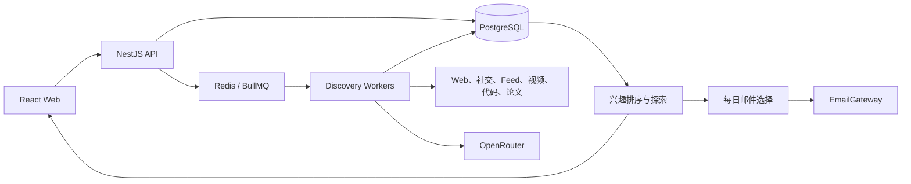

# LetterMate 技术方案

**状态：** 当前实现基线

**更新日期：** 2026-08-08

## 1. 架构

LetterMate 是 npm workspaces 单仓库：React/Vite Web、NestJS API、BullMQ Worker、PostgreSQL/Prisma 和 Redis。



核心约束：

- Web 只调用 LetterMate API，不持有 AI、平台或邮件凭据。
- 趋势榜单只产生搜索种子，不能直接产生 Feed 或邮件内容。
- 质量门控先于个性化，兴趣不能让不合格内容进入 Feed。
- 精确关键词和版本边界不可被查询扩展破坏。
- 最终内容必须有经过验证的 HTTP(S) 原始来源，并执行用户所有权检查。

## 2. 模块边界

| 模块 | 职责 |
| --- | --- |
| `apps/web` | Feed、关键词、博主、兴趣记忆和每日邮件界面 |
| `apps/api` | 输入验证、用户边界、Feed 合并、状态查询和任务入队 |
| `apps/worker` | 来源连接器、质量管线、AI 网关、调度器和队列消费者 |
| `packages/contracts` | API、Web 与 Worker 共享的 Zod 契约 |
| `packages/domain` | 关键词、质量、去重、兴趣排序和探索规则 |
| `packages/config` | 服务端环境配置和安全默认值 |
| `prisma` | 数据模型和迁移 |

提供商实现必须留在适配层。公共数据结构进入 `packages/contracts`，跨入口业务规则进入 `packages/domain`。

## 3. 发现管线

Topic 和 Trend 共用主发现流程：

1. 精确关键词或趋势种子生成有限查询计划。
2. 已启用连接器并发检索候选。
3. 验证 URL、来源证明和正文可用性。
4. 执行事实支持、历史增量和精确/近似去重。
5. AI 只从验证后的候选中选择并生成中文标题、摘要和推荐理由。
6. 结果持久化后进入统一 Feed。

Topic 使用 6/12/24 小时自适应周期。TrendMonitor 使用持久化周期。调度、手动刷新和故障恢复都复用运行租约和幂等任务边界。

## 4. 博主关注

博主创建分为身份解析和确认创建：

- 用户输入名字、Handle、主页 URL 或 RSS/Atom URL。
- Resolver 只从平台或 Feed 的结构化响应产生候选。
- 客户端只能提交短期 `resolutionToken`，不能自造账号 ID。
- 订阅固定平台稳定账号 ID，改名不会创建新关注。

当前实现 RSS/Atom、X 和 Bilibili 公开视频。X 支持原创、连续帖、引用、转发和带父帖上下文的高价值回复；转发保留原作者，回复缺少父帖时不能进入 Feed。Bilibili 订阅固定 `mid`，动态和专栏尚未实现。

`CreatorItem` 保存全部结构有效且已中文化的公开内容；只有 `feedEligible=true` 的内容进入 Feed 和邮件候选。单个平台失败不阻塞其他博主、Topic 或 Trend。

## 5. Feed、兴趣与探索

统一 Feed 按平台内容 ID、规范化 URL 和内容指纹合并 Topic、Trend 与 Creator，并返回全部 `origins[]`。

兴趣信号来自：

- 活动关键词；
- 活动博主的合格内容；
- `interested | less` 显式反馈。

Feed 先完成质量和筛选，再应用稳定兴趣排序。明确订阅不会因负向偏好消失。探索内容来自正向兴趣的相邻技术标签，最多约 10%，候选不足时为零，并永久排除在每日邮件之外。

## 6. 每日邮件

数据模型：

- `DigestPreference`：启用状态和本地发送时间；时区来自 User。
- `DigestRun`：计划日期、选择窗口、状态、租约、安全错误和提供商消息 ID。
- `DigestItem`：冻结的内容键、顺序、中文内容和原始链接快照。

调度器扫描已到本地发送时间且当天没有运行的用户。没有合格内容时创建 `skipped` 运行但不调用邮件服务。任务重试复用同一 `DigestRun` 和 `DigestItem` 快照；失败不推进成功窗口。

`EmailGateway` 隔离投递提供商。默认测试使用 `FakeEmailGateway`；生产运行在完整 SMTP 配置存在时使用 `SmtpEmailGateway`。未配置 SMTP 时 API 返回 `not_configured`，Worker 不启动邮件队列、消费者或调度器，其他发现能力继续运行。

SMTP 使用确定性 `Message-ID`、TLS、连接超时、安全错误分类和脱敏日志。普通 SMTP 没有通用幂等键：如果服务器已接受邮件但连接在确认前中断，重试仍可能产生重复邮件。严格零重复需要改用支持幂等键的供应商 HTTP API。

## 7. API

所有业务端点位于 `/api/v1`。主要新增端点：

| Method | Path | 行为 |
| --- | --- | --- |
| `POST` | `/auth/register` | 创建账户并签发 Session Cookie |
| `POST` | `/auth/login` | 限流登录并签发 Session Cookie |
| `POST` | `/auth/logout` | 校验 CSRF、撤销会话并清除 Cookie |
| `GET` | `/auth/session` | 读取会话用户和 CSRF Token |
| `POST` | `/creators/resolve` | 解析博主身份候选 |
| `POST` | `/creators` | 确认并创建关注 |
| `GET` | `/creators/:id/items` | 读取博主有效内容档案 |
| `PUT` | `/feedback/:contentKey` | 设置、切换或清除反馈 |
| `GET/PUT` | `/digest-preference` | 读取或修改每日邮件设置 |
| `GET` | `/digest-preview` | 预览下一封邮件候选 |
| `GET` | `/digest-status` | 读取投递能力、下一次本地发送时间和最近运行 |

共享 schema 拒绝未声明字段。跨用户资源统一返回 `404`，避免泄露资源是否存在。

## 8. 安全与运行

- 外部抓取执行 SSRF、MIME、大小、重定向和超时限制。
- 日志和 API 只保留安全错误码及 trace/run 标识。
- API 为每个请求生成或校验 `x-trace-id`，在响应头、错误体和完成日志中复用同一标识。请求日志只包含方法、路径、状态和耗时。
- Worker 使用统一 JSON 日志记录 queue/job/run 状态，每分钟输出 waiting/active/delayed/failed 队列快照，并为连接器、趋势来源和邮件任务输出可聚合的安全错误码。日志不包含用户 ID、邮箱、查询词、来源 URL、供应商响应或原始异常文本。
- 邮箱、密码、API Key、授权头和供应商原始响应不能进入客户端或日志。
- 开发环境可使用 `ALLOW_DEV_IDENTITY=true` 的开发身份；生产必须使用真实登录、服务端 Session 和 CSRF，并设置 `ALLOW_DEV_IDENTITY=false`。Session Token 只以 `SESSION_SECRET` HMAC 后的摘要持久化，临近过期时滑动续期；登录失败按客户端与规范化邮箱在 API 进程内限流，成功登录会自动升级旧 scrypt 参数。横向扩展 API 前应把限流状态迁移到 Redis。
- PostgreSQL 使用 custom-format 备份和独立 SHA-256 清单。默认保留最近 14 天全部备份、随后 8 周每周最新一份、再保留 12 个月每月最新一份；无效或不完整备份不参与自动删除。
- 恢复验证只允许写入临时隔离数据库，执行 `pg_restore --exit-on-error` 后校验 public 表数量与 `_prisma_migrations`。工具明确拒绝主库和 PostgreSQL 系统库；生产主库恢复必须经过停机、外部副本确认和人工审批。
- 外部连接器需要在目标环境验证配额、限流和故障恢复。

## 9. 验证

默认测试不联网。真实 AI、X 和 SMTP 测试只在显式 live 开关及完整凭据同时存在时运行。

```powershell
npm run db:generate
npm run db:deploy
npm run lint
npm run typecheck
npm test
npm run build
npm run test:e2e
```

真实登录、Session Cookie、CSRF 校验和用户会话撤销已接入 API 与 Web。开发环境仍可使用 `ALLOW_DEV_IDENTITY=true`；生产部署必须提供 `SESSION_SECRET`、`CSRF_SECRET` 并关闭开发身份。结构化运行事件、队列快照、数据库备份和隔离恢复验证已经实现；目标环境仍需接入告警、定时备份、加密外部副本和周期恢复演练。
