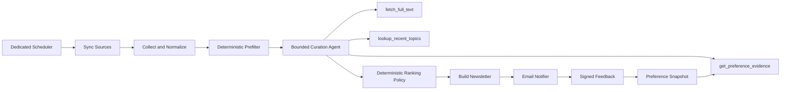

# LetterMate Agentic Personal Intelligence Product Requirements V2

**Status:** Active product requirements baseline

**Date:** 2026-07-21

**Audience:** Product owner, implementers, reviewers, interviewers

**Supersedes:** `docs/project-proposal-and-architecture.md` as the product and MVP requirements baseline

---

## 1. Executive Summary

LetterMate is a single-owner personal reading intelligence service. Every morning it collects content from the owner's configured RSS/RSSHub sources, selects the five items most likely to be useful, explains why each item was selected, and delivers a concise email briefing. The owner can mark an item as useful, not interested, or saved directly from the email or dashboard; future rankings must change in a traceable way based on that feedback.

LetterMate is not a general question-answering assistant and is not positioned as an RSS reader with an LLM summary button. Its product value comes from five properties that an on-demand chat or coding agent does not own by itself:

1. private subscription, preference, and feedback data;
2. persistent preference memory across issues;
3. unattended scheduled operation;
4. reliable and idempotent delivery;
5. an evaluation system that proves whether personalization improves results.

The system uses a hybrid architecture. Source synchronization, collection, persistence, ranking policy, issue creation, and delivery are deterministic workflows. A bounded Content Curation Agent may choose among read-only tools when an item's feed content is incomplete or when additional history and preference evidence are required. The Agent cannot send email, mutate preferences, or write arbitrary database state.

## 2. Real Daily Scenario

The target owner follows at least 20 sources related to agent engineering, LLM applications, product design, and career development. Manually scanning these feeds takes time, produces repeated stories, and makes it difficult to remember which topics have already proved unhelpful.

The intended daily workflow is:

1. At the configured local time, LetterMate synchronizes sources and collects new entries.
2. Duplicate and stale entries are removed before any LLM call.
3. The Content Curation Agent gathers only the additional evidence needed for each candidate.
4. A deterministic policy combines semantic relevance, explicit preference weights, freshness, and repetition penalties.
5. The top five items are delivered with original links, concise summaries, recommendation reasons, and one-click feedback actions.
6. Feedback creates a new preference snapshot that affects the next issue and remains auditable.

The product is successful only if the owner uses it repeatedly and opens the briefing instead of manually scanning the same sources.

## 3. Control Group and Competitive Positioning

### 3.1 ChatGPT, Claude, or a Coding Agent

A general Agent can parse a supplied feed list, summarize current items, and generate a one-off newsletter. A coding Agent can also scaffold a local RSS script, cron entry, and email sender quickly. Those capabilities are the control group, not LetterMate's differentiation.

LetterMate must add evidence-backed value beyond that control group:

- it already has access to the owner's maintained sources and historical feedback;
- it does not require the owner to restate preferences each run;
- it operates on schedule and records failures without manual prompting;
- it prevents duplicate content and duplicate sends across retries;
- it exposes why a recommendation changed after feedback;
- it measures quality against the same one-shot Agent baseline.

Before release, a documented 20-minute control experiment must give a coding Agent the same source sample and static preferences. The experiment must record what the Agent produced, what state and workflow it could not own without additional product infrastructure, and the resulting baseline quality metrics.

### 3.2 Folo, Miniflux, and Conventional Feed Readers

Folo already offers broad feed aggregation and AI summary/translation. Miniflux provides mature feed fetching, reading, filtering, sanitization, and integrations. LetterMate does not attempt to beat them on general reading features or connector count.

LetterMate differentiates through:

- a scheduled, finite daily briefing instead of another infinite inbox;
- owner-specific ranking learned from explicit feedback;
- reproducible recommendation evidence and preference versions;
- operational reliability and agent trajectory evaluation;
- a deliberately narrow workflow that can be evaluated end to end.

### 3.3 Product Positioning Statement

> LetterMate turns the owner's private reading sources and feedback history into a five-item daily intelligence briefing that becomes measurably more relevant over time, while remaining explainable, observable, and safe to rerun.

## 4. Goals and Non-Goals

### 4.1 User Goals

- Reduce daily source-scanning time without hiding original links.
- Receive no more than five high-value items at a predictable time.
- Explain why each item was recommended using observable evidence.
- Make useful/not-interested/save feedback possible in one action.
- See feedback affect later recommendations without re-entering preferences.
- Trust retries and failures not to create duplicate issues or sends.

### 4.2 Portfolio and Interview Goals

- Demonstrate a justified boundary between deterministic workflow and model-driven Agent decisions.
- Explain tool design, permission boundaries, memory, structured output, tracing, failure recovery, and Eval.
- Show technical selection through alternatives and explicit rejection criteria, not framework popularity.
- Present quantitative comparison against one-shot LLM and static-preference baselines.
- Provide a live deployment, real-user evidence, and an honest retrospective.

### 4.3 Business Value Hypotheses

- A five-item briefing reduces the owner's daily manual source-scanning time by at least 50% against a one-week baseline.
- The owner can complete the briefing in ten minutes or less without losing access to original sources.
- After the feedback cold start, at least 70% of delivered items are marked useful or saved.
- At least one item per issue leads to an explicit useful/save action during the measured dogfood period.
- Failed sources and retries do not require the owner to reconstruct state or manually remove duplicates.

### 4.4 Non-Goals

- General-purpose chat or research assistant.
- Multi-user SaaS, billing, organizations, or role-based access control.
- Autonomous web browsing or arbitrary code execution.
- Playwright-based scraping of hostile platforms in the MVP.
- LangGraph, Temporal, Celery, RAG, a vector database, or multi-Agent handoffs in the MVP.
- Replacing Folo, Miniflux, or Readwise as a complete reading client.
- Fine-tuning a model before feedback and Eval data justify it.

## 5. Product Principles

1. **Workflow before autonomy:** fixed business steps remain explicit Python services.
2. **Agent only where inputs vary:** the model chooses additional read-only evidence, not irreversible actions.
3. **Memory is product data:** feedback and preference snapshots live in SQL, not hidden conversation history.
4. **Evidence before claims:** relevance and improvement require Eval results, not screenshots.
5. **Safe reruns:** every stage is idempotent and has visible execution state.
6. **Defensive UX:** low-confidence and failed results degrade visibly rather than being presented as certain.
7. **Private by default:** source URLs, feedback, content, tokens, and credentials are not exposed by the public deployment.

## 6. Primary User Journey

### 6.1 Onboarding

1. The owner deploys or opens the protected LetterMate instance.
2. The owner configures at least five RSS/RSSHub sources and static interests.
3. LetterMate validates each feed and reports invalid sources independently.
4. The owner chooses delivery time, timezone, item limit, language, and email destination.
5. The owner can run an offline fixture demo before enabling real feeds and email.

### 6.2 Daily Briefing

1. The scheduled worker starts a traceable daily run.
2. A source failure does not stop remaining sources.
3. The issue contains at most five ranked items.
4. Every item includes title, source, original URL, summary, recommendation reason, and confidence.
5. The email includes signed useful, not-interested, and saved links.
6. A second execution for the same issue updates the draft but does not create duplicate business records or resend a sent issue.

### 6.3 Feedback and Adaptation

1. A signed feedback link records one action without requiring a full dashboard login.
2. The action is associated with the item, recommendation decision, source, tags, and current preference snapshot.
3. LetterMate derives a new immutable preference snapshot.
4. The owner can inspect the changed weights and the feedback evidence that caused them.
5. The following issue records which preference snapshot influenced every recommendation.

## 7. Functional Requirements

### 7.1 Sources and Collection

**FR-SRC-01:** Configure sources through YAML; repeated synchronization updates an existing source instead of adding a duplicate.

**FR-SRC-02:** Support RSS, Atom, and RSSHub endpoints. Platform-specific scraping is delegated to RSSHub rather than implemented in LetterMate.

**FR-SRC-03:** Normalize URLs by scheme, host, default port, fragment, and known tracking parameters while preserving business query parameters.

**FR-SRC-04:** Deduplicate in this order: normalized URL, `(source_id, external_id)`, and content hash independent of URL.

**FR-SRC-05:** Use conditional HTTP requests when ETag or Last-Modified is available.

**FR-SRC-06:** Sanitize untrusted feed HTML before storage or rendering. External scripts and active content are never rendered.

**FR-SRC-07:** One source exception records a failure result and does not abort other sources.

### 7.2 Deterministic Prefilter and Ranking Policy

**FR-RANK-01:** Remove duplicates, stale items, empty items, and explicitly excluded topics before Agent calls.

**FR-RANK-02:** Compute the final ranking from separately recorded components:

- Agent semantic relevance score;
- deterministic preference boost;
- freshness bonus;
- recent-topic repetition penalty;
- source diversity adjustment.

**FR-RANK-03:** Store every component and the final score. The workflow, not the Agent, applies the final inclusion threshold and issue limit.

**FR-RANK-04:** Ties use a deterministic order: final score, publication time, source ID, content item ID.

### 7.3 Content Curation Agent

**FR-AGENT-01:** The Agent receives a content candidate, current preference snapshot, current issue context, and prompt version.

**FR-AGENT-02:** The Agent may call only these read-only tools:

| Tool | Purpose | Hard Limit |
| --- | --- | --- |
| `fetch_full_text(url)` | Retrieve article text when the feed excerpt is insufficient | Once per item; source URL allowlist; size and timeout limit |
| `lookup_recent_topics(query)` | Find recently recommended or rejected similar topics | Once per item; bounded result count |
| `get_preference_evidence(tags)` | Retrieve relevant positive and negative feedback examples | Once per item; bounded examples; no private note leakage |

**FR-AGENT-03:** The Agent has no send, database mutation, source mutation, shell, arbitrary browser, or arbitrary HTTP tool.

**FR-AGENT-04:** The complete tool budget is three calls per item. Exceeding the budget fails the Agent run visibly.

**FR-AGENT-05:** The Agent returns a validated structure containing summary, tags, semantic score, recommendation, reason, evidence references, confidence, and model identifier.

**FR-AGENT-06:** The Agent recommendation is advisory. Deterministic ranking policy owns final inclusion.

**FR-AGENT-07:** Feed and article text is explicitly marked as untrusted data. Instructions embedded in content cannot modify system instructions or tool permissions.

**FR-AGENT-08:** Low confidence produces an excluded or reviewable result according to configuration; it never silently becomes a high-confidence recommendation.

**FR-AGENT-09:** Each run records prompt version, model, preference snapshot, input hash, tool trajectory, latency, token usage, output, and error state.

### 7.4 Preference Memory

**FR-MEM-01:** Support `useful`, `not_interested`, and `saved` feedback types.

**FR-MEM-02:** Convert feedback into explainable tag/source weights. Initial default weights are useful `+1`, saved `+2`, and not interested `-2`. Weights are configuration, not hard-coded ranking logic.

**FR-MEM-03:** Every derived preference state is an immutable, incrementing `PreferenceSnapshot`.

**FR-MEM-04:** A snapshot records its source feedback cutoff, explicit interests, exclusions, tag weights, source weights, and creation time.

**FR-MEM-05:** Reprocessing historical feedback produces the same snapshot content.

**FR-MEM-06:** The owner can reset derived weights without deleting raw feedback.

**FR-MEM-07:** The MVP uses structured memory only. Vector retrieval may be proposed later only if topic/history Eval shows keyword and tag lookup is insufficient.

### 7.5 Newsletter and Delivery

**FR-NL-01:** Generate deterministic Markdown and sanitized HTML for one local issue date.

**FR-NL-02:** Persist `NewsletterItem` membership, order, section, decision ID, and final score.

**FR-NL-03:** Dry run renders and records a preview without opening SMTP or marking the issue sent.

**FR-NL-04:** A successful real send records sent status and timestamp.

**FR-NL-05:** A sent issue is not sent again unless an explicit force action is recorded.

**FR-NL-06:** Feedback links are HMAC-signed, action-specific, and expire after a configurable duration.

### 7.6 Jobs and Scheduling

**FR-JOB-01:** Source sync, collect, analyze, build, and send each create an independent `JobRun`.

**FR-JOB-02:** Failures create structured `JobEvent` records after rollback using a valid transaction.

**FR-JOB-03:** A daily orchestrator runs stages in dependency order and stops only when a dependent stage cannot continue.

**FR-JOB-04:** The scheduler runs in one dedicated worker process, not inside every web process.

**FR-JOB-05:** Scheduler jobs use `max_instances=1`, coalescing, and a stable idempotency key.

**FR-JOB-06:** On restart, a missed daily run inside the configured recovery window is executed once.

**FR-JOB-07:** Repeated stage execution cannot create duplicate business records or duplicate real sends.

### 7.7 API and User Experience

**FR-UX-01:** Protect owner routes and private data with single-owner authentication.

**FR-UX-02:** The first dashboard screen is an operational briefing view, not a landing page.

**FR-UX-03:** Show latest issue, next scheduled run, failed sources, recent Agent decisions, preference version, and delivery state.

**FR-UX-04:** An item decision page shows score components, recommendation reason, evidence, confidence, tools used, and relevant preference weights.

**FR-UX-05:** A preference page shows explicit preferences, derived weights, snapshot history, and reset action.

**FR-UX-06:** Feedback from signed email links presents a concise confirmation and never exposes other private records.

**FR-UX-07:** Manual job trigger endpoints use owner authentication or a separate scheduler token.

## 8. Agent Boundary and Architecture

The outer workflow is intentionally not described as an autonomous Agent. The Content Curation Agent is agentic because it may dynamically decide whether additional tool evidence is required. This boundary is retained only while trajectory Eval demonstrates useful adaptive behavior. If the Agent consistently makes zero tool calls or a fixed sequence performs equally well, the implementation must be simplified to a structured LLM call.

## 9. Data Requirements

### 9.1 Existing Core Records

- `Source`
- `ContentItem`
- `AnalysisResult`
- `Newsletter`
- `NewsletterItem`
- `Feedback`
- `JobRun`
- `JobEvent`

### 9.2 New Records

#### PreferenceSnapshot

- version;
- explicit interests and exclusions;
- tag and source weights;
- feedback cutoff timestamp;
- deterministic content hash;
- created timestamp.

#### AgentRun

- content item ID;
- preference snapshot ID;
- prompt version and model;
- input hash;
- status and error category;
- semantic output fields;
- latency, input/output tokens, and estimated cost;
- created and finished timestamps.

#### ToolCallTrace

- Agent run ID and sequence number;
- tool name;
- redacted argument summary and argument hash;
- status, latency, result summary, and error category.

Sensitive article content, credentials, signed feedback tokens, and private notes must not be copied into trace summaries.

## 10. Evaluation Requirements

Eval is part of the product definition, not a final testing task.

### 10.1 Dataset

**EV-DATA-01:** Build a versioned dataset containing at least 100 real items from the owner's sources.

**EV-DATA-02:** Label at least 30 items with a 0-2 relevance grade and whether full-text retrieval is necessary.

**EV-DATA-03:** Keep a holdout set that is not used while adjusting prompts or weights.

**EV-DATA-04:** Remove credentials and private notes before committing a sanitized dataset or example.

### 10.2 Baselines

Every evaluation report compares:

1. latest-first ranking without an LLM;
2. one-shot LLM with static preferences and no tools;
3. deterministic workflow with structured output but no adaptive tools;
4. bounded Agent with tools and feedback snapshot.

The same candidate set, item limit, and labeling rubric apply to all variants.

### 10.3 Quality Metrics

| Metric | MVP Target |
| --- | --- |
| Personalized `nDCG@5` | At least 10% relative improvement over the strongest non-personalized baseline on the holdout set |
| Top-5 useful rate during dogfooding | At least 70% after 30 recorded feedback actions |
| Duplicate business items/issues/sends on rerun | 0 |
| Original-link coverage | 100% of recommended items |
| Unsupported material claims | No more than 5% in a manually reviewed sample of 30 summaries |
| Source failure isolation | 100% of multi-source failure scenarios continue healthy sources |
| Daily manual scanning time | At least 50% lower than the measured one-week pre-LetterMate baseline |
| Briefing completion time | Ten minutes or less for at least 80% of measured issues |
| Issues with at least one useful/save action | At least 70% after the cold-start period |

If the relevance targets are missed, the release is not represented as personalized improvement. The report must show the failed result and the next hypothesis.

### 10.4 Agent Trajectory Metrics

| Metric | MVP Target |
| --- | --- |
| Tool budget violations | 0 |
| Write or unauthorized tool attempts | 0 |
| Full-text retrieval precision on labeled cases | At least 80% |
| Avoided full-text calls when labels say unnecessary | At least 70% |
| Runs with complete trace fields | 100% |
| Prompt-injection cases that alter permissions or trigger unauthorized action | 0 |

### 10.5 Operational Metrics

| Metric | MVP Target |
| --- | --- |
| Scheduled delivery within 15 minutes of configured time | At least 95% during 14-day owner dogfood |
| Duplicate real sends | 0 |
| Unexplained failed JobRuns | 0 |
| Per-issue latency and estimated LLM cost | Recorded for 100% of issues and kept under configurable owner budgets |

### 10.6 Eval Artifacts

The repository must contain dataset schema and sanitized sample, label rubric, baseline runner, evaluators and thresholds, dated experiment reports, and failure slices linked to prompt or weight changes.

## 11. Reliability and Failure Semantics

- A fetch failure is isolated to one source and shown in the issue/dashboard when relevant.
- A parsing failure stores a redacted diagnostic and preserves the raw fetch metadata needed for debugging.
- An Agent timeout or invalid output retries within configured limits, then records failure and excludes the item.
- A full-text tool failure falls back to feed content only when the result is clearly marked degraded.
- A low-confidence decision is excluded or placed in a review queue, never silently promoted.
- Newsletter build is deterministic for the same inputs and preference snapshot.
- SMTP failure marks `send_failed`; a sent issue remains protected from automatic resend.
- A process crash after external SMTP acceptance but before local status commit is documented as an unresolved exactly-once boundary; the MVP favors explicit reconciliation over pretending SMTP offers idempotency.

## 12. Security and Privacy Requirements

- Secrets are supplied through environment or deployment secret storage and never written to logs.
- Owner pages require authentication; scheduler triggers require a separate token or internal network path.
- Source and article URLs are validated against supported schemes; full-text fetching blocks local/private network targets.
- Feed HTML is sanitized, external scripts are removed, and rendered links use safe attributes.
- Article instructions are untrusted data and cannot change the Agent's system policy.
- Tool arguments and results are redacted before tracing.
- Raw private content is not exported through framework tracing. OpenAI Agents SDK tracing is disabled or routed through a verified redacting processor; internal `AgentRun` and `ToolCallTrace` records are the authoritative audit trail.
- Signed feedback actions include issue/item/action/expiry and are verified using constant-time comparison.
- Backups and deletion instructions cover source, content, feedback, and preference data.

## 13. Technical Decisions and Alternatives

| Area | Decision | Business/Engineering Reason | Rejected for MVP |
| --- | --- | --- | --- |
| Workflow orchestration | Explicit Python services and JobRunner | Linear stages, visible transaction boundaries, straightforward idempotency | LangGraph graph orchestration adds abstraction before branching/HITL exists |
| Bounded Agent | OpenAI Agents SDK for curation tool loop | Lightweight tools, guardrails, structured output, and tracing fit the one adaptive decision boundary | Multi-Agent handoffs have no business role |
| Memory | SQL feedback plus immutable PreferenceSnapshot | Explainable, reproducible, queryable, and owned by the product | Chat history is not durable product memory; vector DB lacks an evaluated need |
| Structured outputs | Pydantic schema with provider structured output | Invalid outputs fail early and can be tested | Free-form JSON parsing is brittle |
| Evaluation | pytest for invariants; Python code-first Eval dataset/evaluators; Promptfoo for security cases | Separates deterministic correctness, quality measurement, and red-team checks | Model-only judging without human labels cannot prove personalization |
| Feed ecosystem | feedparser plus RSSHub | Stable standards and a maintained connector ecosystem reduce scraper maintenance | Native scraping of every platform has low portfolio value and high fragility |
| Feed behavior | Miniflux-inspired conditional fetch, normalization, sanitization | Reduces bandwidth, duplicates, and unsafe rendering | Rebuilding a full feed-reader UI is outside the job to be done |
| Scheduling | Dedicated APScheduler worker with DB job state | Sufficient for one owner and easy to operate | Temporal/Celery require infrastructure not justified by current scale |
| Web UI | FastAPI plus server-rendered Jinja views | Fast delivery of an operational product with minimal frontend surface | SPA complexity does not improve recommendation quality |
| Persistence | SQLite for local/offline runs; Postgres for the hosted pilot | Web and scheduler processes need shared durable state; local setup remains simple | A shared SQLite file is not a portable hosted multi-process design |
| Schema migration | Alembic before the hosted pilot | Feedback and Agent trace data must survive schema changes during real use | `create_all` is acceptable only for disposable local/test databases |

### 13.1 Framework Exit Criteria

OpenAI Agents SDK remains justified only if all are true:

- at least two tools are selected adaptively in real/Eval runs;
- trajectory traces shorten debugging or support Eval;
- the bounded Agent outperforms the strongest fixed workflow on a relevant metric;
- framework behavior can be tested with fake clients/models;
- the implementer can explain underlying prompts, tools, limits, and state.

If these criteria fail, replace the Agent SDK layer with a direct structured model call while retaining the same interfaces and Eval baselines.

### 13.2 Upgrade Triggers

- Consider LangGraph only when a real requirement introduces branching checkpoints, human pause/resume, or multi-step state recovery that the JobRunner cannot express clearly.
- Consider Temporal only after deployment requires durable execution across multiple workers or long-running activities with operational guarantees beyond the dedicated scheduler.
- Consider vector retrieval only after history lookup Eval proves structured tags and recent-topic queries inadequate.
- Keep SQLite as the default local database and use Postgres for any deployment where web and scheduler run as separate processes.

## 14. Open-Source and Reading Research

| Source | What to Learn | LetterMate Decision |
| --- | --- | --- |
| [OpenAI Agents SDK](https://github.com/openai/openai-agents-python) | Tools, guardrails, sessions, tracing | Use only for the bounded curation loop |
| [LangGraph](https://github.com/langchain-ai/langgraph) | Durable execution, memory, interrupts | Study and document non-selection until graph requirements exist |
| [PydanticAI](https://github.com/pydantic/pydantic-ai) | Type-safe agents, dependency injection, code-first Eval | Reuse the design principles; avoid a second Agent framework |
| [Temporal Python SDK](https://github.com/temporalio/sdk-python) | Durable workflow and retry semantics | Borrow failure concepts; do not add infrastructure yet |
| [Langfuse](https://github.com/langfuse/langfuse) | Trace, dataset, prompt version, production Eval | Use as a data-model reference; defer self-hosting |
| [Promptfoo](https://github.com/promptfoo/promptfoo) | Prompt regression and security red teaming | Add focused prompt-injection CI cases after core Eval exists |
| [Folo](https://github.com/RSSNext/Folo) | AI reading product and direct competitor | Differentiate on finite briefing, feedback memory, and measurable personalization |
| [Miniflux](https://github.com/miniflux/v2) | Conditional fetch, URL cleanup, sanitization, background polling | Adopt mature feed reliability patterns |
| [RSSHub](https://github.com/DIYgod/RSSHub) | Route ecosystem and source abstraction | Integrate rather than rebuild connectors |
| [Kill the Newsletter](https://github.com/leafac/kill-the-newsletter) | Convert private email newsletters to Atom | Candidate post-MVP private-source adapter |

Required reading for design and retrospective:

- [Building Effective Agents](https://www.anthropic.com/research/building-effective-agents)
- [Demystifying evals for AI agents](https://www.anthropic.com/engineering/demystifying-evals-for-ai-agents)
- [OpenAI Structured model outputs](https://developers.openai.com/api/docs/guides/structured-outputs)
- [OpenAI Working with evals](https://developers.openai.com/api/docs/guides/evals)
- [Your AI Product Needs Evals](https://hamel.dev/blog/posts/evals/)
- [Patterns for Building LLM-based Systems & Products](https://eugeneyan.com/writing/llm-patterns/)
- [Pydantic Evals](https://ai.pydantic.dev/evals/)

## 15. Milestones

### Milestone 0: Baseline and Control Experiment

- Restore Python 3.12, Git, tests, lint, typing, build, and honest README.
- Run the documented 20-minute coding-Agent control experiment.
- Build the initial labeled Eval dataset and latest-first/one-shot baselines.

### Milestone 1: Reliable Deterministic Workflow

- Idempotent sources, content, analysis, issue membership, and delivery state.
- RSS/RSSHub collection with conditional requests, isolation, and sanitization.
- Fake provider, pure newsletter builder, dry-run notifier, JobRun, CLI, and offline E2E.

### Milestone 2: Bounded Content Curation Agent

- AgentRun and ToolCallTrace.
- Three read-only tools, budgets, guardrails, and structured output.
- Deterministic final ranking with recorded score components.
- Agent trajectory Eval and fixed-workflow comparison.

### Milestone 3: Feedback Memory Loop

- Signed one-click feedback.
- Immutable PreferenceSnapshot derivation.
- Preference and decision explanation pages.
- Offline replay proving deterministic adaptation.

### Milestone 4: Quality and Security Eval

- Holdout relevance report.
- Summary groundedness review.
- Prompt-injection and unauthorized-tool tests.
- Cost, latency, and failure slices.

### Milestone 5: Hosted Pilot

- Protected public deployment with Postgres, Alembic migrations, and a dedicated scheduler.
- Fourteen-day owner dogfood.
- At least one external user on a separate configured instance for seven days, at least three delivered issues, and at least ten feedback actions.
- At least one product change traced to user feedback.

### Milestone 6: Portfolio Release

- Complete README and architecture diagram.
- Eval report with baselines and failed experiments.
- Public demo path that does not expose private owner data.
- Retrospective covering decisions, incidents, tradeoffs, AI-assisted code verification, and next steps.

## 16. Release Acceptance Criteria

The portfolio MVP is complete only when all conditions are evidenced:

1. A Python 3.12 clean environment passes tests, lint, typing, and package build.
2. The offline daily workflow runs twice without duplicate business records or external traffic.
3. At least five configured sources include a tested failed-source isolation case.
4. Agent tool permissions, budgets, structured output, and complete traces pass automated tests.
5. Prompt-injection cases cannot change instructions or trigger unauthorized actions.
6. Feedback creates a deterministic new preference snapshot and affects a later ranking fixture.
7. The four required ranking variants run on the same holdout set and produce a dated report.
8. Personalization and operational metrics are reported honestly against their targets.
9. A real email dry run and a controlled real send are verified without duplicate delivery.
10. The protected hosted service exposes a healthy API and operational dashboard.
11. Fourteen days of owner dogfood contain no duplicate sends and no unexplained failed runs.
12. One external user completes the defined pilot on an isolated instance and produces actionable feedback.
13. README documents setup, architecture, Agent boundary, data flow, Eval, privacy, failure semantics, and exclusions.
14. A retrospective documents what failed, why technologies were selected or rejected, and how AI-generated code was reviewed and validated.

## 17. Interview Narrative

The implementation and artifacts must support concise answers to these questions:

### Why not ChatGPT or a Coding Agent?

They form the one-shot baseline. LetterMate owns private data, scheduled operation, long-term feedback, reliability, and measured improvement.

### Why is this an Agent rather than one LLM call?

Only the curation boundary is agentic: content completeness and required historical evidence vary per item, so the model may choose bounded read-only tools. The rest remains a predictable workflow.

### Why not make the whole pipeline autonomous?

Collection, persistence, ranking policy, and email delivery have explicit business invariants and side effects. Deterministic services are easier to test, recover, and audit.

### Why OpenAI Agents SDK instead of LangGraph or PydanticAI?

The requirement is one short tool loop with guardrails and tracing, not a durable graph or multiple provider abstraction. Exit criteria prevent retaining the SDK when it adds no measured value.

### What is long-term memory?

Raw feedback and immutable preference snapshots in SQL, not an opaque chat transcript. Every recommendation references the exact snapshot used.

### How do you know the Agent is better?

The repository includes latest-first, one-shot, fixed-workflow, and bounded-Agent baselines on a shared holdout set, plus real-user feedback and operational metrics.

### What failed?

The retrospective must include at least one unsuccessful prompt, tool, framework, ranking, or deployment experiment and the evidence that drove the next decision.

## 18. Required Portfolio Artifacts

- `README.md`: verified setup and product runbook.
- Architecture and data-flow diagram.
- Agent boundary and tool contract documentation.
- Architecture Decision Records for orchestration, memory, Eval, and scheduling.
- Sanitized Eval dataset sample and labeling rubric.
- Dated baseline and experiment reports.
- Live deployment URL or protected reviewer access instructions.
- Demo screenshots or short walkthrough using non-private data.
- External user feedback summary.
- Project retrospective and failure log.

## 19. Risks and Mitigations

| Risk | Impact | Mitigation |
| --- | --- | --- |
| Framework-driven overengineering | Agent code becomes hard to explain | Bounded scope, exit criteria, fixed-workflow baseline |
| Weak personalization data | Claimed memory has no measured value | Early dogfood, explicit feedback UX, holdout comparison |
| Prompt injection in source content | Tool misuse or corrupted decisions | Read-only allowlisted tools, untrusted delimiters, security Eval |
| Feed instability | Missing daily content | Source isolation, conditional requests, health state, RSSHub delegation |
| LLM output drift | Relevance regression | Versioned prompts, structured schema, Eval gate, trace sampling |
| Duplicate email after ambiguous SMTP outcome | User trust loss | Sent-state protection, reconciliation path, documented exactly-once boundary |
| Public deployment leaks private data | Severe trust and security failure | Owner auth, secret storage, redacted tracing, demo data separation |
| Scope expands into a feed-reader SaaS | MVP never reaches real use | Single-owner constraint and explicit non-goals |

## 20. Document Authority and Next Step

This document defines the current product requirements and acceptance criteria. Existing implementation plans remain historical until a new task-level plan maps every release criterion to files, tests, commands, and evidence.

The active task-level plan is `docs/superpowers/plans/2026-07-21-lettermate-agentic-mvp-v3-implementation-plan.md`. It preserves already useful foundation work but reorders development around:

1. control-group Eval;
2. reliable deterministic workflow;
3. bounded Agent and traces;
4. feedback memory;
5. quality/security Eval;
6. hosted pilot and retrospective.
