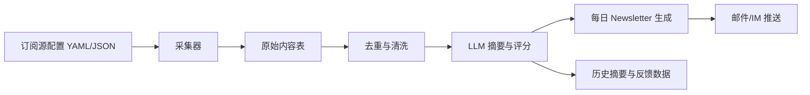

# Personal Newsletter Assistant 技术选型调研

> **Historical document:** Current product and technology decisions are defined by
> `docs/lettermate-agentic-product-requirements-v2.md`. Retain this file for the
> original research history; resolve conflicts in favor of the V2 requirements.

日期：2026-06-26

## 1. 背景与目标

目标是做一个个人 Newsletter 助手，作为 agent 入门项目。它需要收集我关注的内容源，包括 B站 UP 主视频或动态、小红书、X、微信公众号、个人博客等，并对内容进行总结、过滤，最后把有价值的信息推送给我。

这个项目的关键难点不在摘要模型本身，而在内容源接入的稳定性、去重、过滤标准、调度和推送链路。不同平台的数据开放程度差异很大，因此第一版应优先保证可运行、可迭代，而不是一开始覆盖所有平台。

## 2. 平台接入现实

| 内容源 | 推荐接入方式 | 稳定性 | 主要风险 |
| --- | --- | --- | --- |
| 个人博客 | RSS/Atom | 高 | 少数博客没有 RSS，需要页面抓取 |
| B站 | RSSHub，必要时补充 Cookie/Puppeteer | 中 | 动态、登录态、反爬限制 |
| 小红书 | RSSHub/Playwright/托管采集器 | 低 | 严格反爬、登录态、结构变动频繁 |
| X | 官方 API 或第三方采集服务 | 中低 | 官方 API 成本，非官方抓取不稳定 |
| 公众号 | RSSHub/搜狗微信/手动订阅源/第三方服务 | 低 | 缺少面向个人关注列表的稳定公开 API |

参考资料：

- RSSHub B站、小红书等路由文档：https://rsshub-docs-mirror.github.io/routes/social-media
- RSSHub 微信相关路由文档：https://rsshub-docs-mirror.github.io/routes/new-media
- X API Pricing：https://docs.x.com/x-api/getting-started/pricing
- n8n RSS Read 节点：https://docs.n8n.io/integrations/builtin/core-nodes/n8n-nodes-base.rssfeedread/
- n8n AI Agent 节点：https://docs.n8n.io/integrations/builtin/cluster-nodes/root-nodes/n8n-nodes-langchain.agent/
- LangGraph 文档：https://langchain-ai.github.io/langgraph/
- Apify Actors 文档：https://docs.apify.com/platform/actors
- Crawlee 文档：https://crawlee.dev/

## 3. 主流技术选型

### 方案 A：低代码快速 MVP

技术包：

- RSSHub
- n8n
- LLM API
- Email/Telegram/飞书/企业微信推送

适合目标：最快做出能跑的第一版 Newsletter。

优点：

- 搭建速度最快，适合先验证需求。
- n8n 有 RSS Read、AI Agent、邮件和通知类节点，调试直观。
- RSSHub 可以把博客、B站、部分公众号、小红书等内容源统一成 RSS 风格输入。
- 对初学者友好，能快速看到每日摘要效果。

缺点：

- 复杂规则、去重、长期记忆、内容评分会逐渐难维护。
- 小红书、公众号、X 的稳定性仍受平台限制。
- 更像工作流搭建，对 agent 工程能力训练有限。

适用场景：

- 希望 2 到 5 天内看到可用原型。
- 优先验证自己是否真的会每天阅读这个 Newsletter。

### 方案 B：代码优先 Agent

技术包：

- Python
- FastAPI 或 CLI
- SQLite，后续可升级 Postgres
- RSSHub
- Playwright 或 Crawlee
- LangGraph/OpenAI/Claude 等 LLM 编排
- APScheduler/Celery/Prefect 等定时任务
- Email/Telegram/飞书/企业微信推送

适合目标：作为 agent 入门项目，系统学习采集、清洗、去重、摘要、评分、调度和推送。

优点：

- 最适合训练 agent 工程能力。
- 数据模型、去重逻辑、过滤规则、摘要策略都可控。
- 可以逐步加入测试、日志、失败重试、订阅源配置、人工反馈等能力。
- 后续扩展成个人知识库、阅读收件箱、周报系统都比较自然。

缺点：

- 初始开发量比低代码方案大。
- 需要自己处理配置、数据库、调度、错误恢复等工程细节。
- 小红书、公众号、X 的平台不稳定问题不会因为写代码而消失，只是更可控。

适用场景：

- 希望这个项目既能自用，也能作为 agent 学习项目。
- 愿意先做一个小而扎实的 MVP，再逐步扩展。

### 方案 C：Dify 中心化 LLM 工作流

技术包：

- RSSHub 或自写采集器
- Dify Workflow/Agent
- 外部定时器
- SQLite/Postgres/向量库
- 邮件或 IM 推送

适合目标：重点练习 prompt、LLM 工作流、摘要链路和人机调参。

优点：

- 可视化程度高，适合快速调整摘要和过滤 prompt。
- 模型切换、节点调试、workflow 编排比较方便。
- 比 n8n 更偏 LLM 应用层，适合观察 agent 决策过程。

缺点：

- Dify 本身不是强采集系统，采集、去重、状态管理仍要外部补齐。
- 如果后续规则复杂，还是会回到代码层。
- 对小红书、公众号、X 的平台限制没有直接解决能力。

适用场景：

- 更想练 LLM workflow，而不是先写很多后端和采集代码。
- 可以接受采集层和状态层由外部服务承担。

### 方案 D：托管采集增强版

技术包：

- Apify/Firecrawl/Crawlee
- Supabase/Postgres
- Serverless/API
- LLM API
- Email/IM 推送

适合目标：把复杂动态页面采集交给托管平台，减少本地维护成本。

优点：

- 对动态页面、浏览器渲染、任务调度、代理环境更省心。
- 对小红书、X 等非 RSS 内容源更容易尝试。
- 后续可把高风险采集源单独托管，主系统只消费采集结果。

缺点：

- 有持续费用。
- Cookie 和个人登录态需要谨慎处理。
- 第三方平台不一定对国内内容源长期稳定。

适用场景：

- 愿意付费换取采集稳定性和维护成本下降。
- 后续需要覆盖更多非 RSS 内容源。

## 4. 推荐路线

推荐选择方案 B：代码优先 Agent。

理由：

- 这是一个 agent 入门项目，不只是自动化工作流。代码优先方案能练到更完整的工程能力。
- 项目的核心价值在于长期可迭代：订阅源配置、内容去重、价值评分、摘要质量、反馈学习、推送体验。
- 先写一个轻量版，不需要一开始做完整平台，风险可控。

推荐采用“两阶段路线”：

### 阶段 1：MVP

目标：每天自动收集稳定来源，生成一份可读的个人摘要。

范围：

- 支持 RSS/Atom 博客。
- 支持 B站 UP 主投稿或动态，优先通过 RSSHub。
- 支持手动配置订阅源。
- 对新内容做去重。
- 使用 LLM 生成摘要、标签、价值评分。
- 按天生成 Newsletter。
- 通过邮件或 IM 推送。

暂缓：

- 小红书深度采集。
- 任意公众号关注列表自动同步。
- X 官方 API 深度接入。
- 复杂网页管理后台。
- 向量数据库和长期记忆。

### 阶段 2：扩展

目标：补齐高价值但不稳定的内容源，并提高过滤质量。

范围：

- 小红书：Playwright 或托管采集器实验。
- 公众号：RSSHub、搜狗微信、第三方服务或手动链接采集。
- X：评估官方 API 成本，或者接入第三方数据服务。
- 增加用户反馈：有用/无用、收藏、忽略来源。
- 增加主题偏好和长期评分规则。
- 增加 Web UI 或简单管理后台。

## 5. 建议的 MVP 架构

核心模块：

- `sources`：订阅源配置，记录来源类型、URL、作者、标签、采集频率。
- `collectors`：按来源类型抓取内容，第一期实现 RSS 和 RSSHub。
- `storage`：SQLite 存储原始内容、摘要、推送记录。
- `dedupe`：按 URL、内容 hash、标题和发布时间去重。
- `summarizer`：调用 LLM，输出摘要、关键词、价值评分和推荐理由。
- `newsletter`：按日聚合内容，生成 Markdown/HTML。
- `notifier`：发送邮件或 IM。

## 6. 初始技术栈建议

| 层级 | 推荐 |
| --- | --- |
| 语言 | Python |
| 包管理 | uv 或 pip |
| 数据库 | SQLite |
| 配置 | YAML |
| RSS 解析 | feedparser |
| 网页抓取 | Playwright，第二阶段再上 |
| Agent/LLM 编排 | 先直接调用 LLM API，复杂后再引入 LangGraph |
| 调度 | APScheduler 或系统 cron |
| 推送 | SMTP 邮件优先 |
| 部署 | 本地电脑、NAS、VPS 或 GitHub Actions 定时任务 |

第一版不建议过早引入太多框架。先把“采集 -> 去重 -> 摘要 -> 推送”闭环跑通，再决定是否引入 LangGraph、Dify、向量库或 Web UI。

## 7. 下一步决策

建议下一步确认 3 件事：

1. 第一版推送渠道：邮件、Telegram、飞书、企业微信，优先推荐邮件。
2. 第一版内容源：博客 RSS + B站 RSSHub，是否足够作为 MVP。
3. 模型选择：OpenAI、Claude、DeepSeek、通义、智谱等，取决于预算和可用 API。

确认后可以进入正式设计文档和实现计划。
