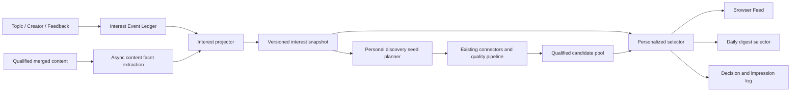

# LetterMate 兴趣记忆与个性化发现设计

**状态：** A1/A2/A3 与语义召回准入评估已实现，向量召回和自适应探索待数据验证
**日期：** 2026-08-10
**研究依据：** [兴趣记忆与个性化发现研究](./research/personalization-memory-systems.md)

## 1. 决策摘要

LetterMate 不构建自由文本的“AI 用户简介”，而构建一套可审计、可撤销、可重建的**兴趣记忆**。它只改变已经通过质量门控内容的发现范围和相对顺序，不改变事实判断、来源证明、精确关键词边界或用户明确订阅。

推荐方案由三层组成：

1. **事实层：** Topic、Creator、显式反馈和实际曝光，是唯一可作为用户事实的数据。
2. **兴趣层：** 从事实层确定性派生的多主题、短期/长期、正向/负向兴趣状态。
3. **决策层：** 某次 Feed 或日报使用的候选、策略版本、排序原因和探索位置，可回放但不反写用户事实。

核心技术选择：

- PostgreSQL 保存事件、标签、画像投影和决策日志；首版不增加独立向量数据库。
- AI 只异步提取有限内容主题和实体，不在线决定最终排序，也不能修改用户事实。
- 首版使用版本化的确定性规则排序；有足够曝光和反馈后再评估学习排序或 contextual bandit。
- 向量仅作为后续语义召回通道，结构化所有权、时间、质量和负反馈过滤始终是最终约束。

## 2. 产品亮点

差异化不是“系统记住得更多”，而是用户能信任并纠正它：

- **双时间尺度：** “最近在研究什么”和“长期喜欢什么”分别维护，短期热点不会永久污染画像。
- **多兴趣表示：** TypeScript、模型发布、数据库等兴趣独立存在，不平均成一个模糊向量。
- **证据可追溯：** 每个兴趣都能回到某个关键词监控、博主关注或明确反馈。
- **负反馈局部化：** 一次“减少推荐”主要影响相似内容，不直接推断用户讨厌整个上位领域。
- **受控探索：** 探索必须是相邻兴趣中的合格内容，最多约 10%，有桥接解释且不进入每日邮件。
- **用户可控制：** 用户可以查看自然语言兴趣主题、暂停个性化、忘记某个主题或清除兴趣历史；不展示内部数字分数。

推荐解释只陈述可证明的关系，例如：

- “因为你监控了 React Compiler”；
- “与你最近感兴趣的 Agent 评测相关”；
- “拓展视野：从 PostgreSQL 性能延伸到数据库可观测性”。

不能把 AI 推断写成用户事实，也不能显示可信分数、证据数量或来源排名。

## 3. 模块结构



### 3.1 外部深模块

Feed 和日报共用一个小界面，调用方不能传权重、排序器名称、探索比例或 embedding：

```ts
interface PersonalDiscovery {
  record(scope: UserScope, event: InterestEventInput): Promise<MemoryReceipt>;

  select(
    scope: UserScope,
    candidates: readonly QualifiedFeedItem[],
    context: SelectionContext,
  ): Promise<RecommendationSlate>;

  inspect(scope: UserScope): Promise<InterestMemoryView>;
}
```

模块隐藏：事件幂等、画像投影、时间衰减、负反馈传播、兴趣匹配、搜索优先级、多样性、探索配额、稳定分页、解释和降级。

`PersonalDiscoverySeedPlanner` 是 Worker 内部模块。它只为自动热点和独立探索管线生成有限搜索种子，不能改写 Topic 查询或把相似词伪装成精确 Topic 命中。

### 3.2 为什么不选其他界面

| 方案 | 优点 | 问题 | 结论 |
| --- | --- | --- | --- |
| 仅 `remember + rank` | 最小、易测试 | 不覆盖兴趣驱动的主动发现；调用方仍要组织召回 | 保留其小界面思想 |
| `ingest + discover + inspect` 全包 | 召回、排序和 surface 扩展统一 | 首版过重，容易形成插件框架和全能模块 | 只吸收事件、版本和降级设计 |
| Feed/日报分别提供便利方法 | 默认调用最简单 | 规则容易按 surface 复制，邮件和 Feed 行为逐渐漂移 | 拒绝 |
| 推荐混合方案 | 在线选择统一，Worker 发现规划独立 | 有两个清晰模块需要协调 | 采用 |

## 4. 领域数据模型

保留 `ContentFeedback` 作为当前 UI 状态。新增数据均以 `userId` 执行所有权和级联删除。

```text
InterestTag
  id, slug, displayName, parentId?, kind, status, taxonomyVersion

ContentInterestTag
  contentKey, tagId, confidence, extractorVersion, createdAt

InterestEvent
  id, userId, eventType, sourceRef, activeKey?, payload,
  occurredAt, recordedAt, supersededAt?

UserInterestProfile
  userId, tagId, shortScore, longScore, negativeScore,
  evidenceUpdatedAt, computedAt, profileVersion

InterestProfileVersion
  userId, version, throughEventId, computedAt, policyVersion

RecommendationDecision
  id, userId, surface, requestKey, profileVersion,
  rankingVersion, candidateVersion, createdAt

RecommendationDecisionItem
  decisionId, contentKey, position, lane, isExploration, reasonCodes

FeedImpression
  id, userId, decisionId, contentKey, position, surface, shownAt
```

关键约束：

- 每个用户、事件类型和 `sourceRef` 只有一条 `activeKey` 非空的当前事件；相同状态重复写入不新增事件，状态切换会失效旧事件并追加新事件。
- `sourceRef` 指向 Topic、Creator 或 `ContentFeedback`，支持撤销和重新投影。
- `ContentInterestTag` 绑定合并后的稳定 `contentKey`，同一内容跨来源共享语义。
- `FeedImpression` 只证明展示，不自动产生负兴趣；未反馈保持未标注。
- `UserInterestProfile` 是可删除、可重建的投影，不是事实来源。
- 所有画像和决策均记录版本，保证回放只读取当时已经发生的事件。

### 4.1 事件类型

首版只接受服务端事实：

- `topic_state` + `schemaVersion=1`：创建、激活、暂停或删除关键词监控；
- `creator_state` + `schemaVersion=1`：关注、激活、暂停或取消博主；
- `feedback_state` + `schemaVersion=1`：`interested | less | null`；
- `impression.v1`：内容实际进入可见区域；不改变兴趣。

后续若加入“收藏”“不想看这个来源”等操作，新增版本化事件类型，不修改旧事件含义。单纯点击在当前需求中不产生兴趣信号。

## 5. 兴趣投影

每个兴趣主题独立维护三项状态：

```text
shortScore(t)   = sum(positiveStrength * shortDecay(age))
longScore(t)    = sum(positiveStrength * longDecay(age))
negativeScore(t)= sum(negativeStrength * negativeDecay(age))
```

建议用 7 天和 90 天作为短期/长期半衰期实验起点，而不是固定产品承诺。

信号优先级：

1. 活动 Topic 是强结构信号，活动期间不衰减，但不允许扩展精确匹配边界。
2. 活动 Creator 是来源信号；其 `feedEligible=true` 内容只有在同一高置信 `topic | entity` 标签至少跨两篇内容、两个自然日重复出现时才贡献较弱主题信号。单篇标签和 `content_type` 不进入画像。
3. `interested` 是最强内容级正向信号，只传播到该内容的高置信主题。
4. `less` 对当前 `contentKey` 直接施加强惩罚，不依赖兴趣标签是否存在；有高置信标签时再单独累计负向信号，对相邻主题传播受限。
5. 取消反馈终止对应信号并重新投影，不写一个方向相反的伪事件。
6. 曝光、未点击和未反馈不改变画像。

同一用户可以同时拥有多个兴趣簇。任何聚合都不能把具体版本实体合并成更宽 Topic 查询。

## 6. 候选与排序

### 6.1 四路候选

1. **订阅通道：** Topic 和活动 Creator 的全部合格内容，属于保护集合。
2. **兴趣通道：** 与高权重主题匹配的 Radar、领域 Topic 和普通推荐内容。
3. **热点通道：** 自动 Trend 产生并通过完整发现管线验证的近期重要内容。
4. **探索通道：** 与正向兴趣相邻、未被明确排斥的合格内容。

首版用 PostgreSQL 标签倒排完成兴趣和探索召回。标签召回出现可测量遗漏后，再用 pgvector 增加语义召回；不能先建立单一“用户平均向量”。

### 6.2 硬约束

- 质量门控、来源证明和用户所有权先于个性化。
- Topic/Creator 保护内容不能被 `less`、多样性或探索移除，只能调整顺序；客户端在反馈成功后立即重新获取 Feed 和兴趣记忆，并显示已生效状态。
- Feed 搜索以文本相关性为第一排序键，个性化只处理相同相关度；搜索不插入探索。
- 来源或 Topic 过滤后的 Feed 不插入其他通道内容。
- 每日邮件最多 10 条，可以因容量延后保护内容，但必须报告覆盖情况；探索永不进入邮件。
- 同候选、画像版本、策略版本和 `asOf` 必须得到同一顺序。

### 6.3 第一版评分

```text
baseScore = subscriptionPriority
          + shortInterestMatch
          + longInterestMatch
          - negativeInterestMatch
          + freshness
          + importance
          + multiOriginSignal
```

所有分量归一化，内部记录但不向用户显示。最终同分按有效时间和 `contentKey` 稳定排序。

基础排序后做确定性多样性重排，限制同一主标签、作者和平台连续出现；保护内容不被驱逐。探索使用 `userId + localDate + rankingVersion` 稳定散列决定位置，避免刷新跳动，比例不超过约 10%。

## 7. 同步、异步与降级

反馈提交必须在同一数据库事务中更新 `ContentFeedback` 并追加 `InterestEvent`。事件写入后由 Worker 增量投影；定时扫描负责补偿丢失的队列通知。

最新显式反馈在 `select()` 中直接叠加，因此立即影响当前排序；派生主题画像允许分钟级延迟。

在线 `select()`：

- 不调用外部 AI 或 embedding 服务；
- 对候选、标签、画像和反馈使用批量读取，禁止 N+1；
- 画像暂时不可用时回退到订阅保护、质量分类和时间排序；
- 可选语义召回、学习排序或探索策略失败时只跳过对应能力，并记录降级原因；
- 合格内容存储或所有权验证失败时 fail closed，不能返回部分跨用户结果。

## 8. 可解释与用户控制

`RecommendationSlate` 为每条内容返回有限原因码和证据引用：

```ts
type RecommendationLane =
  | 'subscription'
  | 'interest'
  | 'trend'
  | 'exploration';

interface RecommendationReason {
  code: 'FOLLOWED_TOPIC' | 'FOLLOWED_CREATOR' | 'RELATED_INTEREST' | 'ADJACENT_EXPLORATION';
  sourceRef: string;
  text: string;
}
```

产品增加轻量“兴趣记忆”视图：

- 最近关注、长期兴趣、减少推荐三个区域；
- 展示自然语言主题和来源，不展示权重、置信度或内部标签 ID；
- 支持忘记主题、清除行为兴趣历史，以及暂停全部个性化；
- 清除兴趣历史不删除 Topic、Creator、Feed 历史或公共内容索引。

## 9. 评估

上线前先 shadow scoring：保留现有顺序，同时记录新策略会如何排序。

离线按事件时间做 rolling split，禁止随机切分造成未来泄漏。基线包括时间倒序、仅订阅保护、规则兴趣排序、规则排序加多样性/探索。

核心指标：

- `interested / impression`、`less / impression`；
- NDCG@K、MRR、Recall@K，只把显式反馈作为标注；
- Topic/Creator 保护内容覆盖率；
- 来源/主题覆盖率、连续重复率和新颖度；
- 探索正负反馈率；
- 质量门控越界数、跨用户内容数和精确版本边界回归，三者必须为零。

浏览器 Feed 与邮件分开评估。数据不足时不训练模型，不用点击率替代用户价值。

## 10. 实施顺序

### 阶段 A1：内容主题与事件账本

1. [x] 定义有限 `InterestTag` 契约和近线 AI 提取器。
2. [x] 新增 `InterestEvent`，让 Topic、Creator 和反馈生命周期在同一数据库事务中可靠写入。
3. [x] 为 Topic、Trend 和 Creator 的合格内容写入版本化 `ContentInterestTag`，并提供近期内容回填命令。
4. [x] 覆盖事件版本、幂等切换、用户隔离、规范化内容键、标签去重和失败降级测试。

A1 不改变 Feed DTO 或现有排序。标签提取发生在合格内容持久化之后；提取或标签写入失败不会回滚发现结果。回填默认扫描最近 30 天、最多 500 条内容，可通过 `INTEREST_BACKFILL_DAYS` 和 `INTEREST_BACKFILL_LIMIT` 调整：

```powershell
npm run backfill:interest-tags -w @lettermate/worker
```

### 阶段 A2：规则画像与 shadow scoring

1. [x] 实现短/长期和负向投影；Topic 精确标签不衰减，Creator 主题证据封顶，显式反馈按置信标签局部传播。
2. [x] 在 `packages/domain` 实现纯评分、稳定排序、多样性与受控探索编排。
3. [x] 记录 `InterestProfileVersion`、当前 `UserInterestProfile` 和版本化 shadow 决策，但不改变用户顺序。
4. [x] 建立 rolling time split 与订阅覆盖、跨用户内容、精确边界三项守门函数。

A2 最初通过 shadow scoring 验证规则；A3 将模块边界收敛为 `select(input)`、`inspect(userId)` 和 `control(userId, command)`。PostgreSQL adapter 批量读取当前有效事件和版本化内容标签，按用户事务锁原子替换当前画像并记录版本化决策；Memory adapter 通过相同接口验证稳定性和用户隔离。搜索 Feed 不进入个性化重排。当前候选池不会因为 A3 增加内容，探索编排只对后续明确标记为相邻探索的合格候选生效。

### 阶段 A3：启用个性化与透明记忆

1. [x] 对普通 Feed 启用规则排序，搜索保持文本优先。
2. [x] 增加有限推荐解释、探索标记契约和兴趣记忆视图。
3. [x] 增加暂停、忘记和清除控制；清除不删除 Topic、Creator 或 Feed 历史。
4. [x] 覆盖 320px、跨用户、降级和端到端验收。

A3 只对现有合格候选排序。`exploration` 通道和界面标记已具备公共契约，但真正的相邻主题候选构造属于 M3；在候选不足时不会用普通热点伪装探索内容。

### 阶段 B：语义召回

1. [x] 按首次显式反馈时间执行 rolling split，只使用反馈发生前的 Topic、Creator、反馈、内容标签、重置和忘记事实。
2. [x] 分离标签覆盖缺口、冷启动和直接/邻接标签召回缺口，并输出 Recall@10、MRR@10、NDCG@10、订阅覆盖和跨用户守门。
3. [ ] 达到 14 天、200 次有效曝光、30 条首次显式反馈、10 条正反馈和零守门违规后，判断是否存在稳定语义缺口。
4. [ ] 只有至少 5 个缺口、缺口率不低于 15% 且跨至少 3 个日期切片时，才引入 pgvector shadow 召回。

向量实现必须使用兴趣簇而非单一用户向量，并重新经过所有结构化过滤。`insufficient_data` 或 `no_stable_gap` 都表示不应建设向量召回，不是评估失败。

### 阶段 C：自适应探索

探索曝光和反馈达到可评估规模后，才用受约束 contextual bandit 替换固定策略。质量、订阅保护、负反馈、探索上限和邮件禁入仍是不可学习的硬约束。

## 11. 明确拒绝

- 不用 Letta/Mem0 的自由文本记忆直接决定 Feed。
- 不把用户所有行为平均成一个 embedding。
- 不把未点击、未反馈或单纯曝光当作负反馈。
- 不让 AI 自由创建用户事实、兴趣权重或最终排序。
- 不在当前规模先引入 TorchRec、Merlin、Feast、Qdrant 或在线深度模型。
- 不为了凑足探索比例降低质量门槛。

## 12. 实现状态（2026-08-10）

第一条可量化的反馈闭环已落地：

- Feed 决策通过可选的 `recommendation.decisionId` 对外暴露。
- 浏览器卡片在至少 50% 进入视口后记录曝光，并按决策批量上报。
- `POST /api/v1/impressions` 校验用户所有权和决策项白名单。
- PostgreSQL 与 Memory 存储按用户、决策、内容键和 UTC 分钟桶去重。
- 曝光仅用于观测，不会自动生成正向或负向兴趣信号。
- Worker 提供按 UTC 日运行的离线效果评估：反馈只在同一用户、同一内容已实际曝光时计入；订阅覆盖率、探索曝光比例和决策跨用户一致性单独报告。

按 UTC 日汇总曝光效果和 rolling-split 标签召回遗漏的两套离线基线已经落地。2026-08-10 的 14 天真实评估仍为 0 曝光、0 显式反馈，状态为 `insufficient_data`；在达到上述样本门槛并通过质量、所有权和精确关键词边界守门前，不引入向量召回、在线学习或 bandit 策略。
