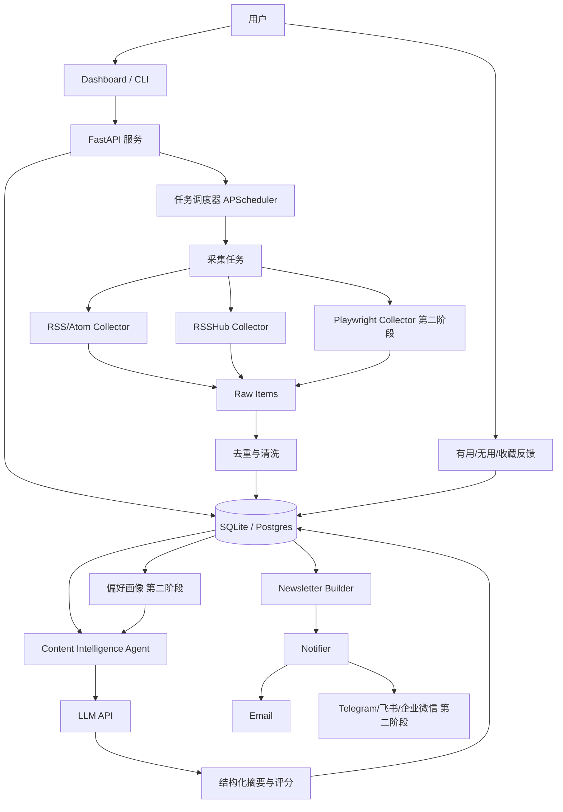
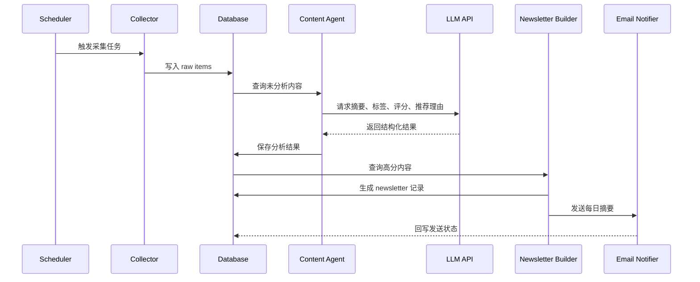
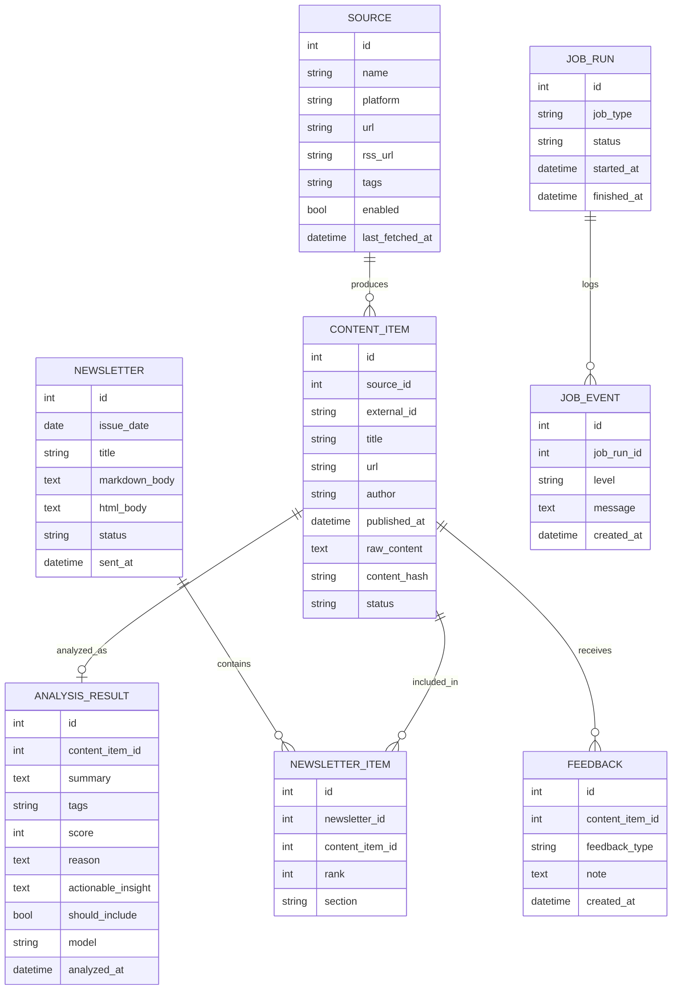

# LetterMate 项目方案与架构设计

> **Superseded on 2026-07-21:** Product scope, Agent boundaries, Eval, deployment,
> and portfolio acceptance are now defined by
> `docs/lettermate-agentic-product-requirements-v2.md`. This file is retained as
> the original product and architecture history; do not use it as the active MVP baseline.

日期：2026-06-26

## 0. 2026-07-21 重规划决策

2026-07-21 的进度审查确认：技术栈和模块边界仍然适合 MVP，但原实施计划后半段不足以交付完整产品闭环。本段记录当时的重规划历史；当前产品基线已经迁移到 `docs/lettermate-agentic-product-requirements-v2.md`，新的 V3 实施计划尚待生成。

本次重规划采用以下约束：

- 保留 Python/FastAPI/SQLAlchemy/SQLite 的模块化单体架构，不引入 LangGraph、任务队列或多用户系统。
- 后续按 `collect -> persist -> analyze -> build -> send` 垂直闭环推进，不再先完成一组互不连通的模块。
- Fake LLM 只用于测试和离线演示；正常运行必须支持至少一个真实的结构化输出 LLM provider。
- 采集、分析、Newsletter 生成和邮件发送都必须可重复执行，并为每次执行保存 `JobRun` 和失败事件。
- 内容去重采用规范化 URL、来源内 guid/external ID、独立内容 hash 三层策略；内容 hash 不包含 URL。
- 增加 `NewsletterItem`，保存每期 Newsletter 的内容成员、排序和分区，不能只保留渲染后的 HTML/Markdown。
- 调度器必须覆盖定时采集和完整每日流程，不能只调度分析与 Newsletter 生成。
- Dashboard 必须展示真实运行数据，包括来源、内容与分析、Newsletter 历史和任务状态；仅有健康检查和静态骨架不算完成。
- 离线端到端测试必须覆盖完整每日流程及重复执行，测试中不得访问真实 RSS、LLM 或 SMTP 服务。

本文档只保留原始产品目标和架构历史；当前需求以 `docs/lettermate-agentic-product-requirements-v2.md` 为准，现有实施计划不得作为活动基线执行。

## 1. 项目定位

LetterMate 是一个面向个人信息消费的多源内容智能助理。它会定时收集用户订阅的博客、B站 UP 主、RSSHub 源，以及后续的小红书、X、微信公众号等内容，对新内容进行去重、清洗、摘要、价值评分和主题归类，最后生成每日 Newsletter 并通过邮件或 IM 推送给用户。

如果作为求职简历项目，LetterMate 不应被包装成“爬虫 + 摘要脚本”，而应定位为：

> 一个具备多源采集、信息筛选、结构化摘要、个性化偏好反馈和自动推送能力的 Personal Intelligence Agent。

这个定位能展示 agent 岗位最关心的能力：真实任务拆解、工具调用、数据状态管理、LLM 结构化输出、异步调度、失败恢复、可观测性和产品闭环。

## 2. 项目目标

### 2.1 用户目标

- 自动收集关注的信息源，减少手动刷平台的时间。
- 过滤低价值内容，只保留值得阅读、收藏或行动的信息。
- 每天收到一份结构清晰、可快速浏览的个人 Newsletter。
- 通过反馈逐步让系统理解自己的阅读偏好。

### 2.2 简历目标

- 展示一个完整可运行的 agent 应用，而不是单点 demo。
- 展示工程能力：模块化设计、数据库建模、任务调度、日志、测试、Docker 部署。
- 展示 LLM 应用能力：摘要、评分、结构化输出、prompt 设计、可解释推荐。
- 展示产品判断：知道哪些平台适合第一期做，哪些平台因反爬或 API 成本应放到第二期。

## 3. 推荐技术方案

采用代码优先方案：

| 层级 | 技术选择 | 说明 |
| --- | --- | --- |
| 后端语言 | Python | Agent 和数据处理生态成熟，适合快速迭代 |
| Web 框架 | FastAPI | 提供管理 API、任务触发 API、Dashboard 数据接口 |
| CLI | Typer | 方便本地调试采集、摘要、推送任务 |
| 数据库 | SQLite 起步，Postgres 可选 | MVP 简单，后续可迁移 |
| ORM | SQLAlchemy 或 SQLModel | 数据模型清晰，便于迁移 |
| 采集 | feedparser + RSSHub + Playwright | 第一阶段 RSS/RSSHub，第二阶段动态站点 |
| 调度 | APScheduler | MVP 足够，后续可替换 Celery/Prefect |
| LLM | OpenAI/Claude/DeepSeek 等 | 使用结构化输出生成摘要和评分 |
| Agent 编排 | 先直接编排，第二阶段引入 LangGraph | 避免第一期过度复杂 |
| 推送 | SMTP 邮件优先 | 稳定、演示成本低 |
| 前端 | 简单 Dashboard，可用 FastAPI templates 或 Next.js | 简历项目建议至少有可演示页面 |
| 部署 | Docker Compose | 方便面试展示和复现 |

## 4. MVP 范围

### 4.1 第一阶段必须完成

- 支持订阅源配置：YAML 或 Web UI 添加 RSS/RSSHub 源。
- 支持博客 RSS/Atom 采集。
- 支持 B站 RSSHub 源采集。
- 支持内容去重：URL、guid、标题、内容 hash。
- 支持内容清洗：提取标题、作者、发布时间、正文摘要、链接。
- 支持 LLM 结构化分析：
  - `summary`：内容摘要。
  - `tags`：主题标签。
  - `score`：价值评分，1 到 5。
  - `reason`：为什么值得或不值得推送。
  - `actionable_insight`：可行动信息或启发。
- 支持每日 Newsletter 生成。
- 支持邮件推送。
- 支持简单 Dashboard：
  - 查看订阅源。
  - 查看采集到的内容。
  - 查看评分和摘要。
  - 查看已发送 Newsletter。
- 支持基础日志和任务运行状态。

### 4.2 第一阶段明确不做

- 不做完整小红书自动化采集。
- 不做任意公众号关注列表同步。
- 不做 X 深度 API 集成。
- 不做复杂权限系统。
- 不做多用户 SaaS。
- 不做向量数据库和 RAG 知识库。

这些内容不是不重要，而是会拉高第一版不确定性。简历项目的第一目标是可运行、可演示、可解释。

## 5. 总体架构



架构原则：

- 采集、分析、推送解耦，任一环节失败不影响其他环节的状态记录。
- 数据先落库，再分析，避免采集结果因 LLM 调用失败而丢失。
- LLM 输出必须结构化，便于排序、筛选、测试和展示。
- 第一阶段保持单体应用，模块边界清晰，后续可以拆任务队列或独立 worker。

## 6. 核心 Agent 工作流

### 6.1 每日自动流程



### 6.2 Agent 决策逻辑

Content Intelligence Agent 负责把“内容”转成“值得阅读的信息”。它不是简单摘要器，而是一个包含判断标准的决策模块。

输入：

- 标题。
- 作者。
- 来源平台。
- 发布时间。
- 链接。
- 正文或内容片段。
- 用户偏好配置。
- 历史反馈，第二阶段启用。

输出：

```json
{
  "summary": "三句话以内的摘要",
  "tags": ["AI", "Product", "Career"],
  "score": 4,
  "reason": "与用户关注的 agent 工程方向相关，包含可复用的系统设计观点。",
  "actionable_insight": "可记录到项目 README 的 agent 评估指标部分。",
  "should_include": true
}
```

评分建议：

- `5`：强相关，有行动价值，应置顶。
- `4`：相关且有启发，应推送。
- `3`：一般相关，可放入补充阅读。
- `2`：信息密度低，不推送。
- `1`：广告、重复、噪音或无关内容。

## 7. 模块设计

### 7.1 Source Manager

职责：

- 管理订阅源。
- 支持启用/停用。
- 支持平台类型、标签、采集频率配置。

关键字段：

- `id`
- `name`
- `platform`
- `url`
- `rss_url`
- `tags`
- `enabled`
- `fetch_interval_minutes`
- `last_fetched_at`

### 7.2 Collector

职责：

- 根据来源类型抓取内容。
- 标准化成统一的 `RawItem`。
- 记录抓取成功、失败、耗时和错误信息。

第一阶段实现：

- `RSSCollector`
- `RSSHubCollector`

第二阶段实现：

- `PlaywrightCollector`
- `XApiCollector`
- `WechatLinkCollector`

### 7.3 Dedupe & Cleaner

职责：

- URL 去重。
- guid 去重。
- 标题 + 来源 + 日期弱去重。
- 内容 hash 去重。
- 清理 HTML、空白字符、广告片段。

设计原因：

很多内容源可能通过不同路径采集到同一篇内容，先去重能节省 LLM 成本。

### 7.4 Content Intelligence Agent

职责：

- 调用 LLM 分析内容。
- 生成摘要、标签、评分、推荐理由。
- 按用户偏好判断是否进入 Newsletter。
- 保存结构化结果。

第一阶段可以使用普通服务类实现：

- `analyze_item(item, preferences) -> AnalysisResult`

第二阶段再升级为 LangGraph：

- `classify -> summarize -> score -> explain -> decide`

### 7.5 Newsletter Builder

职责：

- 查询当天高价值内容。
- 按主题、平台、分数排序。
- 生成 Markdown 和 HTML。
- 保存 newsletter 版本。

推荐结构：

- 今日重点。
- 按主题分组。
- 值得行动的洞察。
- 补充阅读。
- 被过滤内容统计。

### 7.6 Notifier

职责：

- 发送邮件或 IM。
- 记录发送状态。
- 支持失败重试。

第一阶段：

- SMTP 邮件。

第二阶段：

- Telegram Bot。
- 飞书机器人。
- 企业微信机器人。

### 7.7 Dashboard

职责：

- 展示项目可视化成果，增强简历展示效果。
- 管理订阅源。
- 查看内容、摘要、评分和推送历史。
- 给内容打反馈。

第一阶段页面：

- Overview：今日采集数、分析数、推送数、失败数。
- Sources：订阅源列表。
- Items：内容列表和分析结果。
- Newsletters：历史 Newsletter。
- Feedback：有用/无用/收藏。

## 8. 数据模型设计



## 9. API 设计

MVP API 可以保持简单：

| 方法 | 路径 | 用途 |
| --- | --- | --- |
| `GET` | `/health` | 健康检查 |
| `GET` | `/sources` | 查看订阅源 |
| `POST` | `/sources` | 新增订阅源 |
| `PATCH` | `/sources/{id}` | 更新订阅源 |
| `POST` | `/jobs/collect` | 手动触发采集 |
| `POST` | `/jobs/analyze` | 手动触发分析 |
| `POST` | `/jobs/newsletter` | 手动生成 Newsletter |
| `GET` | `/items` | 查看内容列表 |
| `GET` | `/items/{id}` | 查看内容详情 |
| `POST` | `/items/{id}/feedback` | 提交反馈 |
| `GET` | `/newsletters` | 查看 Newsletter 历史 |
| `GET` | `/newsletters/{id}` | 查看单期 Newsletter |
| `POST` | `/newsletters/{id}/send` | 手动发送 |

## 10. 配置设计

示例 `sources.yaml`：

```yaml
sources:
  - name: "OpenAI Blog"
    platform: "blog"
    type: "rss"
    url: "https://openai.com/news/rss.xml"
    tags: ["AI", "LLM"]
    enabled: true

  - name: "B站某 UP 主投稿"
    platform: "bilibili"
    type: "rsshub"
    url: "https://rsshub.example.com/bilibili/user/video/123456"
    tags: ["AI", "Video"]
    enabled: true
```

示例 `preferences.yaml`：

```yaml
profile:
  interests:
    - agent engineering
    - LLM applications
    - product design
    - career growth
  exclude:
    - pure marketing
    - low information density
    - repeated news
  min_score_to_include: 4
newsletter:
  schedule: "08:30"
  max_items: 10
  language: "zh-CN"
```

## 11. 错误处理与可靠性

采集失败：

- 记录失败原因和 HTTP 状态。
- 保留上次成功抓取时间。
- 单个来源失败不影响其他来源。

LLM 失败：

- 内容状态标记为 `pending_analysis`。
- 支持后续重试。
- 对长内容先截断或分块。

推送失败：

- Newsletter 状态标记为 `send_failed`。
- 保留邮件 HTML 和 Markdown。
- 支持手动重发。

数据一致性：

- 先保存 raw item，再进入分析。
- 每个任务有 `job_run` 记录。
- 关键操作可重复执行，避免重复推送。

## 12. 测试策略

单元测试：

- RSS 解析。
- URL/hash 去重。
- LLM 输出 schema 校验。
- Newsletter 排序和分组。

集成测试：

- 使用本地 fake RSS feed 测试完整采集流程。
- 使用 mock LLM 测试分析流程。
- 使用本地 SMTP mock 测试邮件发送。

端到端演示：

- 准备 3 到 5 个稳定 RSS 源。
- 一键运行采集、分析、生成、发送。
- Dashboard 展示采集结果、摘要和历史 Newsletter。

## 13. 里程碑计划

### Milestone 1：项目骨架

- FastAPI 应用。
- SQLite 数据库。
- Source、ContentItem、AnalysisResult、Newsletter 数据模型。
- CLI 命令入口。
- Docker Compose。

### Milestone 2：采集与去重

- RSS feed 采集。
- RSSHub URL 采集。
- 内容标准化。
- URL/guid/hash 去重。
- 任务运行日志。

### Milestone 3：LLM 分析

- 结构化摘要 prompt。
- JSON schema 校验。
- 评分和推荐理由。
- mock LLM 测试。

### Milestone 4：Newsletter 生成与推送

- Markdown/HTML 模板。
- 每日内容排序和分组。
- SMTP 邮件发送。
- 推送历史记录。

### Milestone 5：Dashboard 与反馈

- 订阅源管理。
- 内容列表。
- Newsletter 历史。
- 有用/无用/收藏反馈。

### Milestone 6：简历增强功能

- LangGraph 版本的 agent workflow。
- Playwright 采集实验。
- 可观测性页面。
- README 架构图、demo 截图、项目复盘。

## 14. 简历展示方式

### 14.1 简历项目描述

可写成：

> LetterMate: Personal Intelligence Agent。基于 Python/FastAPI 构建多源内容聚合与智能 Newsletter 系统，支持 RSS/RSSHub 内容采集、去重、LLM 结构化摘要、价值评分、每日邮件推送和用户反馈闭环。设计了可扩展 collector 架构、任务调度与失败重试机制，并通过 Dashboard 展示 agent 决策结果。

### 14.2 简历 bullet

- 设计并实现多源内容采集架构，支持 RSS、RSSHub，并预留 Playwright/X API/公众号链接采集扩展点。
- 使用 LLM 结构化输出生成摘要、标签、价值评分、推荐理由和可行动洞察，实现从内容聚合到信息筛选的 agent 决策链路。
- 构建基于 SQLite/Postgres 的内容状态管理，支持去重、分析状态追踪、Newsletter 版本记录和用户反馈。
- 使用 APScheduler 实现定时采集、分析和推送任务，增加任务日志、失败重试和手动触发 API。
- 提供 Dashboard 展示订阅源、内容评分、历史 Newsletter 和反馈数据，便于演示完整产品闭环。

### 14.3 面试讲述重点

- 为什么第一期先做 RSS/RSSHub，而不是直接做小红书/公众号全量自动化。
- 如何把“摘要器”升级成“agent 决策模块”。
- 如何控制 LLM 成本：先去重、再过滤、最后分析。
- 如何处理平台不稳定：collector 插件化、失败隔离、任务日志。
- 如何让系统可迭代：用户反馈、偏好配置、评分规则。

## 15. 风险与应对

| 风险 | 影响 | 应对 |
| --- | --- | --- |
| 小红书、公众号、X 接入不稳定 | 项目延期 | 第一阶段不作为核心闭环，作为扩展实验 |
| LLM 输出不稳定 | Newsletter 质量波动 | 使用结构化 schema、重试、fallback prompt |
| 内容重复 | 成本升高、体验变差 | URL/guid/hash 多层去重 |
| 邮件进垃圾箱 | 推送失败 | 支持 IM 推送作为备选 |
| 项目过大 | 难以完成 | 坚持单用户 MVP，不做多用户 SaaS |

## 16. 成功标准

MVP 成功标准：

- 可以配置至少 5 个订阅源。
- 可以一键完成采集、分析、生成 Newsletter、发送邮件。
- 每条内容有摘要、标签、评分和推荐理由。
- Dashboard 能展示来源、内容、分析结果和 Newsletter 历史。
- README 包含架构图、运行方式、demo 截图和技术取舍说明。

简历成功标准：

- 面试官能在 3 分钟内理解项目价值。
- 代码仓库能在 10 分钟内本地跑起来。
- 项目不依赖不稳定平台也能完成核心 demo。
- 项目能清晰体现 agent 工程能力，而不只是 API 调用。

## 17. 推荐下一步

下一步进入实现计划前，建议先确认第一版的最终取舍：

- 推送渠道：默认邮件。
- 内容源：默认博客 RSS + B站 RSSHub + 手动 RSSHub 源。
- 模型：默认使用一个支持结构化输出的 LLM API。
- UI：默认做一个轻量 Dashboard，而不是只做命令行。

确认后即可把本文档拆成开发计划，按 Milestone 逐步实现。
