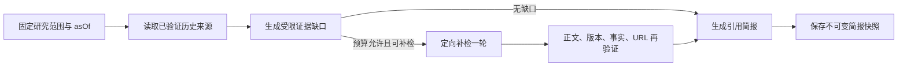

# LetterMate Agent 能力与企业方案对比研究

**日期：** 2026-08-08
**范围：** 开源 Agent 编排、Durable Execution、MCP、Agent 可观测性，以及 AWS、Azure、Google 的托管 Agent 平台
**研究边界：** 不讨论离线质量评估；只判断哪些运行时和产品能力适合 LetterMate 的多源发现、精确关键词、趋势种子、来源验证、去重、中文 Feed 与 BullMQ 长任务。
**结论：** LetterMate 不应为了简历展示而迁移到通用多 Agent 框架。当前最有业务价值、也最能体现工程深度的方向，是：在现有确定性发现管线之上增加受限的证据缺口补检、阶段 checkpoint/resume、任务级模型路由与成本预算；随后再提供基于已验证来源的中文研究简报。MCP、自由协作式多 Agent、AutoGen/CrewAI，以及云厂商托管 Agent Runtime 目前都不应成为主线。

## 1. 先确认 LetterMate 已有的 Agent 基线

以下能力已经存在，不能重新包装成“新亮点”：

- Topic、Trend、Creator 已是不同触发入口，共享正文补全、事实支持、精确/近似去重、中文化和来源验证。
- Topic 运行有数据库租约、快照、超时、失败恢复和 BullMQ 重试；Trend、Creator、Digest 也有持久化运行状态。
- AI 输出使用 JSON Schema 与 Zod 双重约束，非法结构会被拒绝或进行一次受限修复。
- AI 只能从服务端已验证候选中选择 URL；最终 URL 再经过规范化和 allowlist 检查，模型不能发明来源。
- 上游标题、正文、作者、平台和 URL 被明确视为不可信数据，系统提示要求忽略其中的指令，已有 prompt-injection 基础防护。
- 外部抓取已有 SSRF、MIME、大小、重定向和超时限制。
- 兴趣记忆已经是可审计、可撤销、版本化的结构化信号，而不是一段由 LLM 随意改写的“Agent memory”。
- 已有脱敏 run/stage 日志，但目前主要是阶段耗时和聚合数量，还不是完整的模型用量、成本和可恢复执行记录。

因此，真正的缺口不是“有没有 Agent 类”，而是下面四个问题：

1. 初次检索发现正文或一手证据不足时，能否在不扩大关键词边界的前提下做一次有目标的补检？
2. 运行在检索或 AI 阶段后失败时，能否从最近完成的安全边界继续，而不是重做全部外部调用？
3. 不同 AI 任务能否使用不同模型，并受每次运行的请求、Token、成本和时间预算约束？
4. 能否把合格内容进一步组织成有逐条引用、可回溯且不夸大结论的中文研究简报？

## 2. 候选能力的结论对比

| 候选能力 | 业务价值 | 工程信号 | 当前适配性 | 结论 |
| --- | --- | --- | --- | --- |
| 基于已验证来源的 cited research brief | 高：把“发现链接”升级为“理解变化” | 高：claim-source 约束、快照、长任务、引用渲染 | 高，但依赖下面三项基础 | **建议做，作为用户可见主亮点** |
| bounded evidence-gap follow-up retrieval | 高：挽救缺正文、缺一手来源或版本证据的候选 | 很高：受限 Agent loop、停止条件、业务不变量 | 很高 | **优先做** |
| durable stage checkpoint / resume | 高：减少重复抓取和重复 AI 成本，提高长任务恢复能力 | 很高：幂等、租约、checkpoint、版本快照 | 很高 | **优先做，先沿用 BullMQ** |
| per-run budget、task-specific model routing、usage/cost governance | 高：直接控制成本、降级和供应商故障 | 很高：能力路由、审计、SLO、FinOps | 很高 | **优先做** |
| targeted HITL | 中低：只有身份确认、昂贵任务或未来写操作需要 | 中：interrupt/resume、审批审计 | 当前大部分是只读自动任务 | **不做通用 HITL，只保留定点场景** |
| MCP | 当前低：14 个第一方 connector 已有类型化接口 | 中高，但容易沦为协议展示 | 当前无第三方插件生态 | **暂缓；先借鉴工具契约和安全模式** |
| 自由协作式多 Agent | 低：现有任务是确定性流水线，不是开放式团队协作 | 表面高，实际可控性差 | 低 | **暂缓；使用显式 graph/stage，不让 Agent 互聊** |
| 迁移到云厂商托管 Agent Runtime | 取决于部署环境 | 企业能力强 | 与现有 BullMQ/PostgreSQL/Redis 重叠 | **部署选型，不应成为产品核心** |

## 3. 最值得做的用户功能：有来源的研究简报

### 3.1 功能定义

用户在 Topic 或 Feed 条目上主动发起“研究简报”，系统生成一份中文快照，至少包含：

- 发生了什么：只陈述来源能够支持的事实；
- 时间线：按原始发布时间组织，不用模型猜测日期；
- 为什么重要：与该精确 Topic 或具体版本的关系；
- 来源之间的差异：存在冲突时并列呈现，不替用户制造确定结论；
- 仍未知的内容：证据不足时明确留空或说明尚无可靠来源；
- 逐段或逐条引用：每个关键事实都能跳回已验证 HTTP(S) 原文。

这比简单增加“聊天 Agent”更符合 LetterMate，因为它复用了产品最强的资产：持续采集、多源证据、历史去重、精确版本边界和中文输出。

OpenAI 官方将 deep research 定位为通过 Responses API 和搜索/数据工具完成多步骤研究并输出带引用结果的长任务；官方也建议长任务采用 background mode。它证明了“多步检索 + cited report”是成熟产品形态，但 LetterMate 不应把托管 deep research 的网页结果直接写入 Feed，而应让任何模型或托管研究服务都受本地 verified-source pool 约束。[OpenAI deep research guide](https://developers.openai.com/api/docs/guides/deep-research)；[OpenAI background mode](https://developers.openai.com/api/docs/guides/background)

### 3.2 与通用 deep research 的区别

| 维度 | 通用 deep research | LetterMate research brief |
| --- | --- | --- |
| 入口 | 任意开放问题 | 已有 Topic、Feed 条目或明确技术对象 |
| 搜索范围 | 通常允许模型自主扩大 | 完整关键词、型号、版本边界不可扩大 |
| 来源 | 由托管服务或模型搜索获得 | 必须进入 LetterMate 主发现管线并通过抓取、事实与 URL 验证 |
| 输出 | 一次性报告 | 可重放的 `asOf` 快照，关联运行、来源和策略版本 |
| 失败结果 | 可能仍生成尽力回答 | 没有充分证据时允许短报告、未决项或零结果 |
| 对 Feed 的影响 | 取决于产品 | 简报不能反向绕过 Feed 质量门槛 |

### 3.3 推荐的执行结构



简报生成器只能引用输入中的稳定 `sourceId`，服务端再将 `sourceId` 映射为 URL；不要让模型直接输出或改写 URL。简报应保存 `asOf`、Topic/条目快照、来源集合、prompt/policy/model-route 版本和最终内容，保证以后能够说明“这份简报当时基于什么生成”。

### 3.4 不应加入的内容

- 不显示内部可信分、证据数量或来源排名；这些与当前产品约束冲突。
- 不因多个来源重复报道就把同一事实判得更真。
- 不把趋势榜单当证据；趋势仍然只能产生搜索种子。
- 不提供无边界的“帮我研究任何东西”聊天入口；首版只从现有 Topic/Feed 上下文发起。
- 不把简报中的新结论自动写回 Topic、兴趣画像或 Feed。

## 4. 核心 Agent 能力：受限证据缺口补检

### 4.1 为什么它比自由 Agent loop 更合适

当前质量管线遇到正文不足会抓取正文，仍不满足时丢弃；AI 判断 `unsupported` 或 `conflicting` 后也不会继续寻找另一份一手材料。这保证了高精度，但会漏掉“新闻摘要先出现、官方 release notes 稍后可找到”或“当前来源只缺具体版本证明”的有效内容。

建议增加一个 **最多一轮、由确定性控制器执行** 的补检环：

1. 初次检索和正文补全完成。
2. 质量阶段返回临时 `EvidenceGap`，只描述缺什么，不给可信分，也不生成 URL。
3. 控制器检查 Topic 边界、剩余时间、请求数和 AI 成本预算。
4. 仅为可补救缺口生成精确 query，并只路由到适合的 connector。
5. 新候选重新经过现有正文、事实、去重、中文和 URL 门控。
6. 达到一轮、预算或 deadline 任一停止条件即结束；没有合格内容仍是正常结果。

建议的内部缺口代码可以是 `missing_body`、`missing_primary_record`、`version_ambiguous`、`date_ambiguous`、`source_conflict`。它们只属于运行工件，不成为用户可见的 Feed trust state。

LangGraph 的 graph、conditional edge 和 durable execution，CrewAI Flow 的 event/branch/loop，以及 Google ADK 的 graph、dynamic、loop/parallel workflow 都证明“模型节点和确定性节点混合”是主流模式；但 LetterMate 的环路很小，直接实现显式状态机比引入框架更清楚。[LangGraph overview](https://docs.langchain.com/oss/javascript/langgraph/overview)；[CrewAI Flows](https://docs.crewai.com/en/concepts/flows)；[Google ADK workflows](https://adk.dev/workflows/)

### 4.2 强制边界

- `maxFollowupRounds = 1`，以后只有真实数据证明有价值才提高。
- query 必须包含原 Topic 的完整关键词；实体/版本 Topic 还必须包含精确 required terms。
- 模型只能返回缺口类型、查询文本和 connector capability，不直接选择任意 URL。
- connector、候选数、抓取字节、请求次数、AI Token、成本和 wall-clock 都有硬预算。
- 补检失败不回滚首轮已经合格的内容，也不降低质量门槛。
- 同一 source/candidate fingerprint 不重复抓取或重复送入 AI。
- prompt injection 防护沿用现有策略：来源文本永远是数据，不能改变 query、预算、connector 或停止条件。

### 4.3 简历价值

这项能力可以准确描述为“bounded agentic retrieval”，因为它确实存在观察、诊断、行动、再验证的闭环；同时停止条件、工具集合和业务边界都由代码控制，不是假装自主的无限循环。

## 5. 运行可靠性：先在 BullMQ 上做 checkpoint/resume

### 5.1 当前租约没有解决什么

现有租约解决的是重复 Worker、过期占用和并发所有权，不等于 durable execution。一个 Topic 在完成 14 个 connector、正文抓取或 AI 判断后发生进程崩溃，BullMQ 重试仍可能重新执行此前的外部调用。

建议为每个运行增加阶段游标和不可变工件引用：

```text
RunStage
  runId
  stage                  plan | retrieve | enrich | assess | followup | compose | persist
  status                 pending | running | completed | failed
  inputDigest
  artifactRef?
  attemptCount
  startedAt / finishedAt
  codeVersion
  policyVersion
  promptVersion?
  modelRouteVersion?
  safeError?
```

恢复时只复用满足以下条件的 `completed` 工件：输入摘要、Topic 快照、代码/策略/提示版本均匹配，且工件仍在保留期内。数据库写入继续使用幂等键和事务；Redis job data 只保存游标和小型引用，不保存大正文。

BullMQ 官方已经提供 Process Step Jobs 模式：每完成一步就更新 job data，使重试从正确步骤开始；Flows 还支持 parent-child fan-out/fan-in。BullMQ 同时强调可重试 job 应保持幂等、原子和简单。LetterMate 已经依赖 BullMQ，因此应先使用这些模式和 PostgreSQL 工件表，而不是增加第二个编排基础设施。[BullMQ Process Step Jobs](https://docs.bullmq.io/patterns/process-step-jobs)；[BullMQ Flows](https://docs.bullmq.io/guide/flows)；[BullMQ idempotent jobs](https://docs.bullmq.io/patterns/idempotent-jobs)

### 5.2 与 LangGraph、Temporal 的对比

LangGraph 官方把 durable execution、human-in-the-loop 和 memory 作为长运行 stateful agent 的核心能力，并要求可重放节点对非确定操作和副作用进行封装。[LangGraph durable execution](https://docs.langchain.com/oss/javascript/langgraph/durable-execution)

Temporal 的保证更强：Workflow Event History 是事实源，进程失败后通过 replay 重建状态；网络、数据库、LLM 和文件 I/O 等外部副作用放在 Activity 中，replay 复用已记录结果。Temporal TypeScript SDK支持 Node.js，并面向分布式、长运行异步业务逻辑。[Temporal Workflows](https://docs.temporal.io/workflows)；[Temporal TypeScript SDK](https://github.com/temporalio/sdk-typescript)

| 方案 | 优点 | 代价 | LetterMate 结论 |
| --- | --- | --- | --- |
| BullMQ step + PostgreSQL artifact | 复用现有栈；改造范围小；与当前租约、Prisma 事务一致 | replay 语义和版本治理需要自己定义 | **现在采用** |
| LangGraph JS checkpointer | AI graph、branch、interrupt 表达清楚 | 与现有 service/queue 状态重复；仍需业务幂等 | 补检环明显复杂后再考虑 |
| Temporal TypeScript | Event History、Activity retry、timer、signal、长时暂停成熟 | 新服务、新数据库/Cloud、确定性约束、迁移所有工作流 | 达到触发条件后再评估 |

Temporal 的合理触发条件是：单次流程跨天或跨周、需要大量 timer/signal/HITL 暂停、跨多个服务执行 saga、出现多个独立 Worker runtime，或手写 replay/补偿逻辑已经成为主要维护成本。当前发现运行默认十分钟级，未达到这一阈值。

## 6. 模型路由、运行预算与成本治理

### 6.1 当前缺口

LetterMate 目前主要通过单一 `AI_MODEL` 承担 Topic 扩展、趋势分类、候选判断、中文编写、Creator 本地化和兴趣标签。不同任务对推理能力、结构化输出、上下文长度、延迟和成本的要求明显不同；OpenRouter 响应中的 usage/cost 也尚未成为运行预算的一部分。

OpenRouter 官方说明每个响应会返回 prompt/completion/reasoning/cache Token 和 cost；其路由支持 provider 选择、价格上限、fallback 和数据策略。其 Agent SDK 还提供按 step、Token 和 cost 的停止条件。这些能力可以直接作为 LetterMate 自有网关的设计依据，不必迁移到 OpenRouter Agent SDK。[OpenRouter usage accounting](https://openrouter.ai/docs/cookbook/administration/usage-accounting)；[OpenRouter provider routing](https://openrouter.ai/docs/guides/routing/provider-selection)；[OpenRouter model fallbacks](https://openrouter.ai/docs/guides/routing/model-fallbacks)；[OpenRouter stop conditions](https://openrouter.ai/docs/agent-sdk/call-model/stop-conditions)

### 6.2 推荐的任务路由

```text
AiTask
  topic_expansion
  trend_classification
  evidence_gap_detection
  candidate_assessment
  brief_synthesis
  feed_localization
  creator_localization
  interest_tagging

ModelRoute
  task
  primaryModel
  fallbackModels[]
  requiredCapabilities[]
  maxInputTokens / maxOutputTokens
  timeoutMs
  allowProviderFallback
  providerAllowlist?
  dataPolicy
  version
```

原则不是“便宜模型做所有简单任务、贵模型做所有重要任务”，而是每条 route 都有回归验证后的固定版本：

- 分类、标签和 query 草案可使用快速、低成本且结构化输出稳定的模型。
- 事实支持判断和研究简报需要更强的长上下文与指令遵循能力。
- 中文本地化可以单独路由，但预算不足时不能输出英文 Feed；只能减少结果或返回零结果。
- fallback 只对允许的 retryable provider/model 错误生效；实际请求模型和实际响应模型都要记录。
- 自动“任意最佳模型”路由不适合核心质量阶段，因为它削弱可复现性。模型晋级应通过版本化配置完成。

### 6.3 每次运行的硬预算

建议同时限制：

- connector 请求数与每 connector 请求数；
- 抓取总字节和候选总数；
- AI input/output/reasoning Token；
- AI 实际成本；
- follow-up round 和 tool call 数；
- wall-clock deadline；
- 用户或租户的日预算与并发配额。

预算耗尽后的业务语义必须是“保留已经通过全部门槛的少量结果，停止可选步骤或返回零结果”，不能降低证据、中文或来源标准。Interest tagging 等派生任务可以延迟补做；Feed 必需的中文内容和来源验证不能跳过。

### 6.4 可观测性

OpenTelemetry 已将 GenAI spans、metrics、events、MCP 和 provider conventions 拆入独立 GenAI semantic-conventions 仓库。当前 GenAI span 约定仍标为 `Development`，包含 `gen_ai.operation.name`、provider、request/response model、prompt name/version、input/output Token 和 tool execution；输入、输出、system instructions 和 tool definitions 属于 opt-in，且官方明确警告可能包含 PII 或敏感信息。[OpenTelemetry GenAI conventions](https://github.com/open-telemetry/semantic-conventions-genai)；[GenAI spans](https://github.com/open-telemetry/semantic-conventions-genai/blob/main/docs/gen-ai/gen-ai-spans.md)

LetterMate 应保留自己的稳定内部事件契约，再映射到 OTel，而不是让处于 Development 的字段直接成为数据库 schema。推荐记录 task、run ID、route version、requested/actual model、provider、duration、retry、Token、cost 和低基数错误码；默认不记录 prompt、来源正文、用户关键词、URL 和模型输出。

## 7. HITL：只用于真正需要人类授权的边界

LangGraph interrupts、OpenAI Agents SDK human-in-the-loop、CrewAI Flow human feedback、Microsoft Agent Framework checkpoint/HITL，以及 AWS Bedrock 的 return control 都支持暂停运行并把工具参数交给应用或人类后继续。[LangGraph interrupts](https://docs.langchain.com/oss/javascript/langgraph/interrupts)；[OpenAI Agents SDK human-in-the-loop](https://developers.openai.com/api/docs/guides/agents-sdk#human-in-the-loop)；[AWS Bedrock return control](https://docs.aws.amazon.com/bedrock/latest/userguide/agents-returncontrol.html)

但 LetterMate 的核心工具是只读搜索和抓取，且产品追求后台自动发现。把每次 connector 或 AI 判断交给用户确认会破坏体验。建议：

- **保留已有 HITL：** Creator 身份预览与用户确认，这是外部身份绑定的正确边界。
- **研究简报：** 用户主动点击生成已经构成授权；首版不再增加中途审批。若范围不明确，在启动前收集时间范围和精确对象，而不是运行中打断。
- **证据冲突：** 系统在简报中说明未决，不让用户替系统“批准”为事实，也不进入 Feed。
- **未来写操作：** 如果以后支持发帖、订阅外部账号、修改第三方资源或付费工具，必须增加 tool-level confirmation、参数预览和审批审计。
- **运维场景：** 重复认证失败、超预算重跑或切换数据策略可以要求管理员批准，但这是控制面，不应伪装成 Agent 对话。

结论是当前不需要新建通用 HITL 引擎。Checkpoint schema 要预留 `waiting_for_input` 的可能性，但不提前建设没有业务入口的审批 UI。

## 8. MCP：值得借鉴，不值得现在接入主发现链路

MCP 是 host-client-server 协议：server 暴露 tools/resources/prompts，host 负责权限、上下文聚合和安全边界；每个 client 与一个 server 建立隔离会话并进行 capability negotiation。它是工具互操作协议，不是 durable workflow 或业务质量框架。[MCP architecture 2025-11-25](https://modelcontextprotocol.io/specification/2025-11-25/architecture)

MCP 工具规范支持 JSON Schema 输入、可选 output schema 和结构化结果，同时要求 server 验证输入、实施访问控制、限流和净化输出，client 验证结果；工具 annotation 必须视为不可信。规范建议敏感操作保留人类拒绝能力。[MCP tools](https://modelcontextprotocol.io/specification/2025-11-25/server/tools)

MCP HTTP 授权基于 OAuth 2.1 子集，要求 resource indicator、token audience validation、HTTPS、PKCE，并明确防止 token passthrough、token theft 和 confused deputy。[MCP authorization](https://modelcontextprotocol.io/specification/2025-11-25/basic/authorization)

### 8.1 为什么现在不接入

- 14 个 connector 都是 LetterMate 第一方 TypeScript 代码，已经有 `SourceConnector`、Zod/domain validation、超时、并发、request budget、SSRF 和错误契约。
- 把内部函数包成 MCP 不会提升检索质量，反而增加进程/网络、协议协商、认证、tool poisoning 和版本兼容成本。
- 核心 Feed 需要严格的 URL allowlist 和来源 proof；让模型动态发现任意 MCP tool 会扩大信任边界。
- 当前没有第三方开发者、跨语言 connector 团队，或外部 Agent 客户端要消费 LetterMate 工具。

### 8.2 应先借鉴的 MCP 模式

可以把现有 connector registry 深化为内部 `ToolDescriptor`，包括稳定 ID、输入/输出 schema、只读/有副作用标记、所需 credential scope、source type、地区、配额、超时、数据保留策略和健康状态。它保持进程内接口，同时为未来 MCP adapter 留出边界。

真正需要 MCP 的触发条件：

1. 允许第三方独立部署 connector；
2. 需要 Python/Go 服务提供专业检索能力；
3. 希望外部 IDE/Agent 查询 LetterMate 已保存 Feed；
4. 企业客户要求将内部搜索、SharePoint 或数据平台通过统一协议接入。

届时应先提供只读工具，例如 `search_saved_feed`、`get_item_sources`、`list_topics`；触发刷新等写操作需要用户授权、所有权检查、幂等键和审计。内部主发现管线仍不应依赖任意远程 MCP server 才能完成。

## 9. 多 Agent 与开源框架逐项判断

### 9.1 LangGraph

LangGraph 是低层 stateful agent orchestration，重点是 durable execution、human-in-the-loop、memory、长运行状态和 graph/subgraph，而不是预制聊天 UI；有 JavaScript/TypeScript 实现。[LangGraph repository](https://github.com/langchain-ai/langgraph)；[LangGraph JS overview](https://docs.langchain.com/oss/javascript/langgraph/overview)

**可迁移模式：** typed state、conditional edge、checkpoint、interrupt；适合把 research brief 表达为显式 graph。
**不适用项：** 当前 Topic/Trend 主流程分支有限，引入 checkpointer 会与 Prisma run state、BullMQ retry 重叠。
**结论：** 不迁移主流程；当 research brief 出现多轮分支、暂停和子图复用后再做 spike。

### 9.2 OpenAI Agents SDK

官方 SDK 提供 agent、tools、handoffs/agents-as-tools、guardrails、sessions、tracing 和 HITL，JavaScript/TypeScript 与 LetterMate 技术栈匹配。[OpenAI Agents SDK guide](https://developers.openai.com/api/docs/guides/agents-sdk)

**可迁移模式：** 工具 schema、input/output/tool guardrail、run-level tracing、显式最大 turn；可用于独立的 on-demand brief。
**不适用项：** handoff 和 conversation session 不是定时发现的核心；SDK tracing 不能替代业务 checkpoint、租约或幂等。
**锁定：** SDK 是开源库且可抽象 model provider，但 OpenAI hosted tools、Responses background mode 和平台 trace 会产生 API/平台耦合。
**结论：** 可作为 research brief 的候选 adapter，不替换 `AiGateway` 和主编排。

### 9.3 AutoGen、Semantic Kernel 与 Microsoft Agent Framework

AutoGen 官方仓库目前明确进入 maintenance mode，不再新增功能，并建议新项目使用 Microsoft Agent Framework。AutoGen Studio 也明确是原型工具，不是生产应用。[AutoGen repository](https://github.com/microsoft/autogen)

Semantic Kernel Agent Framework 提供 agent abstraction、collaboration、human-agent collaboration 和 orchestration，主要面向 .NET、Python 与 Java 生态。[Semantic Kernel Agent Framework](https://learn.microsoft.com/en-us/semantic-kernel/frameworks/agent/)

Microsoft Agent Framework 是 AutoGen/Semantic Kernel 的当前后继方向，官方列出 graph workflow、sequential/concurrent/handoff/group collaboration、checkpointing、streaming、HITL、time travel 和 OpenTelemetry，但语言是 .NET 与 Python。[Microsoft Agent Framework repository](https://github.com/microsoft/agent-framework)

**可迁移模式：** middleware、checkpoint、并发 workflow、provider abstraction 和 OTel。
**不适用项：** LetterMate 是 TypeScript monorepo，引入 Python/.NET runtime 只为编排会增加部署和契约成本；自由 group collaboration 对精确来源工作流没有收益。
**结论：** AutoGen 不采用；Semantic Kernel 不新引入；只参考 Microsoft Agent Framework 的 workflow/middleware 设计。

### 9.4 CrewAI

CrewAI 区分 Crews 与 Flows：Crews 面向自主角色协作，Flows 面向精确、事件驱动的控制、共享状态、分支和循环；框架主要是 Python。[CrewAI repository](https://github.com/crewAIInc/crewAI)；[CrewAI Flows](https://docs.crewai.com/en/concepts/flows)

**可迁移模式：** 用 Flow 包住有边界的 Agent 步骤，而不是让 Crew 控制事实门槛。
**不适用项：** Python sidecar、角色提示和 Agent 对话会复制已有 TypeScript service 边界。
**结论：** 不采用；research brief 使用本地显式 workflow 即可。

### 9.5 Temporal

Temporal 不是 Agent 框架，而是 durable execution 平台。它最适合跨服务、长时间、需要 replay、timer、signal 和可靠 Activity retry 的业务流程。[Temporal Workflows](https://docs.temporal.io/workflows)

**可迁移模式：** deterministic workflow、外部调用 Activity 化、event history、idempotency key、signal。
**不适用项：** 当前流程短、已有 BullMQ/Redis/Prisma，立即迁移会形成双编排栈。
**结论：** 作为未来升级路线，不作为本轮亮点开发。

### 9.6 MCP 与 OpenTelemetry

MCP 解决工具互操作，OTel GenAI conventions 解决 telemetry vocabulary；二者都不负责业务编排、来源证明、租约或恢复。
**结论：** OTel 映射值得近期做；MCP adapter 暂缓。

## 10. 企业托管方案对比

| 方案 | 官方核心能力 | 对 LetterMate 的真实价值 | 锁定与不适用项 | 结论 |
| --- | --- | --- | --- | --- |
| AWS Bedrock Agents | 托管 prompt、memory、monitoring、encryption、permissions、API invocation；action groups、knowledge bases、trace、version/alias；支持 supervisor/collaborator 多 Agent | AWS/IAM/VPC 标准化、托管工具调用和审计 | Agent/action group/session/KB 都是 Bedrock 资源；仍需自行实现 connector、精确关键词、来源 proof 和 PostgreSQL 业务状态 | 仅在 AWS 企业部署要求明确时考虑，不迁移核心 |
| Microsoft Foundry Agent Service | Prompt agent、Hosted agent、Responses API；可托管 LangGraph/OpenAI Agents SDK/自定义 container；Entra identity、RBAC、VNet、observability、toolbox、MCP、版本与稳定 endpoint | 当前企业方案中对“保留自有代码”最友好；适合 Azure 身份和网络治理 | Hosted agent 仍围绕 Foundry Responses、tool catalog、Entra 和 Azure 运行环境；与 BullMQ worker hosting 重叠 | 可作为未来 Azure 部署层，不作为业务架构 |
| Google Vertex AI Agent Engine / 当前 Agent Runtime、ADK | ADK graph/dynamic/collaborative/template workflows；Session/State/Memory；Agent Runtime 托管部署、扩展和治理；日志、指标、trace | GCP/Gemini 团队可获得托管 runtime 与 ADK workflow | 当前 Agent Runtime 部署文档列 Python、Go；TypeScript ADK workflow 与托管部署支持并不完全对齐；Session/Memory 与现有 PostgreSQL 状态重复 | 当前不采用 |

AWS Bedrock Agents 官方说明其 Agent 会编排模型、数据源、应用和对话，自动调用 API/knowledge base，并由服务管理 prompt、memory、monitoring、encryption、permissions 和 API invocation；multi-agent 使用 supervisor 与 collaborators 的层级模型。[AWS Bedrock Agents](https://docs.aws.amazon.com/bedrock/latest/userguide/agents.html)；[AWS multi-agent collaboration](https://docs.aws.amazon.com/bedrock/latest/userguide/agents-multi-agent-collaboration.html)

Microsoft Foundry Agent Service 官方区分 prompt agents 与 hosted agents；Hosted agent 可以运行 Agent Framework、LangGraph、OpenAI Agents SDK 或自有代码，并提供托管 endpoint、autoscale、Entra identity、session state 和 observability。平台还提供 Responses API、MCP/toolbox、RBAC、VNet 与版本发布。[Microsoft Foundry Agent Service](https://learn.microsoft.com/en-us/azure/ai-foundry/agents/overview)

Google 的 Vertex AI Agent Engine 是本次比较所指的托管 Agent 方向；官方当前 ADK 部署文档使用 Google Cloud Agent Platform **Agent Runtime** 名称。ADK 把 workflow 分成 graph、dynamic、collaborative 和固定 sequence/loop/parallel 模板；Session、State、Memory 由可替换 service 管理。当前 Agent Runtime 部署页强调托管基础设施、扩展和治理，并列出 Python 与 Go 支持。[Vertex AI Agent Engine overview](https://cloud.google.com/vertex-ai/generative-ai/docs/agent-engine/overview)；[Google ADK workflows](https://adk.dev/workflows/)；[ADK sessions/state/memory](https://adk.dev/sessions/)；[Deploy to Agent Runtime](https://adk.dev/deploy/agent-runtime/)；[ADK observability](https://adk.dev/observability/)

### 10.1 企业能力中真正值得复制的部分

- agent/runtime identity：每个 connector 或工具只取得最小 credential scope；
- network boundary：生产环境按 connector 控制 egress，而不是允许任意模型 URL；
- version/publish：prompt、policy、model route 和 tool catalog 都有不可变版本，可灰度和回滚；
- stable endpoint：API 与 Worker 不感知具体模型供应商；
- usage/cost quota：按 user/run/task 计量，预算耗尽有明确语义；
- trace correlation：API trace、BullMQ job、database run、connector call 和 model call 使用同一 trace/run lineage；
- control plane 与 data plane 分离：配置、密钥、发布和审批不混入普通任务数据。

这些设计都可以在现有 NestJS/BullMQ/PostgreSQL/OpenRouter 架构中实现，不要求采购托管 Agent 平台。

## 11. 推荐路线

### P0：先补运行基础，不增加新框架

1. 建立任务级 `ModelRoute` 和 `RunBudget`，解析并聚合 OpenRouter usage/cost。
2. 建立 PostgreSQL `RunStage`/artifact 与 BullMQ step cursor，支持从安全阶段恢复。
3. 将现有 stage 日志扩展为不含内容的 AI/tool telemetry，并映射 OTel GenAI conventions。
4. 保持 `AiGateway`、`SourceConnector` 和 domain gate 为框架无关边界。

### P1：实现真正的 Agent loop

1. 在 Topic/Trend 主发现中加入最多一轮的 evidence-gap follow-up retrieval。
2. 所有 query、connector、request、Token、cost、candidate 和时间均有硬停止条件。
3. 补检结果重新走完整质量管线；不降低门槛、不改变兴趣记忆、不绕过来源验证。

### P2：交付用户可见亮点

1. 从 Topic 或 Feed 条目发起 cited research brief。
2. 使用历史合格来源和同一受限补检环。
3. 保存 `asOf` 不可变快照、来源引用和运行版本。
4. 首版只做技术变化说明，不做开放式聊天或自动外部操作。

### 暂缓

- MCP server/client 主链路；
- supervisor + collaborator 多 Agent；
- AutoGen、Semantic Kernel、CrewAI 或 Microsoft Agent Framework runtime；
- Temporal 迁移；
- AWS/Azure/Google 托管 Agent Runtime 迁移；
- 通用 HITL/审批中心。

## 12. 开发前决策建议

若只选一个用户能直观看到的亮点，选择 **cited research brief**；但开发顺序仍应先完成 budget、checkpoint 和 evidence-gap loop，否则它只是一次昂贵且难恢复的长 prompt。

若只选一个底层亮点，选择 **bounded evidence-gap follow-up retrieval**。它最能体现 LetterMate 的 Agent 特性，同时不破坏“趋势只给种子、完整关键词不可扩展、来源必须验证、无合格内容允许为空”的产品逻辑。

若只选一个企业工程亮点，选择 **BullMQ + PostgreSQL durable stage execution 与 per-run cost governance**。这比迁移到某个 Agent 框架更能展示对失败语义、幂等、恢复、成本和供应商边界的理解。

最终建议组合是：

```text
P0 RunBudget + ModelRoute
   +
P0 RunStage checkpoint/resume
   +
P1 bounded evidence-gap retrieval
   ->
P2 cited research brief
```

这个组合有用户价值、有 Agent 行为、有企业运行质量，也保留现有业务规则。MCP 与多 Agent 在当前阶段没有足够业务理由，做了反而会削弱项目的判断力。

## 13. 一手资料索引

- LangGraph: [repository](https://github.com/langchain-ai/langgraph), [JS overview](https://docs.langchain.com/oss/javascript/langgraph/overview), [durable execution](https://docs.langchain.com/oss/javascript/langgraph/durable-execution), [interrupts](https://docs.langchain.com/oss/javascript/langgraph/interrupts)
- OpenAI: [Agents SDK](https://developers.openai.com/api/docs/guides/agents-sdk), [deep research](https://developers.openai.com/api/docs/guides/deep-research), [background mode](https://developers.openai.com/api/docs/guides/background)
- Microsoft: [AutoGen](https://github.com/microsoft/autogen), [Semantic Kernel Agent Framework](https://learn.microsoft.com/en-us/semantic-kernel/frameworks/agent/), [Microsoft Agent Framework](https://github.com/microsoft/agent-framework)
- CrewAI: [repository](https://github.com/crewAIInc/crewAI), [Flows](https://docs.crewai.com/en/concepts/flows)
- Durable execution: [Temporal Workflows](https://docs.temporal.io/workflows), [Temporal TypeScript SDK](https://github.com/temporalio/sdk-typescript), [BullMQ Process Step Jobs](https://docs.bullmq.io/patterns/process-step-jobs), [BullMQ Flows](https://docs.bullmq.io/guide/flows), [BullMQ idempotent jobs](https://docs.bullmq.io/patterns/idempotent-jobs)
- Protocol and telemetry: [MCP architecture](https://modelcontextprotocol.io/specification/2025-11-25/architecture), [MCP tools](https://modelcontextprotocol.io/specification/2025-11-25/server/tools), [MCP authorization](https://modelcontextprotocol.io/specification/2025-11-25/basic/authorization), [OpenTelemetry GenAI conventions](https://github.com/open-telemetry/semantic-conventions-genai)
- Current provider: [OpenRouter usage accounting](https://openrouter.ai/docs/cookbook/administration/usage-accounting), [provider routing](https://openrouter.ai/docs/guides/routing/provider-selection), [model fallbacks](https://openrouter.ai/docs/guides/routing/model-fallbacks), [stop conditions](https://openrouter.ai/docs/agent-sdk/call-model/stop-conditions)
- Enterprise managed: [AWS Bedrock Agents](https://docs.aws.amazon.com/bedrock/latest/userguide/agents.html), [AWS multi-agent collaboration](https://docs.aws.amazon.com/bedrock/latest/userguide/agents-multi-agent-collaboration.html), [AWS return control](https://docs.aws.amazon.com/bedrock/latest/userguide/agents-returncontrol.html), [Microsoft Foundry Agent Service](https://learn.microsoft.com/en-us/azure/ai-foundry/agents/overview), [Vertex AI Agent Engine](https://cloud.google.com/vertex-ai/generative-ai/docs/agent-engine/overview), [Google ADK workflows](https://adk.dev/workflows/), [Google Agent Runtime](https://adk.dev/deploy/agent-runtime/)
